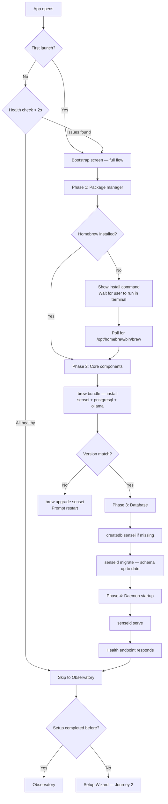

# Journey 1: Install & Bootstrap

> Get sensei running on your machine. Every launch verifies health.

## Flow



## Screens

### Bootstrap screen (1 screen, always shown on issues)

```
┌──────────────────────────────────────────────────────┐
│  先  Sensei · startup                                 │
├──────────────────────────────────────────────────────┤
│                                                       │
│  Components                                           │
│  Checking dependencies. No input needed.              │
│                                                       │
│  ┌───────────────────────────────────────────────┐   │
│  │  ⬡  Homebrew        4.4.2 · ready          ●  │   │
│  │  $  sensei           0.9.4 · ready          ●  │   │
│  │  ◇  senseid          0.9.4 · starting…     ◉  │   │
│  │  ⟷  sensei-mcp       0.9.4 · ready          ●  │   │
│  │  🐘 PostgreSQL       17.2 · ready           ●  │   │
│  │  🦙 Ollama           0.6.2 · ready          ●  │   │
│  │     gemma3:27b · qwen3:14b                     │   │
│  └───────────────────────────────────────────────┘   │
│                                                       │
│  Nothing leaves localhost:9823.                       │
└──────────────────────────────────────────────────────┘
```

**Per-component states:**

| State | Visual | User action needed |
|-------|--------|-------------------|
| detecting | Pulsing amber dot | None — wait |
| installing | Progress bar + size | None — automatic |
| pulling | Progress bar + model size | None — can skip |
| starting | Pulsing dot | None — wait |
| upgrading | Progress bar + versions | None — restart after |
| ready | Solid jade dot + version | None |
| failed | Amber dot + error | Read error, may need terminal action |
| skipped | Grey dot | None — can enable later in Settings |

### Homebrew missing (sub-screen within bootstrap)

```
┌──────────────────────────────────────────────────────┐
│  Sensei uses Homebrew to manage its dependencies.     │
│                                                       │
│  Run this in your terminal:                           │
│                                                       │
│  ┌────────────────────────────────────────────────┐  │
│  │ /bin/bash -c "$(curl -fsSL https://raw...)"    │  │
│  └────────────────────────────────────────────────┘  │
│                                            [Copy]     │
│                                                       │
│  Waiting for Homebrew…  ◉                             │
└──────────────────────────────────────────────────────┘
```

## How to use

1. **Desktop users:** Open the app. Bootstrap runs automatically. Follow any prompts (Homebrew install if missing). Wait for green dots.
2. **CLI users:** `brew install sensei` then `sensei serve`. The daemon handles database creation and migration on first start.
3. **Subsequent launches:** Bootstrap checks health in < 2 seconds. If everything is green, you go straight to the observatory.
4. **Version updates:** `brew upgrade sensei` or desktop detects mismatch and prompts upgrade.

## Mockup status

| Screen | Mockup exists? | What mockup covers | What's missing |
|--------|---------------|--------------------|---------------------------------|
| Bootstrap (components) | ✓ `setup-wizard.jsx` WizComponents | 3 components: cli, mcp, daemon with auto-resolve animation | **Needs update:** add Homebrew, PostgreSQL, Ollama as components. Remove model selection (moved to wizard step 8). Make this a startup screen, not just wizard step 2. |
| Homebrew missing | ✗ | — | **New sub-screen:** show install command, copy button, poll for installation |
| Version mismatch | ✗ | — | **New sub-screen:** show current vs expected version, upgrade button, restart prompt |
| Failed component | ✗ | — | **New sub-screen:** error message, troubleshooting hint, manual fix command |

### Design brief for mockup changes

**Update WizComponents to be a standalone startup screen:**
- Remove from wizard step sequence — this runs independently before the wizard
- Add 3 new component rows: Homebrew, PostgreSQL, Ollama (in addition to existing cli, mcp, daemon)
- On healthy system, this screen flashes for < 2 seconds with all green dots, then auto-advances
- On first install, animate through: detecting → installing → starting → ready per component
- If Homebrew missing, show a distinct sub-view with terminal command and polling indicator
