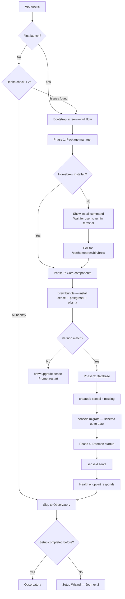

# Journey 1: Install & Bootstrap

> Get sensei running on your machine. Every launch verifies health.

## Flow

## Screens

### Bootstrap screen

**What to show:**
- A component checklist showing each dependency: Homebrew, sensei CLI, senseid (daemon), sensei-mcp, PostgreSQL, Ollama (plus pulled model names)
- Each component displays: name, version (when known), and current state
- A privacy reassurance line: "Nothing leaves localhost:9823."

**Component states:**

| State | Visual indicator | User action needed |
|-------|-----------------|-------------------|
| detecting | Pulsing amber | None — wait |
| installing | Progress bar + size | None — automatic |
| pulling | Progress bar + model size | None — can skip |
| starting | Pulsing indicator | None — wait |
| upgrading | Progress bar + versions | None — restart after |
| ready | Solid jade + version | None |
| failed | Amber + error message | Read error, may need terminal action |
| skipped | Grey | None — can enable later in Settings |

**User interaction:**
- On a healthy system, this screen flashes for < 2 seconds with all-green states, then auto-advances.
- On first install, components animate through their states sequentially (detecting, installing, starting, ready).
- No user input required unless Homebrew is missing.

**Why:** The user needs confidence that all dependencies are healthy before proceeding. This screen is the single source of truth for system readiness.

### Homebrew missing (sub-screen within bootstrap)

**What to show:**
- An explanation that sensei uses Homebrew to manage dependencies
- The Homebrew install command (the standard curl one-liner)
- A copy-to-clipboard button for the command
- A polling indicator showing sensei is waiting for Homebrew to appear

**User interaction:**
- Copy the command, run it in their terminal, then wait for sensei to detect the installation.

**Why:** Homebrew is the only dependency that requires manual user action. This sub-screen bridges the gap between "not installed" and "ready" with minimal friction.

## How to use

1. **Desktop users:** Open the app. Bootstrap runs automatically. Follow any prompts (Homebrew install if missing). Wait for green dots.
2. **CLI users:** `brew install sensei` then `sensei serve`. The daemon handles database creation and migration on first start.
3. **Subsequent launches:** Bootstrap checks health in < 2 seconds. If everything is green, you go straight to the observatory.
4. **Version updates:** `brew upgrade sensei` or desktop detects mismatch and prompts upgrade.

## Data sources

| Data | Source |
|------|--------|
| Homebrew presence | Check for `/opt/homebrew/bin/brew` |
| Component versions | `brew list --versions`, binary `--version` flags |
| Component health | senseid health endpoint |
| Database state | `createdb` + `senseid migrate` exit codes |
