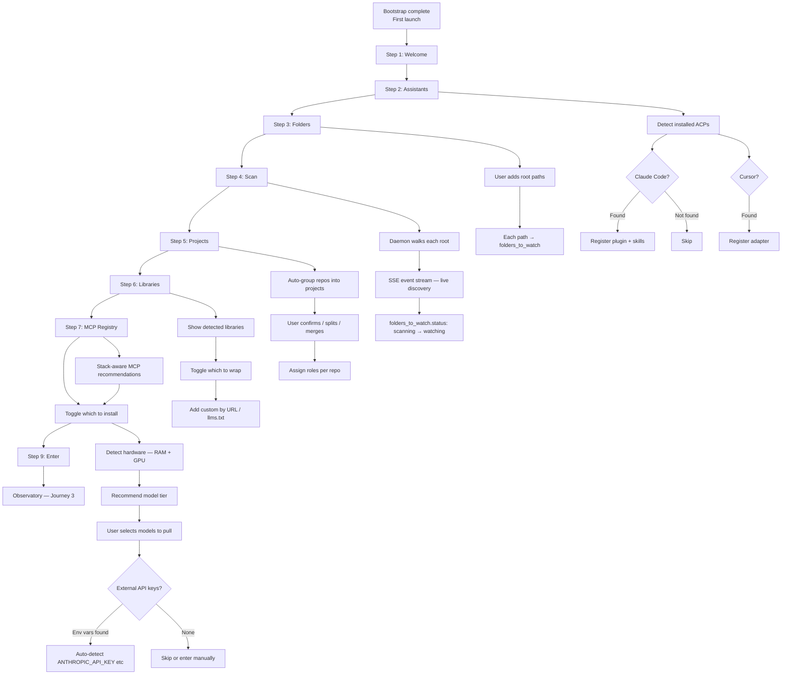
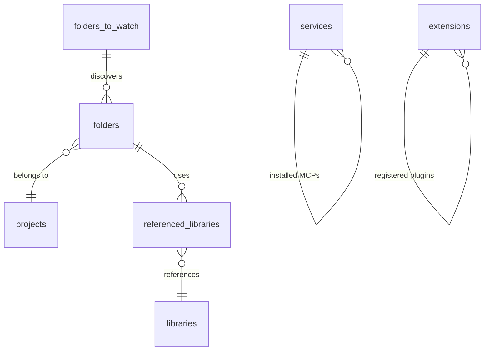

# Journey 2: Setup & Discovery

> Point sensei at your code. Watch it discover repos, auto-group projects, detect libraries, recommend services.

## Flow

## Screens

### Step 1: Welcome

**What to show:**
- Sensei logo and name
- A brief philosophy statement: sensei observes AI sessions (prompts, corrections, outcomes), learns what works for your codebase, and begins to teach — surfacing patterns, preventing repeated mistakes, improving first-try rate
- Privacy assurance: nothing leaves your machine

**User interaction:**
- Click "Begin setup" to proceed.

**Why:** Set expectations. The user should understand that sensei is a teacher, not a linter — it watches, learns, then teaches.

### Step 2: Assistants

**What to show:**
- A list of detected AI coding assistants (Claude Code, Cursor, Codex CLI, Aider, etc.)
- For each: name, version, install path, detected/not-found status
- A brief explanation of what registration does (registers MCP tools so assistants can call search, get_callers, etc.)

**User interaction:**
- Toggle which assistants to register with. Auto-detected ones are pre-checked.

**Why:** Sensei works through MCP tools inside the user's existing assistant. This step establishes which assistants to integrate with.

### Step 3: Folders

**What to show:**
- A list of root directories the user wants sensei to watch
- For each: path and a brief description (auto-detected or user-entered)
- An explanation: sensei will recursively scan these for git repos and organize them into projects (depth 1-2 for plain folders, any depth for git)

**User interaction:**
- Add root directories via folder picker or path entry.
- Remove directories from the list.

**Why:** Sensei needs to know where the user's code lives before it can discover projects and build its index.

### Step 4: Scan

**What to show:**
- Aggregate stats: number of roots, repos discovered, files queued
- A progress indicator (percentage or bar)
- A live event log showing discovery in real time (SSE stream) — timestamps, repo names, file counts, processing status
- Completion summary: total repos, total files, elapsed time

**User interaction:**
- Watch. No input needed. The scan runs automatically.

**Why:** Gives the user confidence that sensei found their code. The live stream prevents the feeling of a frozen UI during a potentially long operation.

### Step 5: Projects

**What to show:**
- Auto-grouped projects, each containing one or more repos
- For each project: name, constituent repos with paths
- For each repo: a role indicator (frontend, backend, library, infra)
- Project-level metadata fields: client, goal

**User interaction:**
- Confirm auto-grouping or reorganize: rename projects, change repo roles, split a project into multiple, merge projects together
- Set client and goal per project
- Create new projects manually

**Why:** Sensei's insights are project-scoped. Correct grouping determines whether analytics are meaningful — a monorepo with 3 services should be one project, not three.

### Step 6: Libraries

**What to show:**
- Libraries detected from the user's code (name, version, language, doc-indexing status, usage frequency)
- A toggle per library to include/exclude from indexing
- Options to import custom libraries by URL or llms.txt

**User interaction:**
- Toggle which libraries to index.
- Import additional libraries not auto-detected.

**Why:** Sensei wraps libraries — indexing their docs and exposing search, usage, and drift tools via MCP. The user controls which libraries are worth the indexing cost.

### Step 7: MCP Registry

**What to show:**
- The user's detected stack (e.g., "Rust, TypeScript, PostgreSQL, Redis")
- Recommended MCP servers based on stack, with: name, publisher, verification status, tool count
- Additional available MCP servers beyond the recommendations

**User interaction:**
- Toggle which MCP servers to install. Stack-based recommendations are pre-checked.

**Why:** External MCP servers extend sensei's tool surface (database queries, deployment, monitoring). Stack-aware recommendations reduce decision fatigue.

### Step 8: Inference

**What to show:**
- Hardware detection summary: RAM, GPU type, recommended model tier
- Local models section (via Ollama): model name, disk size, purpose/role. Pre-checked based on hardware capacity.
- Total resource impact: disk usage, RAM during inference
- External providers section: auto-detected API keys from environment variables (e.g., ANTHROPIC_API_KEY), with status. Fields to enter keys manually for providers without auto-detection.
- A note that external models enable richer reasoning but local models work without them

**User interaction:**
- Select which local models to pull (can proceed to next step while models download in background).
- Review auto-detected API keys; optionally enter keys for additional providers.
- Skip entirely to configure later in Settings.

**Why:** Inference powers the insights panel. This step right-sizes model selection to the user's hardware and lets them opt into external providers without requiring it.

### Step 9: Enter

**What to show:**
- A summary of everything configured: project count, repo count, library count, MCP server count, registered assistants, inference status
- A brief message setting expectations: sensei will watch in silence for a few days, then begin to teach
- A note that setup can be resumed from Settings at any time

**User interaction:**
- Click "Enter the observatory" to finish setup.

**Why:** Closure. The user sees the full picture of what was configured and knows what to expect next.

## What gets created

## How to use

1. **First time:** The wizard runs automatically after bootstrap. Follow each step.
2. **Adding a project later:** Settings → Folders → Add → triggers re-scan → new projects appear.
3. **Reorganizing:** Settings → Projects → Split/Merge/Move repos.
4. **Re-running setup:** Settings → "Re-run setup wizard" starts from Step 2.

## Data sources

| Data | Source |
|------|--------|
| Installed assistants | File system detection (known install paths) |
| Repos and files | Recursive walk of `folders_to_watch` roots |
| Project grouping | Heuristic: directory proximity, shared config, monorepo markers |
| Libraries | Dependency files (Cargo.toml, package.json, etc.) |
| MCP recommendations | Stack detection cross-referenced with MCP registry |
| Hardware specs | System profiling (RAM, GPU via sysctl / Metal API) |
| API keys | Environment variable detection |
