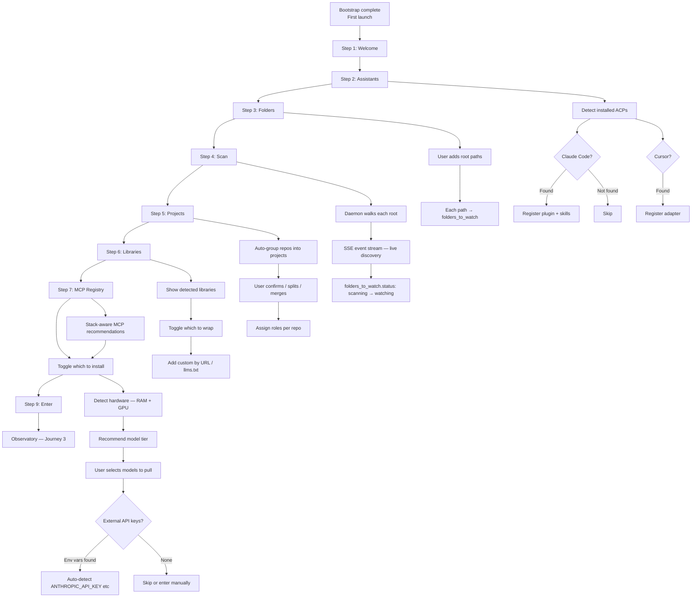
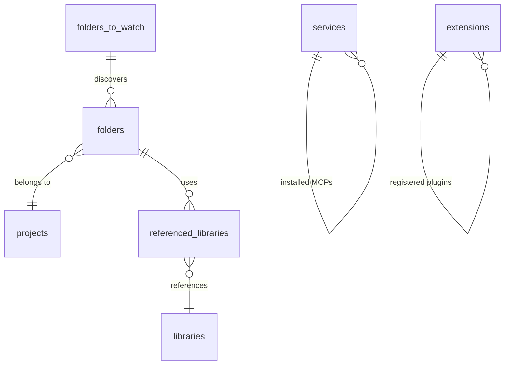

# Journey 2: Setup & Discovery

> Point sensei at your code. Watch it discover repos, auto-group projects, detect libraries, recommend services.

## Flow



## Screens (8 steps + welcome + done)

### Step 1: Welcome

```
┌──────────────────────────────────────────────────────┐
│                                                       │
│              先                                        │
│           sensei                                      │
│                                                       │
│     A teacher does not write the code.                │
│     A teacher watches. Notices. Teaches.              │
│                                                       │
│     Sensei observes your AI sessions — prompts,       │
│     corrections, outcomes — and learns what works     │
│     for your codebase. After a few sessions, it       │
│     begins to teach: surfacing patterns, preventing   │
│     repeated mistakes, improving first-try rate.      │
│                                                       │
│     Nothing leaves your machine.                      │
│                                                       │
│                               [Begin setup →]         │
└──────────────────────────────────────────────────────┘
```

**What the user does:** Reads. Clicks "Begin setup."

### Step 2: Assistants

```
┌──────────────────────────────────────────────────────┐
│  三  Assistants                                       │
│      Which AI coding tools do you use?                │
│                                                       │
│  ☑  Claude Code    1.8.2   /Users/you/.claude/code   │
│     → register sensei plugin, skills, session hooks   │
│                                                       │
│  ☑  Cursor         0.42    /Applications/Cursor.app   │
│     → register MCP server, adapter config             │
│                                                       │
│  ☐  Codex CLI      —       not found                  │
│  ☐  Aider          —       not found                  │
│                                                       │
│  Sensei registers its MCP tools with each assistant   │
│  so they can call search(), get_callers(), etc.       │
│                                                       │
└──────────────────────────────────────────────────────┘
```

**What the user does:** Toggle which assistants to register with. Auto-detected ones are pre-checked.

### Step 3: Folders

```
┌──────────────────────────────────────────────────────┐
│  四  Folders                                          │
│      Where does your work live?                       │
│                                                       │
│  ┌────────────────────────────────────────────────┐  │
│  │  ~/Developer           monorepo root, 3 pkgs   │  │
│  │  ~/work/clients        client projects          │  │
│  └────────────────────────────────────────────────┘  │
│                                                       │
│  [+ Add folder]                                       │
│                                                       │
│  Sensei will recursively scan these folders for       │
│  git repos and organize them into projects.           │
│  Depth 1-2 for plain folders, any depth for git.     │
│                                                       │
└──────────────────────────────────────────────────────┘
```

**What the user does:** Add root directories. Each becomes a `folders_to_watch` entry.

### Step 4: Scan

```
┌──────────────────────────────────────────────────────┐
│  五  Scan                                             │
│      Discovering your projects. ~2M files/min.        │
│                                                       │
│  Roots: 2  ·  Discovered: 8  ·  Queued: 3,214       │
│  ████████████████████░░░░░░░  72%                     │
│                                                       │
│  ┌────────────────────────────────────────────────┐  │
│  │ 00:02  ~/Developer · found git repo            │  │
│  │ 00:03  ~/Developer/lumen-app · git    842f     │  │
│  │ 00:04  ~/Developer/lumen-canvas · git  614f    │  │
│  │ 00:05  ~/Developer/lumen-shell · git   291f    │  │
│  │ 00:06  lumen-app · 612/842 processed           │  │
│  │ 00:08  lumen-canvas · 614/614 · graph done     │  │
│  │ ...                                             │  │
│  └────────────────────────────────────────────────┘  │
│                                                       │
│  scan complete · 8 repos · 3,214 files · 21s         │
└──────────────────────────────────────────────────────┘
```

**What the user does:** Watches. No input needed. Live SSE stream shows discovery in real time.

### Step 5: Projects

```
┌──────────────────────────────────────────────────────┐
│  六  Projects                                         │
│      3 projects detected. Confirm or reorganize.      │
│                                                       │
│  ┌─ 工  Lumen Studio ──────────────────────────────┐ │
│  │  ☑ lumen-app     ~/Developer/lumen-app    前    │ │
│  │  ☑ lumen-canvas  ~/Developer/lumen-canvas  書   │ │
│  │  ☑ lumen-shell   ~/Developer/lumen-shell   基   │ │
│  │  Client: internal    Goal: [                  ] │ │
│  └──────────────────────────────────────────────────┘ │
│                                                       │
│  ┌─ 雲  Lumen Cloud ───────────────────────────────┐ │
│  │  ☑ lumen-api     ~/work/lumen-cloud/api    後   │ │
│  │  ☑ lumen-sync    ~/work/lumen-cloud/sync   後   │ │
│  │  ☑ lumen-auth    ~/work/lumen-cloud/auth   後   │ │
│  └──────────────────────────────────────────────────┘ │
│                                                       │
│  [Split]  [Merge]  [+ Create project]                 │
└──────────────────────────────────────────────────────┘
```

**What the user does:** Confirm auto-grouping. Rename projects. Change repo roles (前=frontend, 後=backend, 書=library, 基=infra). Split or merge projects. Set client/goal.

### Step 6: Libraries

```
┌──────────────────────────────────────────────────────┐
│  七  Libraries                                        │
│      6 detected · sensei will index docs for these.   │
│                                                       │
│  Detected from code                                   │
│  ☑  axum       0.7.5   Rust    docs indexed     47x  │
│  ☑  tokio      1.39    Rust    docs indexed    112x  │
│  ☑  sqlx       0.8.0   Rust    docs indexed     23x  │
│  ☑  Svelte 5   5.0.0   TS      docs indexed    128x  │
│  ☐  wgpu       0.20    Rust    no docs           7x  │
│                                                       │
│  [+ Import from URL]  [+ Import llms.txt]             │
│                                                       │
│  Sensei wraps these libraries — indexes their docs    │
│  and exposes search, usage, and drift tools via MCP.  │
└──────────────────────────────────────────────────────┘
```

**What the user does:** Toggle which libraries to index. Import custom ones by URL or llms.txt.

### Step 7: MCP Registry

```
┌──────────────────────────────────────────────────────┐
│  八  MCP Registry                                     │
│      Recommended for your stack.                      │
│                                                       │
│  Your stack: Rust · TypeScript · PostgreSQL · Redis   │
│                                                       │
│  Recommended                                          │
│  ☑  PostgreSQL MCP   supabase    ✓ verified   14 tools│
│  ☑  Stripe MCP       stripe      ✓ verified   18 tools│
│  ☐  Redis MCP        redis labs  ✓ verified    9 tools│
│  ☐  GitHub MCP       github      ✓ verified   23 tools│
│                                                       │
│  Other available                                      │
│  ☐  Sentry MCP       sentry      ✓ verified   11 tools│
│  ☐  Playwright MCP   microsoft   ✓ verified    7 tools│
│  ☐  Figma MCP        figma       ✓ verified   12 tools│
│                                                       │
└──────────────────────────────────────────────────────┘
```

**What the user does:** Toggle which external MCP servers to install. Stack-based recommendations are pre-checked.

### Step 8: Inference

```
┌──────────────────────────────────────────────────────┐
│  八+  Inference                                       │
│       Local models + external providers               │
│                                                       │
│  Your machine: 32GB RAM · Apple M3 Pro · Metal GPU    │
│  Recommended: Full reasoning panel (3 models)         │
│                                                       │
│  Local models (via Ollama)                            │
│  ☑  gemma3:27b     16.0 GB   reasoning + analysis    │
│  ☑  qwen3:14b       8.7 GB   second opinion          │
│  ☐  llama4-scout   10.2 GB   synthesis (optional)    │
│                                                       │
│  Total: ~25 GB disk · ~20 GB RAM during inference     │
│  [Pull selected models]  [Skip — configure later]     │
│                                                       │
│  ─────────────────────────────────────────────────    │
│                                                       │
│  External providers (optional — bring your own key)   │
│                                                       │
│  ● Anthropic    ANTHROPIC_API_KEY detected    ✓       │
│  ○ OpenAI       no key found     [Enter API key]      │
│  ○ Custom       OpenAI-compatible  [Configure]        │
│                                                       │
│  External models enable richer reasoning in the       │
│  insights panel. Local models work without them.      │
│                                                       │
└──────────────────────────────────────────────────────┘
```

**What the user does:**
1. Select which local models to pull (hardware-aware recommendations pre-checked).
2. Model pull runs in background — can proceed to next step while downloading.
3. If environment variables for API keys are detected (e.g. `ANTHROPIC_API_KEY`), they are auto-shown.
4. Optionally enter API keys for external providers.
5. Skip entirely if they want local-only or configure later in Settings.

### Step 9: Enter

```
┌──────────────────────────────────────────────────────┐
│  九  The observatory is ready.                        │
│                                                       │
│       3 projects · 8 repos · 6 libraries · 2 MCPs    │
│       2 assistants registered                         │
│                                                       │
│  Start a session with your assistant.                 │
│  Sensei will watch in silence for a few days,         │
│  then begin to teach.                                 │
│                                                       │
│  Setup can be resumed at any time from Settings.      │
│                                                       │
│                        [Enter the observatory →]      │
└──────────────────────────────────────────────────────┘
```

**What the user does:** Clicks "Enter the observatory." Setup complete.

## What gets created



## How to use

1. **First time:** The wizard runs automatically after bootstrap. Follow each step.
2. **Adding a project later:** Settings → Folders → Add → triggers re-scan → new projects appear.
3. **Reorganizing:** Settings → Projects → Split/Merge/Move repos.
4. **Re-running setup:** Settings → "Re-run setup wizard" starts from Step 2.

## Mockup status

| Screen | Mockup exists? | What mockup covers | What's missing |
|--------|---------------|--------------------|---------------------------------|
| Welcome | ✓ `setup-wizard.jsx` | Tagline, begin button | — |
| Components | ✓ `setup-wizard.jsx` | 3 components with auto-resolve | **Moved to bootstrap (J1).** Remove from wizard. |
| Assistants | ✓ `setup-wizard.jsx` | ACP detection, checkbox registration | — |
| Folders | ✓ `setup-wizard.jsx` | Add paths, notes | — |
| Scan | ✓ `setup-wizard.jsx` | Live SSE stream, progress, stats | — |
| Projects | ✓ `setup-wizard.jsx` | Auto-group, split/merge, roles, metadata | — |
| Libraries | ✓ `setup-wizard.jsx` | Detected list, toggle, custom add | — |
| MCP Registry | ✓ `setup-wizard.jsx` | Stack-aware recommendations, toggle | — |
| Inference | ✗ | — | **New step needed:** hardware detection, model selection, API key config |
| Enter | ✓ `setup-wizard.jsx` | Summary counts, "enter observatory" | Add inference summary (models pulled, providers configured) |

### Design brief for mockup changes

**Remove Components step from wizard** — it's now the bootstrap startup screen (J1), not a wizard step. Wizard starts at Welcome → Assistants.

**Add Inference step (new, after MCP Registry):**
- Hardware detection banner: RAM, GPU, recommended tier
- Local models section: checkboxes with model name, size, purpose. Pre-checked based on hardware.
- Pull progress: can proceed to next step while models download in background
- External providers section: auto-detect env vars (ANTHROPIC_API_KEY, OPENAI_API_KEY). Show status. Allow manual entry.
- Skip option: "Continue without — configure later in Settings"

**Update Enter step:** Add inference summary line ("2 local models · 1 external provider" or "no inference configured")
