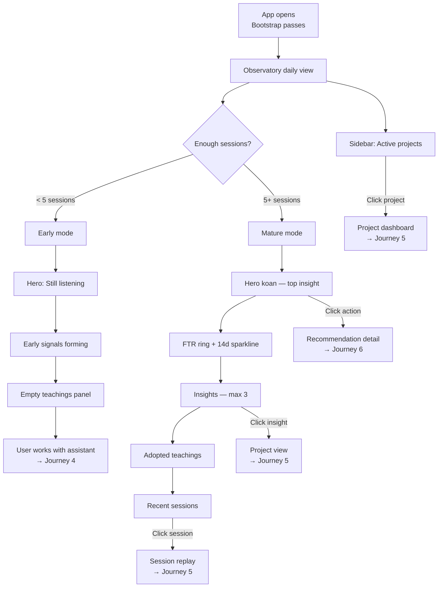
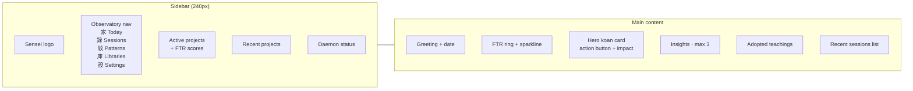

# Journey 3: Observe & Orient

> The daily home screen. Sensei watches sessions quietly, then surfaces what it notices.

## Flow



## Screens (1 main screen, 2 modes)

### Observatory — Early mode

Shown when sensei has observed fewer than ~5 sessions. Quiet, unassuming.

```
┌──────────────────────────────────────────────┬──────────────────────┐
│                                               │ OBSERVATORY          │
│  Wed · 23 Apr                                 │ 家 Today             │
│  Good morning, Jerry.                  ◌ FTR  │ 録 Sessions      4   │
│                                  building…    │ 紋 Patterns      —   │
│                                               │ 庫 Libraries    14   │
│  ┌────────────────────────────────────────┐   │ 設 Settings          │
│  │                                        │   │                      │
│  │  sensei is listening     観             │   │ ACTIVE PROJECTS      │
│  │                                        │   │ 工 Lumen Studio  —   │
│  │  Still listening.                      │   │ 雲 Lumen Cloud   —   │
│  │                                        │   │ 紋 Brand Kit     —   │
│  │  Sensei has watched 4 sessions so far. │   │                      │
│  │  A few early signals are forming in    │   │ RECENT               │
│  │  lumen-auth, but nothing confident     │   │ 筆 Sketch tool  3w   │
│  │  enough to teach yet.                  │   │                      │
│  │                                        │   │                      │
│  │  ~2-3 more sessions until first lesson │   │ daemon · running     │
│  └────────────────────────────────────────┘   │ heartbeat 2s ago     │
│                                               │                      │
│  Early signals                                │                      │
│  ┌──────────────────────────────────────┐     │                      │
│  │ 耳 Listening                         │     │                      │
│  │   Watching prompt style in canvas.   │     │                      │
│  │   Early signal: you prefer terse.    │     │                      │
│  └──────────────────────────────────────┘     │                      │
│                                               │                      │
│  System has learned                           │                      │
│  ┌──────────────────────────────────────┐     │                      │
│  │     空                                │     │                      │
│  │  No teachings adopted yet.            │     │                      │
│  │  Sensei needs a few more sessions.    │     │                      │
│  └──────────────────────────────────────┘     │                      │
│                                               │                      │
└───────────────────────────────────────────────┴──────────────────────┘
```

**What the user does:** Reads. Understands sensei is building a baseline. Goes to work with their assistant (Journey 4). Comes back tomorrow.

### Observatory — Mature mode

Shown after sensei has enough data to teach. This is the daily-driver screen.

```
┌──────────────────────────────────────────────┬──────────────────────┐
│                                               │ OBSERVATORY          │
│  Wed · 23 Apr                                 │ 家 Today             │
│  Good morning, Jerry.        ◌ 78 FTR · 14d  │ 録 Sessions     41   │
│                             ↑ 6% vs prior     │ 紋 Patterns     12   │
│                             ▂▃▃▄▃▄▅▄▅▆▅▆▅▆   │ 庫 Libraries    14   │
│                                               │ 設 Settings          │
│  ┌────────────────────────────────────────┐   │                      │
│  │                                        │   │ ACTIVE PROJECTS      │
│  │  聴           sensei speaks            │   │ 工 Lumen Studio  82  │
│  │                                        │   │ 雲 Lumen Cloud   64  │
│  │  The AI does not know your auth.       │   │ 紋 Brand Kit     91  │
│  │                                        │   │                      │
│  │  Three sessions corrected this week    │   │ RECENT               │
│  │  in lumen-auth — all touched refresh   │   │ 筆 Sketch tool  3w   │
│  │  or device flow. There is no           │   │ 巻 Docs site   2mo   │
│  │  integration-test persona for this     │   │                      │
│  │  module yet.                           │   │                      │
│  │                                        │   │ daemon · running     │
│  │  [Draft a persona →]  ● FTR +14%      │   │ heartbeat 2s ago     │
│  │                   from s-2891 · 2d ago │   │                      │
│  └────────────────────────────────────────┘   │                      │
│                                               │                      │
│  Also worth noticing                          │                      │
│  ┌──────────────────────────────────────┐     │                      │
│  │ 繰 Pattern recurring          3rd×   │     │                      │
│  │   Cache invalidation missed again.   │     │                      │
│  ├──────────────────────────────────────┤     │                      │
│  │ 昇 Teaching adopted          +7% FTR │     │                      │
│  │   Canvas smoothing promoted to rule. │     │                      │
│  ├──────────────────────────────────────┤     │                      │
│  │ 探 Drift detected         low urgency│     │                      │
│  │   brand-tokens README 47 days old.   │     │                      │
│  └──────────────────────────────────────┘     │                      │
│                                               │                      │
│  System has learned                           │                      │
│  ┌──────────────────────────────────────┐     │                      │
│  │ ▎ 2d ago · lumen-studio              │     │                      │
│  │   Canvas smoothing pattern → rule    │     │                      │
│  │ ▎ 5d ago · lumen-cloud               │     │                      │
│  │   Auth refresh · clock-skew tolerance│     │                      │
│  │ ▎ 1w ago · brand-kit                 │     │                      │
│  │   Token drift watchdog enabled       │     │                      │
│  └──────────────────────────────────────┘     │                      │
│                                               │                      │
│  Recent sessions                              │                      │
│  ● lumen-auth    Fix refresh token     3×  38m│                      │
│  ● lumen-canvas  Bezier smoothing      1st 22m│                      │
│  ● lumen-auth    OAuth device flow     4×  1h │                      │
│  ● brand-tokens  Dark-mode ramps       1st 18m│                      │
│                                               │                      │
└───────────────────────────────────────────────┴──────────────────────┘
```

**What the user does:**

1. **Read hero koan** — understand the most important thing today
2. **Click "Draft a persona →"** — opens action drawer → send to Claude Code (Journey 6)
3. **Scan insights** — are patterns recurring? teachings working? drift accumulating?
4. **Check FTR trend** — is it going up? down? Which projects are struggling?
5. **Click a project** in sidebar — drill into project-specific view (Journey 5)
6. **Click a session** — see session replay with tool calls and corrections (Journey 5)

## Layout anatomy



## How it works

| Section | Data source | Update frequency |
|---------|------------|-----------------|
| FTR ring | `sessions` table, 14-day window | After each session completes |
| Hero koan | Highest-urgency recommendation from insights engine | Daily or after significant FTR change |
| Insights | Aggregated from session analytics, pattern detection, drift detection | After each session |
| Adopted teachings | `change_impacts` where verdict = positive | After impact measurement (7-day window) |
| Recent sessions | Latest 4-8 sessions | Real-time as sessions complete |
| Project FTR | Per-project from `sessions` grouped by `project_id` | After each session |

## How to use

1. **Morning routine:** Open sensei. Read the hero koan. Act on it if urgent. Check FTR trend.
2. **Between sessions:** Glance at insights. Are patterns recurring? Is a teaching working?
3. **End of week:** Review adopted teachings. Is the system getting smarter? FTR trending up?
4. **Drilling down:** Click anything to go deeper — project view, session replay, pattern catalog.

## Mockup status

| Screen | Mockup exists? | What mockup covers | What's missing |
|--------|---------------|--------------------|---------------------------------|
| Observatory — early mode | ✓ `observatory.jsx` | Hero "still listening", early signals, empty teachings | — |
| Observatory — mature mode | ✓ `observatory.jsx` | Hero koan, FTR ring, insights, adopted teachings, sessions | — |
| Sidebar navigation | ✓ `observatory.jsx` | Active projects, recent, archived, nav sections | — |
| First entry toast | ✓ `observatory.jsx` | Welcome toast on first visit | — |
| Projects index (cards) | ✓ `navigation.jsx` | Card grid with search + status filter | — |
| Projects palette (Cmd-K) | ✓ `navigation.jsx` | Global search across projects, libs, sessions, commands | — |
| Projects browser (tree) | ✓ `navigation.jsx` | Left tree + grid, status grouping | — |

### Design brief for mockup changes

**Observatory mockups are comprehensive.** The main gap is connecting the observatory to the action drawer (J6) — when user clicks "Draft a persona →" on the hero koan, it should open the action drawer. The mockup shows the button but not the transition.

**Navigation mockups cover 3 variants.** A decision is needed on which to use (cards, palette, or tree browser). Could be: palette (Cmd-K) as the quick switcher + cards as the default view.
