# Journey 5: Understand the Codebase

> Explore code structure, browse libraries, replay sessions, try MCP tools.

## Flow

```mermaid
flowchart TD
    A[User clicks project\nin sidebar] --> B[Project dashboard]
    B --> C{Which section?}

    C --> D[Overview]
    D --> D1[Repos list]
    D --> D2[Recommendations]
    D --> D3[Hotspots summary]
    D --> D4[Patterns in use]

    C --> E[Graph]
    E --> E1{Lens mode}
    E1 --> E1a[Call graph — force layout]
    E1 --> E1b[Matrix — heatmap]
    E1 --> E1c[Clusters — community bubbles]
    E --> E2{Overlay}
    E2 --> E2a[Rework heat]
    E2 --> E2b[Duplicate clusters]
    E2 --> E2c[Patterns]
    E2 --> E2d[God-nodes / hotspots]
    E2 --> E2e[Stale / drift]

    C --> F[Patterns]
    F --> F1[Patterns followed — rule / suggested / gap]
    F --> F2[Anti-patterns — with fix cross-links]
    F1 -->|Promote| F3[suggested → rule]
    F2 -->|Fix| F4[Send refactor prompt to ACP]

    C --> G[Sessions]
    G --> G1[Session list — FTR, corrections, duration]
    G1 -->|Click| G2[Session replay]
    G2 --> G2a[Tool call timeline]
    G2 --> G2b[Correction details]
    G2 --> G2c[What assistant asked / received]

    C --> H[Libraries]
    H --> H1[Detected + imported list]
    H1 -->|Click| H2[Library detail]
    H2 --> H2a[Top symbols + usage counts]
    H2 --> H2b[Call sites — file:line:snippet]
    H2 --> H2c[Attached rules]
    H2 --> H2d[MCP tool examples]

    C --> I[MCP Playground]
    I --> I1[Browse tools by category]
    I1 -->|Select tool| I2[Fill inputs + execute]
    I2 --> I3[See request + response]
    I --> I4[Scope switch — sensei / postgres-mcp / stripe-mcp]

    C --> J[Settings]
    J --> J1[Identity — name, icon, client, goal]
    J --> J2[Stack — languages, frameworks, runtimes]
    J --> J3[Links — docs, dashboards, runbooks]
    J --> J4[Guidelines — project rules]
    J --> J5[Skills — per-project toggle]
    J --> J6[Privacy — logging, redaction]
```



## Screens

### Project dashboard (overview)

```
┌──────────────────────────────────────────────────────┐
│  雲 Lumen Cloud · internal                            │
│  Goal: Keep everyone's work in sync.   64 FTR ▂▃▂▁▂  │
│  28 sessions (7d) · preferred: claude-code            │
│                                                       │
│  ┌─ Overview ─ Graph ─ Patterns ─ Sessions ─ … ──┐   │
│                                                       │
│  Repos                                                │
│  lumen-api    ~/work/lumen-cloud/api    Rust · 後     │
│  lumen-sync   ~/work/lumen-cloud/sync   Rust · 後     │
│  lumen-auth   ~/work/lumen-cloud/auth   Rust · 後     │
│                                                       │
│  Sensei recommends                                    │
│  ┌────────────────────────────────────────────────┐   │
│  │ 急 Write an auth integration-test persona      │   │
│  │   3 sessions corrected this week.              │   │
│  │   Projected FTR +14%                           │   │
│  │   [Send to Claude Code →]  [Customize prompt]  │   │
│  └────────────────────────────────────────────────┘   │
│                                                       │
│  Patterns in use: 6                                   │
│  ✓ Adapter (7 places) · ✓ Observer (14) · ...         │
│  ⚠ Copy-paste error handling (12 sites)               │
└──────────────────────────────────────────────────────┘
```

### Code graph (3 lens modes × 5 overlays)

```
┌──────────────────────────────────────────────────────┐
│  Graph · Lumen Cloud          12 files · 14 edges     │
│                                                       │
│  Lens: [Call graph]  Matrix  Clusters                 │
│  Show: [Rework heat]  Duplicates  Patterns  Gods  Stale│
│                                                       │
│  ┌────────────────────────────────────────────────┐   │
│  │                                                │   │
│  │    ◉ router.ts (42 fan-in)                     │   │
│  │   ╱  │  ╲                                      │   │
│  │  ○   ○   ○  middleware / handlers              │   │
│  │      │                                          │   │
│  │      ◉ session.ts (28 fan-in)                  │   │
│  │     ╱ ╲                                         │   │
│  │    ○   ○  refresh.ts · oauth.ts                │   │
│  │                                                │   │
│  │  ● = hot (rework overlay active)               │   │
│  │  Node size = fan-in + fan-out                  │   │
│  └────────────────────────────────────────────────┘   │
│                                                       │
│  Selected: router.ts · 42 fan-in · 18 fan-out         │
│  7 rework sessions · god-node                         │
│  [View callers]  [Send refactor prompt]               │
└──────────────────────────────────────────────────────┘
```

### Session replay

```
┌──────────────────────────────────────────────────────┐
│  Session s-2891 · Fix refresh token rotation          │
│  10:42 → 11:20 · 38m · 3 corrections · NOT first-try │
│                                                       │
│  Tool call timeline                                   │
│  ┌────────────────────────────────────────────────┐   │
│  │ 10:42  start · claude-code · cwd lumen-auth    │   │
│  │ 10:43  get_session_context() → 4 files loaded  │   │
│  │ 10:44  search("refresh token") → 3 results     │   │
│  │ 10:45  EDIT src/auth/refresh.ts                │   │
│  │ 10:51  TEST failed — TokenExpiredError          │   │
│  │ 10:53  ⚠ CORRECTION "account for clock skew"  │   │
│  │ 10:55  search("clock skew") → 1 result         │   │
│  │ 10:58  EDIT src/auth/refresh.ts + skewTolerance│   │
│  │ 11:02  TEST 5/5 passing                        │   │
│  │ 11:08  ⚠ CORRECTION "handle refresh during     │   │
│  │         rotation"                               │   │
│  │ 11:14  EDIT + inFlightMutex                    │   │
│  │ 11:20  checkpoint · committed · 38m             │   │
│  └────────────────────────────────────────────────┘   │
│                                                       │
│  Click any event to see:                              │
│  • Tool call: input params + full response            │
│  • Correction: what was wrong + how it was fixed      │
│  • Edit: file diff                                    │
└──────────────────────────────────────────────────────┘
```

### MCP Playground

```
┌──────────────────────────────────────────────────────┐
│  MCP Playground                                       │
│  Scope: [sensei]  postgres-mcp  stripe-mcp            │
│                                                       │
│  Categories                    Tool detail             │
│  場 Project tools (3)          sensei.search           │
│  庫 Library tools (4)    →     Search code by query    │
│  紋 Pattern tools (3)                                  │
│  録 Session tools (1)          Project: [Lumen Cloud ▾]│
│                                Query:  [refresh token ]│
│                                Limit:  [10           ]│
│                                                        │
│                                [Run tool]              │
│                                                        │
│                                Response:               │
│                                ┌──────────────────┐   │
│                                │ 3 results:       │   │
│                                │ auth/refresh.ts  │   │
│                                │ auth/session.ts  │   │
│                                │ api/handlers/... │   │
│                                └──────────────────┘   │
│                                                        │
│  Tool usage stats (this project)                       │
│  search: 47x · get_callers: 23x · get_patterns: 0x ⚠ │
└──────────────────────────────────────────────────────┘
```

## How to use

1. **Daily check:** Open project from sidebar → Overview shows recommendations + pattern summary
2. **Investigate hotspot:** Graph tab → rework overlay → click hot node → see callers → send refactor prompt
3. **Understand failure:** Sessions tab → click a corrected session → step through tool calls → see where it went wrong
4. **Explore patterns:** Patterns tab → see what's followed vs anti-patterns → promote or fix
5. **Test a tool:** MCP Playground → select tool → fill inputs → run → see response
6. **Check library usage:** Libraries tab → click library → see top symbols, call sites, rules

## Additional screens (not yet in mockups)

### Doc traceability (idea 13) — new section in project view

**Purpose:** Show doc-to-code links, flag stale/broken references, offer "fix drift" actions.

**Content needed:**
- List of doc files with link health: current / drifted / broken
- Per-doc drill-in: which symbols it references, their current state
- Drift detail: what changed (old signature → new signature)
- Action: "Update doc" → sends prompt to ACP with the specific drift
- Filter: show all / drifted only / broken only

**User flow:** Project view → Doc traceability section → see drifted docs → click → see what changed → send fix to ACP

### Pattern knowledge catalog (idea 17) — extension of patterns section

**Purpose:** Browse industry patterns (patterns.dev, GoF), match against codebase, import as project rules.

**Content needed:**
- Catalog browser with categories (GoF structural, behavioral, creational; resilience; data access)
- Per-pattern: description, example, known implementations in this codebase (if any)
- "Match" indicator: "This pattern detected in 3 places" or "Not present — recommended"
- Import action: add pattern as project rule (suggested → rule)
- Evidence: sessions that used this pattern and their FTR correlation

**User flow:** Patterns tab → "Browse catalog" → filter by category → see matches → import recommended ones

### Tool usage analytics (idea 25) — extension of MCP playground

**Purpose:** See which tools are used/ignored across sessions, correlate with FTR.

**Content needed:**
- Tool frequency chart: bar chart of tool usage per week/month
- Unused tools list with "why?" analysis (skill doesn't mention it, name unclear, etc.)
- Effectiveness correlation: "Sessions using get_patterns() had 92% FTR vs 68% without"
- Per-tool detail: average response time, % of times result was used by assistant
- Trend: is tool adoption increasing after a skill change?

**User flow:** MCP Playground → "Usage stats" tab → see frequency → click tool → see effectiveness → decide whether to update skill instructions

---

## Mockup status

What exists in the current mockups (`docs/design/02-desktop/setup/lib/`) vs what this journey needs.

| Screen | Mockup exists? | What mockup covers | What's missing |
|--------|---------------|--------------------|---------------------------------|
| Project overview | ✓ `project-shared.jsx` | Repos list, recommendations, FTR sparkline, hotspots | — |
| Code graph (3 lens) | ✓ `project-shared.jsx` | Force-layout, matrix, clusters + 5 overlays | — |
| Patterns followed | ✓ `project-shared.jsx` | Rule/suggested/gap lifecycle, confidence, places | — |
| Anti-patterns | ✓ `project-shared.jsx` | Severity, cross-link to constructive fix | — |
| Sessions list | ✓ `project-shared.jsx` | FTR, corrections, duration, time | — |
| Session replay | ✗ | — | Full tool call timeline, correction details, input/response for each call |
| Libraries list | ✓ `libraries.jsx` | Detected/imported/services groups, filter, search | — |
| Library detail | ✓ `libraries.jsx` | Top symbols, usage places, rules, MCP examples | — |
| MCP Playground | ✓ partial `libraries.jsx` | Tool browser, form inputs, run tool, response | Tool usage stats, effectiveness correlation, scope switching between MCPs |
| Project settings | ✓ `project-shared.jsx` | Identity, stack, repos, links, guidelines, skills, privacy | — |
| Doc traceability | ✗ | — | **New screen needed:** doc-to-code links, drift status, fix actions |
| Pattern catalog | ✗ | — | **New screen needed:** industry pattern browser, match against codebase, import |
| Tool usage analytics | ✗ | — | **New screen needed:** frequency charts, unused tools, FTR correlation |

### Design brief for missing screens

For an LLM designer creating additional mockups:

**Session replay screen:**
- Part of the project view, accessible by clicking a session in the sessions list
- Header: session id, title, time range, duration, outcome (first-try or N corrections)
- Main content: vertical timeline of events — each event is a row with timestamp, kind icon, description
- Event kinds: start, context_loaded, tool_call, edit, test, correction, phase_change, end
- Clicking a tool_call event expands to show input params (JSON) and response (JSON/text)
- Clicking a correction event shows what was wrong and how the assistant adjusted
- Color coding: corrections in amber, successful tool calls in jade, tests in neutral

**Doc traceability screen:**
- Part of the project view, new tab alongside Overview/Graph/Patterns/Sessions
- Header: "N docs tracked · N current · N drifted · N broken"
- List view: doc file path, link count, health status (current/drifted/broken), last checked
- Drill-in: click doc → see each reference → symbol name, expected signature, actual signature, status
- Action per drifted/broken ref: "Send fix to Claude Code" → opens action drawer with pre-filled prompt

**Pattern catalog screen:**
- Extension of the existing Patterns tab — add a "Browse catalog" button or sub-tab
- Left rail: category filter (GoF · Structural, GoF · Behavioral, Resilience, Data Access, etc.)
- Main list: pattern name, family, description, "detected in N places" badge (or "not present")
- Detail panel: full description, example code, where it's detected in this codebase, FTR correlation
- Action: "Import as project rule" or "Mark as gap" (recommended but absent)

**Tool usage analytics screen:**
- Extension of MCP Playground — add a "Usage" tab alongside "Try tool"
- Bar chart: tool usage frequency over time (weekly buckets)
- Table: tool name, total calls, % used in response, avg response time, FTR correlation
- Highlight: tools with 0 usage get ⚠ badge — "Never called. Skill may not mention this tool."
- Trend line: per-tool adoption over time (did a skill change increase usage?)
