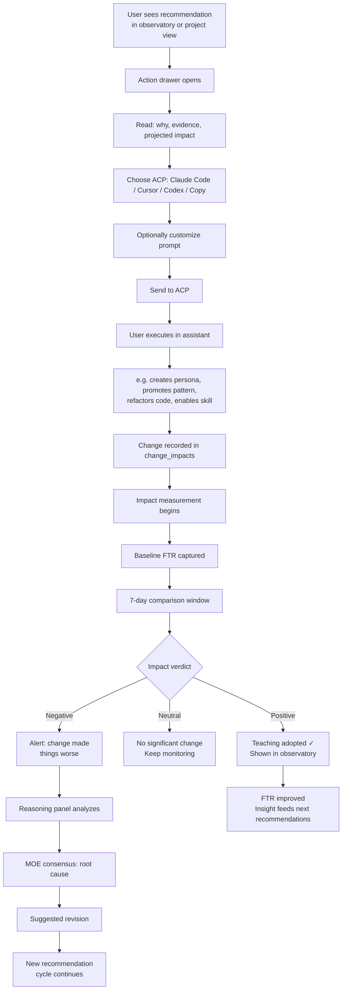
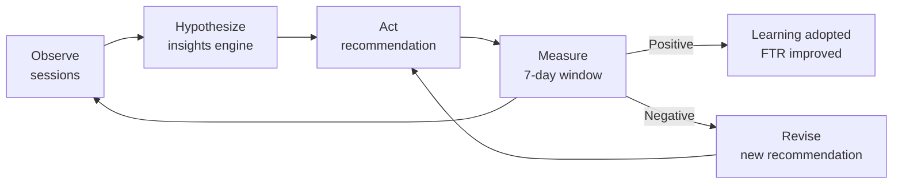

# Journey 6: Measure & Improve

> Close the loop: act on recommendations, measure impact, adjust if it didn't work.

## Flow



## Screens

### Action drawer (slide-out panel)

```
┌──────────────────────────────────────────────────────┐
│  Sensei recommends                              [✕]   │
│                                                       │
│  急  Write an auth integration-test persona           │
│                                                       │
│  Why:                                                 │
│  3 sessions corrected in lumen-auth in 7 days.        │
│  All touched refresh or device flow. No persona       │
│  covers this module yet.                              │
│                                                       │
│  Evidence:                                            │
│  • s-2891 — clock-skew tolerance missed               │
│  • s-2889 — device flow invented wrong test pattern   │
│  • s-2886 — cache invalidation missed                 │
│                                                       │
│  Impact: Projected FTR +14% in Lumen Cloud            │
│                                                       │
│  ─────────────────────────────────────────────────    │
│                                                       │
│  Send to:  [Claude Code ▾]  Cursor  Codex  Copy      │
│  CWD:      ~/work/lumen/lumen-auth                    │
│                                                       │
│  Prompt:                                              │
│  ┌────────────────────────────────────────────────┐   │
│  │ You are drafting a new Sensei persona for      │   │
│  │ Lumen Cloud's lumen-auth module.               │   │
│  │                                                │   │
│  │ Context:                                       │   │
│  │ - 3 recent sessions corrected issues in        │   │
│  │   refresh.ts, device-flow.ts.                  │   │
│  │ - Common failure: model forgets clock-skew     │   │
│  │   tolerance and existing retry strategy.       │   │
│  │ ...                                            │   │
│  └────────────────────────────────────────────────┘   │
│  824 chars                                            │
│                                                       │
│  [Launch in Claude Code →]                            │
└──────────────────────────────────────────────────────┘
```

**What the user does:** Read the reasoning. Choose ACP. Optionally edit the prompt. Launch.

### Change impact report (appears after 7-day measurement)

```
┌──────────────────────────────────────────────────────┐
│  Impact: auth-tests persona                           │
│  Added: 2026-04-23 · Measured: 7 days                 │
│                                                       │
│  ┌────────────────────────────────────────────────┐   │
│  │                Before       After      Delta   │   │
│  │  FTR           64%          78%        +14%  ↑ │   │
│  │  Corrections   3.2/session  1.1/session  -66%  │   │
│  │  search() use  47x/week     28x/week    -40%  │   │
│  │  Duration      44m avg      31m avg     -30%  │   │
│  │                                                │   │
│  │  Verdict: POSITIVE ✓                           │   │
│  └────────────────────────────────────────────────┘   │
│                                                       │
│  The persona provides enough auth context that the    │
│  assistant no longer needs to search() for basic      │
│  patterns. Clock-skew and mutex rules are followed    │
│  without correction.                                  │
└──────────────────────────────────────────────────────┘
```

### Negative impact alert

```
┌──────────────────────────────────────────────────────┐
│  ⚠ Impact alert: retry-backoff rule                   │
│  Added: 2026-04-20 · Measured: 5 days                 │
│                                                       │
│  FTR dropped 64% → 58% since this change.             │
│  Corrections increased from 2.1 to 3.4 per session.   │
│                                                       │
│  Reasoning panel analysis:                            │
│  ┌────────────────────────────────────────────────┐   │
│  │ gemma3:27b: The retry rule conflicts with the  │   │
│  │ existing skewTolerance logic in refresh.ts.    │   │
│  │                                                │   │
│  │ qwen3:14b: Agrees. Sessions correct the rule's │   │
│  │ guidance — assistant follows rule but user      │   │
│  │ overrides with existing pattern.               │   │
│  │                                                │   │
│  │ Consensus (high confidence):                   │   │
│  │ Revise rule to defer to existing retry pattern │   │
│  │ for clock-skew handling.                       │   │
│  └────────────────────────────────────────────────┘   │
│                                                       │
│  [Revise rule →]  [Revert change]  [Keep monitoring]  │
└──────────────────────────────────────────────────────┘
```

**What the user does:** Read the analysis. Choose to revise, revert, or keep monitoring.

## The continuous loop



## How to use

1. **See a recommendation** in observatory or project overview
2. **Click it** → action drawer opens with evidence and prompt
3. **Send to your ACP** → execute the change (create persona, promote pattern, etc.)
4. **Wait 7 days** → sensei measures the impact automatically
5. **Check the verdict** → positive (teaching adopted), neutral (keep watching), negative (revise)
6. **If negative** → read the reasoning panel analysis → revise or revert

## Mockup status

| Screen | Mockup exists? | What mockup covers | What's missing |
|--------|---------------|--------------------|---------------------------------|
| Action drawer | ✓ partial `project-shared.jsx` | ACP picker, prompt editor, evidence, launch button | Reasoning panel output not shown in mockup |
| Recommendation cards | ✓ `project-shared.jsx` + `data.js` | Urgency, title, why, impact, evidence, prompt | — |
| Change impact report | ✗ | — | **New screen needed:** before/after comparison, verdict, reasoning |
| Negative impact alert | ✗ | — | **New screen needed:** alert banner, MOE reasoning trace, revise/revert actions |
| Adopted teachings list | ✓ `observatory.jsx` | Compact list in observatory daily view | No detail view for individual teaching |

### Design brief for mockup changes

**Action drawer exists but needs extension:**
- Add reasoning panel output section (collapsible) — shows what local models concluded and why
- Add confidence indicator — "high confidence" vs "uncertain — two hypotheses"

**Change impact report (new):**
- Accessible from "Adopted teachings" in observatory, or from project recommendations
- Header: change name, date applied, measurement window
- Before/after table: FTR, corrections/session, key tool usage, duration
- Verdict badge: POSITIVE (jade) / NEUTRAL (grey) / NEGATIVE (amber)
- Reasoning summary: one paragraph explaining why the change helped/hurt
- Actions: if negative → [Revise] [Revert] [Keep monitoring]

**Negative impact alert (new):**
- Appears as a banner in observatory and project view when a change is hurting FTR
- Expandable: shows MOE reasoning trace (each model's analysis + consensus)
- Actions: [Revise rule] [Revert change] [Keep monitoring] [Dismiss]
