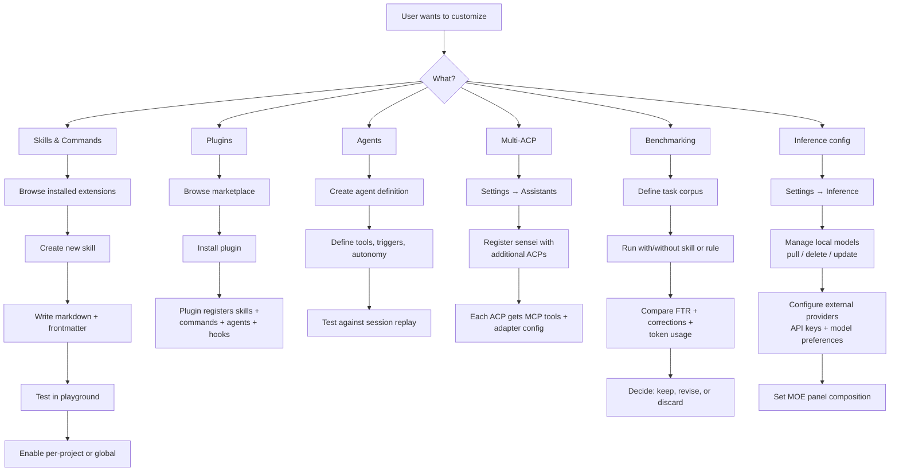

# Journey 7: Extend & Customize

> Custom skills, commands, agents, plugins. Multiple AI assistants. Benchmarking effectiveness.

## Flow



## Screens

### Extensions browser

```
┌──────────────────────────────────────────────────────┐
│  Skills & Plugins                                     │
│                                                       │
│  Filter: [All]  Skills  Commands  Agents  Plugins     │
│  Scope:  [Global]  Project: Lumen Cloud               │
│                                                       │
│  ┌────────────────────────────────────────────────┐   │
│  │ ● zero-errors-policy        skill   builtin    │   │
│  │   Enforces zero lint and test errors           │   │
│  │   Scope: global   Enabled: ☑                   │   │
│  ├────────────────────────────────────────────────┤   │
│  │ ● auth-tests                skill   local      │   │
│  │   Auth module persona for lumen-cloud          │   │
│  │   Scope: project  Enabled: ☑                   │   │
│  ├────────────────────────────────────────────────┤   │
│  │ ● sensei:build              command  builtin   │   │
│  │   TDD cycle with pattern enforcement           │   │
│  │   Scope: global   Enabled: ☑                   │   │
│  ├────────────────────────────────────────────────┤   │
│  │ ○ doc-drift-detector        skill   builtin    │   │
│  │   Detect and resolve stale docs                │   │
│  │   Scope: global   Enabled: ☐                   │   │
│  └────────────────────────────────────────────────┘   │
│                                                       │
│  [+ Create skill]  [+ Import plugin]                  │
└──────────────────────────────────────────────────────┘
```

### Skill editor

```
┌──────────────────────────────────────────────────────┐
│  Edit: auth-tests                                     │
│                                                       │
│  Frontmatter (parsed → props)                         │
│  ┌────────────────────────────────────────────────┐   │
│  │ name: auth-tests                               │   │
│  │ description: Use when working in lumen-auth    │   │
│  │   module on refresh or device flow code.       │   │
│  │ triggers:                                       │   │
│  │   - cwd: "*/lumen-auth/**"                     │   │
│  └────────────────────────────────────────────────┘   │
│                                                       │
│  Content (markdown body)                              │
│  ┌────────────────────────────────────────────────┐   │
│  │ # Auth Tests Persona                           │   │
│  │                                                │   │
│  │ ## Rules                                       │   │
│  │ - Always account for 30s clock-skew tolerance  │   │
│  │ - Use inFlightMutex for concurrent refresh     │   │
│  │ - Integration tests hit real database          │   │
│  │ ...                                            │   │
│  └────────────────────────────────────────────────┘   │
│                                                       │
│  [Save]  [Export as .md]  [Test in playground]         │
└──────────────────────────────────────────────────────┘
```

### Inference settings

```
┌──────────────────────────────────────────────────────┐
│  Settings → Inference                                 │
│                                                       │
│  Local models (Ollama)                                │
│  ┌────────────────────────────────────────────────┐   │
│  │ ● gemma3:27b    16.0 GB  reasoning      active │   │
│  │ ● qwen3:14b      8.7 GB  second opinion active │   │
│  │ ○ llama4-scout   —        not pulled            │   │
│  │                            [Pull 10.2 GB]       │   │
│  └────────────────────────────────────────────────┘   │
│                                                       │
│  MOE reasoning panel                                  │
│  Proposer:    [gemma3:27b ▾]                          │
│  Challenger:  [qwen3:14b ▾]                           │
│  Synthesizer: [gemma3:27b ▾]  or external ▾           │
│                                                       │
│  External providers                                   │
│  ┌────────────────────────────────────────────────┐   │
│  │ ● Anthropic  ANTHROPIC_API_KEY  ✓ configured   │   │
│  │ ○ OpenAI     [Enter API key]                   │   │
│  │ ○ Custom     [Configure endpoint]              │   │
│  └────────────────────────────────────────────────┘   │
│                                                       │
│  Routing: [Auto]  Always local  Always external       │
│  Auto = local for simple tasks, external for complex  │
└──────────────────────────────────────────────────────┘
```

### Benchmark runner

```
┌──────────────────────────────────────────────────────┐
│  Benchmark: auth-persona effectiveness                │
│                                                       │
│  Task corpus: 5 auth-related tasks from lumen-cloud   │
│  Variant A: without auth-tests persona                │
│  Variant B: with auth-tests persona                   │
│                                                       │
│  Results:                                             │
│  ┌────────────────────────────────────────────────┐   │
│  │              Variant A    Variant B    Delta    │   │
│  │  FTR         40%          80%          +40%    │   │
│  │  Corrections 2.4 avg      0.6 avg      -75%   │   │
│  │  Tokens      42k avg      31k avg      -26%   │   │
│  │  Duration    38m avg      24m avg      -37%   │   │
│  └────────────────────────────────────────────────┘   │
│                                                       │
│  Conclusion: persona significantly improves FTR       │
│  for auth tasks. Token reduction is secondary benefit.│
│                                                       │
│  [Promote to permanent]  [Run again]  [Discard]       │
└──────────────────────────────────────────────────────┘
```

## How to use

1. **Create a skill** — Extensions → Create → write markdown → test → enable
2. **Install a plugin** — Extensions → Import → marketplace or git URL
3. **Configure inference** — Settings → Inference → pull models, add API keys, set MOE panel
4. **Add an ACP** — Settings → Assistants → register sensei with a new AI tool
5. **Benchmark a change** — define task corpus → run A/B → compare FTR + corrections
6. **Export/import skills** — Extensions → Export as .md or Import from .md

## Additional screens (not yet in mockups)

### Agent editor (idea 21)

**Purpose:** Define autonomous agents that can run multi-step tasks (review, build, analysis).

**Content needed:**
- Agent name, description, trigger conditions (manual, scheduled, event-driven)
- Tool access list: which MCP tools the agent can call
- Autonomy level: fully autonomous, requires approval at checkpoints, manual-only
- Template library: pre-built agents for common tasks (code review, test generation, doc update)
- Test: run agent against a session replay to see what it would do

**User flow:** Extensions → Agents → Create → define tools + triggers → test against replay → enable

### Persona editor (idea 23)

**Purpose:** Create project-specific personas with trigger conditions, rules, and context.

**Content needed:**
- Persona name, description, trigger (cwd pattern, file type, module name)
- Rules list: what the assistant should know/follow when this persona is active
- Context: files to always include, patterns to enforce
- Derived from: which sessions/corrections inspired this persona (evidence trail)
- Test: preview what `get_session_context()` returns when this persona fires

**User flow:** Extensions → Personas → Create → set triggers + rules → link evidence → test → enable

### Multi-ACP configuration (idea 12)

**Purpose:** Manage per-ACP adapter settings — how sensei registers with each AI assistant.

**Content needed:**
- List of detected ACPs with registration status
- Per-ACP detail: what's registered (MCP server, plugin, skills, hooks, logging)
- Re-register action: if adapter config changed, re-run registration
- Test connection: verify MCP server is reachable from this ACP
- ACP-specific settings: some ACPs need different MCP transport (stdio vs HTTP)

**User flow:** Settings → Assistants → click ACP → see registration detail → re-register if needed

---

## Mockup status

| Screen | Mockup exists? | What mockup covers | What's missing |
|--------|---------------|--------------------|---------------------------------|
| Extensions browser | ✗ | — | **New screen needed:** filter by kind, scope, source; enable/disable; create/import |
| Skill editor | ✗ | — | **New screen needed:** frontmatter editor + markdown body + test + export |
| Agent editor | ✗ | — | **New screen needed:** tool access, triggers, autonomy, test against replay |
| Persona editor | ✗ | — | **New screen needed:** trigger conditions, rules, evidence trail, preview |
| Inference settings | ✗ | — | **New screen needed:** model management, MOE panel config, external providers |
| Multi-ACP config | ✓ partial `setup-wizard.jsx` | ACP detection + checkbox in wizard step 2 | Per-ACP detail view, re-register, test connection, transport config |
| Benchmark runner | ✗ | — | **New screen needed:** task corpus definition, A/B variants, results comparison |

### Design brief for missing screens

**Extensions browser:**
- Global page (not project-scoped). Accessible from sidebar.
- Filter bar: All / Skills / Commands / Agents / Hooks / Plugins
- Scope filter: Global / Project: [dropdown]
- Each row: icon, name, kind badge, source badge (builtin/marketplace/local), scope, enabled toggle
- Actions: + Create skill, + Create agent, + Import plugin
- Click row → opens editor for that extension type

**Skill editor:**
- Two-pane: top = frontmatter (structured form: name, description, triggers), bottom = markdown body (code editor)
- Toolbar: Save, Export as .md, Import from .md, Test in playground
- Preview panel: what `get_session_context()` returns when this skill is active
- Round-trip: edit in UI → save to DB; export to .md file → import back

**Agent editor:**
- Structured form: name, description, trigger (manual/scheduled/event-driven)
- Tool access: checklist of available MCP tools this agent can call
- Autonomy: radio — fully autonomous / checkpoint approval / manual only
- Template selector: start from a pre-built template (code reviewer, test generator, doc updater)
- Test panel: pick a session replay → run agent against it → see what actions it would take

**Persona editor:**
- Similar to skill editor but focused on personas
- Trigger section: cwd glob patterns, file type filters, module name patterns
- Rules section: list of rules (add/remove/reorder)
- Evidence section: which sessions/corrections this persona addresses (linked from recommendations)
- Preview: simulate `get_session_context()` with this persona active → show what the assistant would see

**Inference settings:**
- Local models section: list of pulled models with size, status (active/not pulled), pull/delete actions
- MOE panel config: 3 dropdowns (proposer, challenger, synthesizer) — select from local or external models
- External providers: table of configured providers with API key status, test connection button
- Routing preference: Auto / Always local / Always external

**Benchmark runner:**
- Create benchmark: name, task corpus (list of task descriptions), project scope
- Variants: A (baseline — no change), B (with change — skill/rule/persona)
- Run: executes tasks with each variant, captures FTR + corrections + tokens + duration
- Results: side-by-side comparison table + conclusion text
- Actions: Promote change to permanent / Run again / Discard
