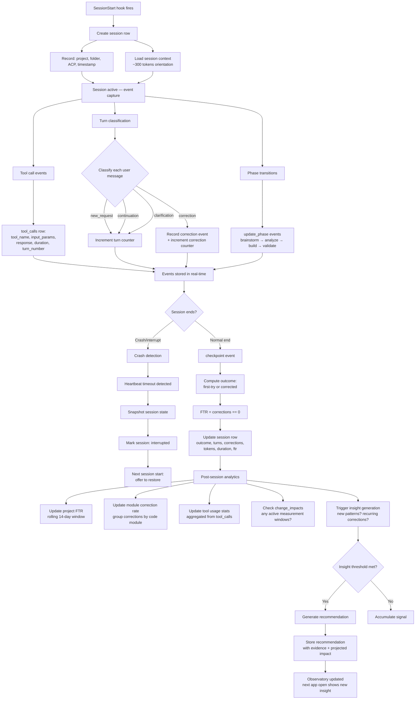
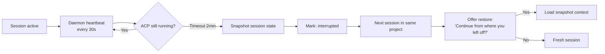

# System: Session Lifecycle

> What happens behind the scenes during and after an AI coding session.

## Lifecycle flow



## Turn classification (idea 04, 07)

Every user message is classified to determine if it's a correction (affects FTR) or normal flow.

| Classification | Signal | Affects FTR? |
|---------------|--------|-------------|
| `new_request` | New task or sub-task | No |
| `continuation` | "yes", "go ahead", "looks good" | No |
| `correction` | "no", "not that", "use X instead", reverts code | Yes |
| `clarification` | Question about scope, requirements | No |

**Classification method:**
- Phase 1: Regex heuristics (keywords, patterns)
- Phase 2: Local model classification (gemma3) — more accurate

### Correction detail capture

When a correction is detected:
```json
{
  "turn": 5,
  "type": "correction",
  "text": "account for 30s clock skew per SDK 4.2",
  "module": "auth/refresh.ts",
  "tool_before": "search('refresh token')",
  "tool_after": "search('clock skew tolerance')"
}
```

This feeds the module correction rate and recommendation engine.

## Crash recovery (idea 11)



**Snapshot includes:**
- Active phase and task
- Files being edited
- Last tool calls and their results
- Uncommitted decisions

## Post-session analytics pipeline

After every session completes, these run:

| Step | Input | Output | Latency |
|------|-------|--------|---------|
| FTR computation | Session corrections count | `session.ftr` boolean | Immediate |
| Project FTR update | All sessions in 14-day window | Project FTR trend | < 1s |
| Module correction rate | Corrections grouped by file path | Per-module rate | < 1s |
| Tool usage aggregation | `tool_calls` rows | Usage frequency map | < 1s |
| Change impact check | Active `change_impacts` rows | Updated current metrics | < 1s |
| Insight generation | Accumulated signals | New recommendations | 1-5s (may use local model) |

## Tables written

`sessions`, `events`, `tool_calls`, `change_impacts` (updated), recommendations (generated)
