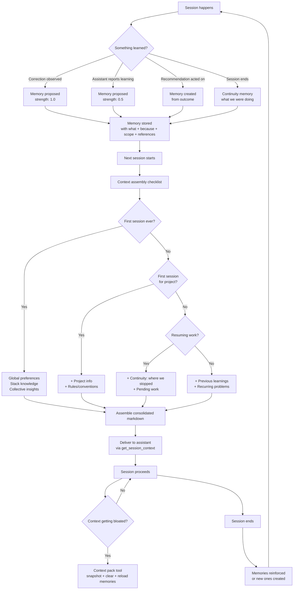
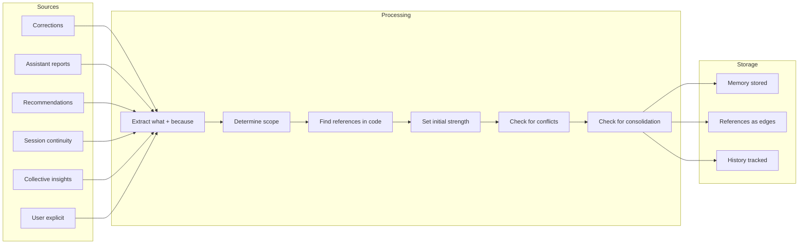
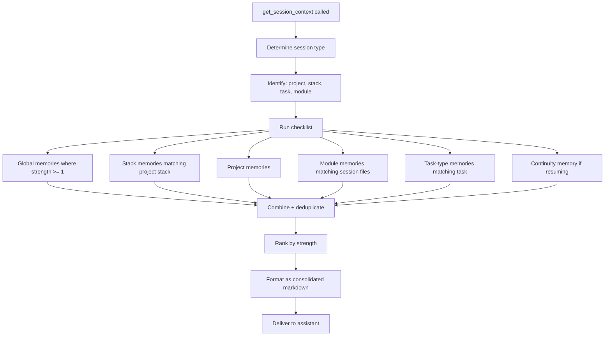
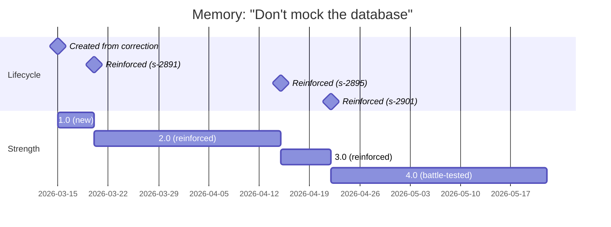

# Journey 9: Memory & Learning

> Sensei learns from every session. Memories accumulate, strengthen, surface contextually. Users review, validate, and consolidate what sensei has learned.

## Flow

## Screens

### Observatory — Memory indicator

**What to show:**
- Section title with active/pending memory counts
- 3-5 most recent memories, each with: age, scope, strength (dot indicator), title, reinforcement count, source session
- Pending validation items: assistant-proposed memories with a warning badge
- Actions per pending item: Validate, Enhance, Dismiss
- Link to full memory view

**User interaction:**
- Scan recent learnings at a glance
- Validate or dismiss assistant-proposed memories
- Click through to the full project memory view

**Why:** Surface what sensei has learned in the daily observatory view so the user stays aware of accumulating knowledge and can validate uncertain memories quickly.

---

### Project view — Memory section

**What to show:**
- Filter bar: scope (all, project, module, task-type, stack), status (active, pending, archived), sort (strength, recent, category)
- Memory list, each item showing: strength dots, title, truncated "because" reasoning, scope tags, module tags, task-type tags, reinforcement count, violation count, age, reference count (good examples + bad examples)
- Actions per memory: View, Edit, Archive
- Consolidation suggestions section: MOE-proposed merges showing which memories can be combined, the proposed core concept, and a link to review
- Memory stats: active count, pending count, archived count, strongest memory, most-referenced memory, conflict count

**User interaction:**
- Filter and sort memories
- Validate assistant-proposed memories
- Edit "because" reasoning or scope
- Archive memories that no longer apply
- Review MOE consolidation suggestions
- View stats to understand memory health

**Why:** Give the user a complete view of everything sensei has learned about this project, with tools to curate, validate, and consolidate that knowledge.

---

### Memory detail (drill-in)

**What to show:**
- Memory title, strength (dots + numeric), status, category, creation date
- Full "because" text: the reasoning behind this memory, including the incident that created it
- Scope breakdown: project, modules, task types
- References: good examples (file:line with snippet description), bad examples (file:line with snippet description), evidence sessions (session IDs)
- Reinforcement history: chronological list of events (created, reinforced, edited) with dates and session IDs
- Original correction quote if created from a user correction

**User interaction:**
- Click references to navigate to code locations
- Edit the "because" reasoning or scope
- Convert the memory to a permanent project guideline (max strength, non-decaying)
- Archive if no longer relevant

**Why:** Let the user understand the full story behind a memory — why it exists, how it was reinforced, and what code it applies to — so they can make informed decisions about keeping, editing, or promoting it.

---

### Memory consolidation review

**What to show:**
- Source memories: list of memories being merged, each with title and current strength
- Proposed consolidated memory: title, combined rules/content, merged "because" reasoning, combined evidence
- Combined strength: highest of the source memories
- Note that original memories will be archived upon acceptance

**User interaction:**
- Review the proposed merge
- Edit the consolidated text before accepting
- Accept (archives originals, creates merged memory)
- Keep separate (dismiss the suggestion)

**Why:** Prevent memory bloat by letting the MOE panel suggest merges of related memories, with full user control over the final result.

---

### Context pack tool (mid-session)

**What to show:**
- Current progress snapshot: what the user is working on, what's completed, what's pending, what files are in-flight
- Memories to reload: grouped by scope (global, project, module, task-type) with counts
- Noise to clear: stale file reads and accumulated context that will be removed
- What will be kept: snapshot + memories + active files

**User interaction:**
- Trigger when a session feels sluggish or the assistant starts forgetting rules
- Review what will be snapshot and what will be cleared
- Execute the rotation or cancel

**Why:** Give users a way to reset a bloated session context without losing progress or accumulated memories. Sensei snapshots the current state, clears noise, and reloads relevant memories.

---

## How it works

### Memory creation pipeline

### Memory retrieval for sessions

### Memory lifecycle over time

## How to use

1. **Do nothing** — memories accumulate automatically from corrections and session activity.
2. **Validate** — when the assistant proposes a memory, review and validate from observatory or project view.
3. **Enhance** — edit the "because" reasoning or adjust scope when a memory is too narrow or too broad.
4. **Consolidate** — review MOE suggestions to merge related memories into concise knowledge.
5. **Rotate context** — in long sessions, trigger the context pack tool to snapshot and reload with fresh memories.
6. **Convert to guideline** — promote a battle-tested memory to a permanent project rule.
