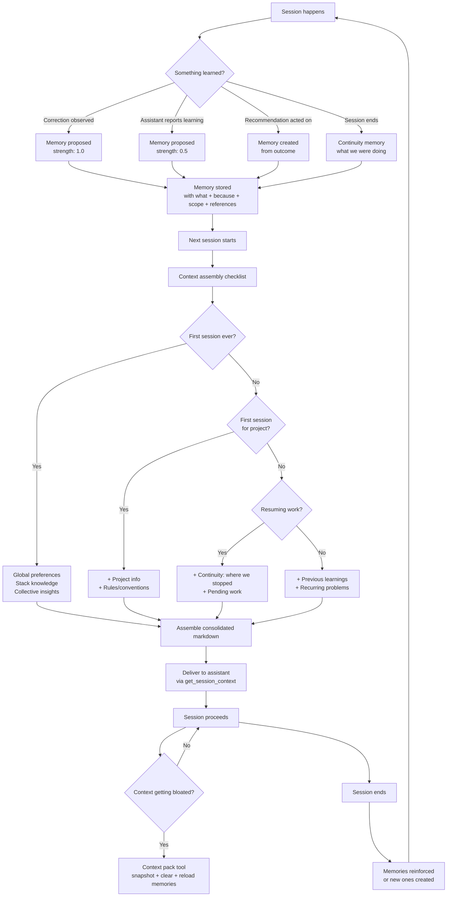
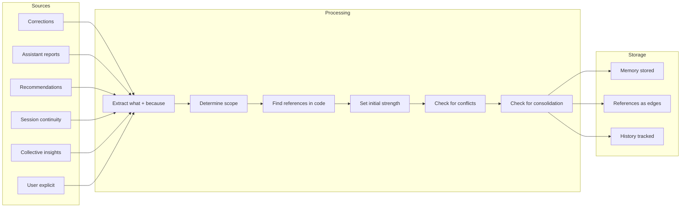
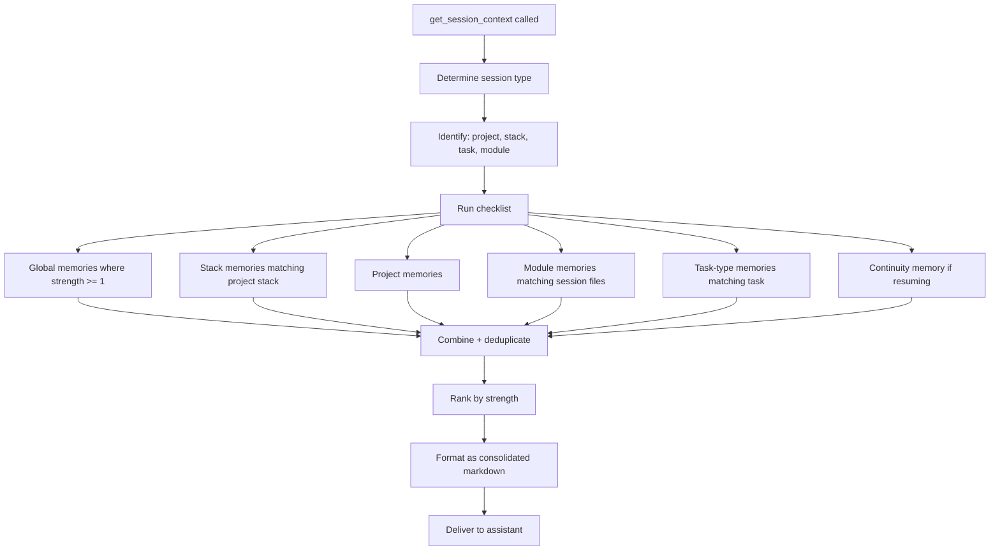
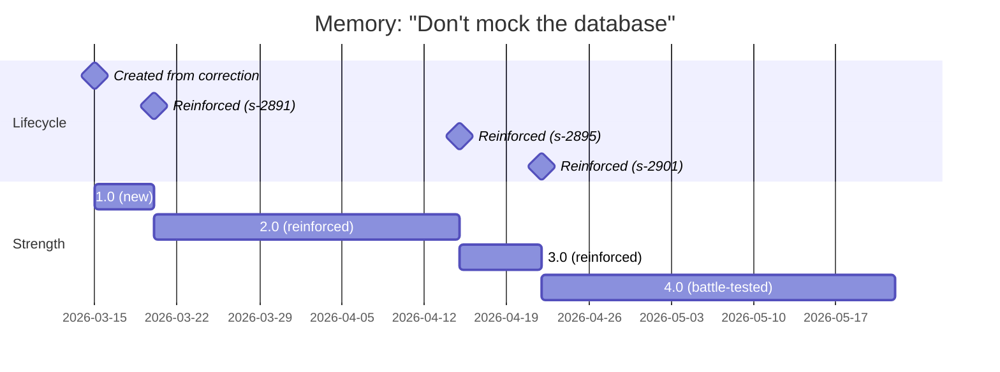

# Journey 9: Memory & Learning

> Sensei learns from every session. Memories accumulate, strengthen, surface contextually. Users review, validate, and consolidate what sensei has learned.

## Flow



## Screens

### Observatory — Memory indicator

Memory surfaces in the observatory daily view as part of the "system has learned" section.

```
┌──────────────────────────────────────────────────────┐
│  System has learned                                   │
│                                                       │
│  ▎ 2d ago · lumen-cloud · strength 4                 │
│    Don't mock the database in integration tests       │
│    3x reinforced · 0 violations                       │
│                                                       │
│  ▎ 5d ago · global · strength 3                      │
│    Check clock-skew tolerance in refresh flows        │
│    2x reinforced · from s-2891                        │
│                                                       │
│  ▎ new · lumen-cloud · strength 0.5                  │
│    ⚠ Assistant learned: cache invalidation before     │
│    token rotation — awaiting validation               │
│    [Validate]  [Enhance]  [Dismiss]                   │
│                                                       │
│  42 active memories · 3 pending validation            │
│  [View all memories]                                  │
└──────────────────────────────────────────────────────┘
```

**What the user does:** Scan recent learnings. Validate assistant-proposed memories. Click through to full memory view.

### Project view — Memory section

New section in the project view alongside Overview, Graph, Patterns, Sessions, Settings.

```
┌──────────────────────────────────────────────────────┐
│  雲 Lumen Cloud · Memories                            │
│                                                       │
│  Scope: [All]  Project  Module  Task-type  Stack      │
│  Status: [Active]  Pending  Archived                  │
│  Sort: [Strength ▾]  Recent  Category                 │
│                                                       │
│  ┌────────────────────────────────────────────────┐   │
│  │ ●●●●○  Don't mock the database in             │   │
│  │        integration tests                       │   │
│  │        because: mock/prod divergence masked    │   │
│  │        broken migration (Q1 2026)              │   │
│  │        scope: project · modules: database,     │   │
│  │        migration · task: test, fix             │   │
│  │        3x reinforced · 0 violations · 47d old  │   │
│  │        refs: 2 good examples · 1 bad example   │   │
│  │        [View]  [Edit]  [Archive]               │   │
│  ├────────────────────────────────────────────────┤   │
│  │ ●●●○○  Use adapter pattern for auth            │   │
│  │        because: inline auth diverges — sync.ts │   │
│  │        missed audit log (s-2891)               │   │
│  │        scope: project · modules: auth/*        │   │
│  │        2x reinforced · 0 violations · 23d old  │   │
│  │        refs: auth_adapter.rs:14 (good)         │   │
│  │              handlers/auth.ts:42 (bad)          │   │
│  │        [View]  [Edit]  [Archive]               │   │
│  ├────────────────────────────────────────────────┤   │
│  │ ●○○○○  ⚠ Cache invalidation before rotation   │   │
│  │        (pending validation — assistant learned) │   │
│  │        [Validate]  [Enhance]  [Dismiss]        │   │
│  └────────────────────────────────────────────────┘   │
│                                                       │
│  ─────────────────────────────────────────────────    │
│                                                       │
│  Consolidation suggestions (from MOE panel)           │
│  ┌────────────────────────────────────────────────┐   │
│  │ 📎 3 memories about auth can be consolidated:  │   │
│  │    "adapter pattern" + "clock-skew" + "mutex"  │   │
│  │    → Core concept: "Auth module conventions"   │   │
│  │    [Review consolidation]                      │   │
│  └────────────────────────────────────────────────┘   │
│                                                       │
│  Memory stats                                         │
│  42 active · 3 pending · 12 archived                  │
│  Strongest: "Don't mock DB" (4.0)                     │
│  Most referenced: "Adapter pattern" (6 sessions)      │
│  Conflict detected: 0                                 │
└──────────────────────────────────────────────────────┘
```

**What the user does:**
1. Browse memories by scope, status, strength
2. Validate assistant-proposed memories
3. Edit "because" reasoning or scope
4. Archive memories that no longer apply
5. Review MOE consolidation suggestions
6. View memory stats — what's strongest, most referenced

### Memory detail (drill-in)

```
┌──────────────────────────────────────────────────────┐
│  Memory: Don't mock the database in integration tests │
│                                                       │
│  Strength: ●●●●○ (4.0)    Status: active             │
│  Category: correctness     Created: 2026-03-15        │
│                                                       │
│  Because:                                             │
│  Q1 2026: mocked tests passed but prod migration      │
│  failed. Three days of debugging. The mock diverged   │
│  from actual PostgreSQL behavior on nullable FKs.     │
│                                                       │
│  Scope:                                               │
│  Project: lumen-cloud                                 │
│  Modules: database/*, migration/*                     │
│  Task types: test, fix                                │
│                                                       │
│  ─────────────────────────────────────────────────    │
│                                                       │
│  References                                           │
│  ✓ Good: tests/integration/auth_flow.rs:28            │
│    "Real DB connection with test transaction"          │
│  ✗ Bad: tests/unit/mock_refresh.rs:14                 │
│    "Mocked DB — missed nullable FK behavior"          │
│  📝 Evidence: sessions s-2891, s-2895, s-2901         │
│                                                       │
│  ─────────────────────────────────────────────────    │
│                                                       │
│  History                                              │
│  2026-04-22 · reinforced (session s-2901)             │
│  2026-04-15 · reinforced (session s-2895)             │
│  2026-03-20 · reinforced (session s-2891)             │
│  2026-03-15 · created from correction                 │
│    user: "no, don't mock the database"                │
│                                                       │
│  [Edit]  [Archive]  [Convert to guideline]            │
└──────────────────────────────────────────────────────┘
```

**What the user does:**
1. Read the full reasoning and history
2. Click references to navigate to code
3. Edit the "because" or scope if it needs refinement
4. Convert to a project guideline (permanent, max strength)
5. Archive if no longer relevant

### Memory consolidation review

```
┌──────────────────────────────────────────────────────┐
│  Consolidation: Auth module conventions               │
│                                                       │
│  MOE panel suggests merging 3 memories:               │
│                                                       │
│  Source memories:                                      │
│  1. "Use adapter pattern for auth" (strength 3)       │
│  2. "Check clock-skew tolerance" (strength 4)         │
│  3. "Use inFlightMutex for concurrent refresh" (2)    │
│                                                       │
│  Proposed consolidated memory:                        │
│  ┌────────────────────────────────────────────────┐   │
│  │ Auth module conventions                        │   │
│  │                                                │   │
│  │ All auth integrations use the adapter pattern  │   │
│  │ (see auth_adapter.rs:14). Key rules:           │   │
│  │ - 30s clock-skew tolerance for token flows     │   │
│  │ - inFlightMutex for concurrent refresh ops     │   │
│  │ - Never inline auth logic in handlers          │   │
│  │                                                │   │
│  │ Because: inline auth diverges (sync.ts missed  │   │
│  │ audit log), clock-skew causes TokenExpiredError │   │
│  │ at +3s offset, concurrent refresh without      │   │
│  │ mutex causes race conditions.                  │   │
│  │ Evidence: s-2891, s-2895, s-2901 (3 sessions)  │   │
│  └────────────────────────────────────────────────┘   │
│                                                       │
│  Combined strength: 4.0 (highest of sources)          │
│  Original memories will be archived.                  │
│                                                       │
│  [Accept consolidation]  [Edit first]  [Keep separate]│
└──────────────────────────────────────────────────────┘
```

**What the user does:** Review the proposed merge. Accept, edit, or keep memories separate.

### Context pack tool (mid-session)

When context gets bloated in a long session, the assistant or user triggers a context rotation:

```
┌──────────────────────────────────────────────────────┐
│  Context rotation                                     │
│                                                       │
│  Current session context is large. Sensei can:        │
│                                                       │
│  1. Snapshot current progress                         │
│     ✓ Working on: inFlightMutex implementation        │
│     ✓ Completed: skewTolerance, tests passing         │
│     ✓ Pending: mutex implementation, integration test │
│     ✓ In-flight: auth/refresh.ts                      │
│                                                       │
│  2. Reload relevant memories                          │
│     → 5 global memories                               │
│     → 8 project memories (lumen-cloud)                │
│     → 3 module memories (auth/refresh.ts)             │
│     → 2 task-type memories (fix)                      │
│                                                       │
│  3. Clear accumulated noise                           │
│     → Remove stale file reads from context             │
│     → Keep: snapshot + memories + active files         │
│                                                       │
│  [Rotate context now]  [Cancel]                       │
└──────────────────────────────────────────────────────┘
```

**What the user does:** Trigger when session feels sluggish or assistant starts forgetting rules. Sensei snapshots, clears, and reloads with fresh memories.

## How it works

### Memory creation pipeline



### Memory retrieval for sessions



### Memory lifecycle over time



## How to use

1. **Do nothing** — memories accumulate automatically from corrections and session activity
2. **Validate** — when assistant proposes a memory, review and validate from observatory or project view
3. **Enhance** — edit the "because" reasoning or adjust scope when a memory is too narrow/broad
4. **Consolidate** — review MOE suggestions to merge related memories into concise knowledge
5. **Rotate context** — in long sessions, trigger context pack tool to snapshot + reload with fresh memories
6. **Convert to guideline** — promote a battle-tested memory to a permanent project rule

## Mockup status

| Screen | Mockup exists? | What's missing |
|--------|---------------|----------------|
| Observatory memory indicator | ✗ | **New section** in daily view — recent learnings, pending validation, memory stats |
| Project memory view | ✗ | **New section** in project view — filter/sort memories, validate, consolidate |
| Memory detail | ✗ | **New screen** — full reasoning, references to code, reinforcement history |
| Memory consolidation | ✗ | **New screen** — MOE-proposed merge, preview, accept/edit/keep separate |
| Context pack tool | ✗ | **New screen** (or modal) — snapshot summary, memory reload preview, rotate action |

### Design brief for missing screens

**Observatory memory indicator:**
- Part of "system has learned" section in observatory daily view
- Shows 3-5 most recent memories with strength indicators (● dots)
- Pending validation items have ⚠ badge and Validate/Enhance/Dismiss actions
- Count: "42 active · 3 pending · [View all]"

**Project memory view:**
- New tab in project view: Overview / Graph / Patterns / **Memories** / Sessions / Settings
- Filter bar: scope (all, project, module, task-type, stack) + status (active, pending, archived) + sort
- Each memory shows: strength dots, title, truncated "because", scope tags, reinforcement count, age, reference count
- Actions per memory: View, Edit, Archive
- Bottom section: MOE consolidation suggestions + memory stats

**Memory detail:**
- Drill-in from project memory list or observatory
- Full "because" text, scope breakdown, reference list with clickable code links
- Reinforcement history timeline
- Actions: Edit, Archive, Convert to guideline

**Memory consolidation:**
- Triggered from project memory view when MOE suggests a merge
- Shows source memories side by side with proposed consolidated version
- User can edit the consolidated text before accepting
- Accept archives originals, creates merged memory with combined strength

**Context pack tool:**
- Modal triggered by assistant or user during a session
- Shows: current progress snapshot, memories to reload (grouped by scope), noise to clear
- Single "Rotate context now" action
