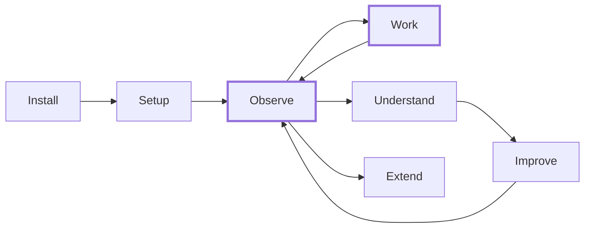

# Journeys

How users experience sensei, and what the system does behind the scenes. Each journey references the [ideas](../ideas/) it covers.

For conceptual depth, see [ideas](../ideas/). For implementation detail, see [design](../design/).

---

## The arc

New users move left to right. Returning users live in the **Observe → Work → Improve** loop.

---

## User journeys

| # | Journey | Screens | Ideas covered |
|---|---------|---------|---------------|
| 1 | [Install & Bootstrap](./01-install-bootstrap.md) | Bootstrap, homebrew-missing | 26, 03 |
| 2 | [Setup & Discovery](./02-setup-discovery.md) | Welcome, assistants, folders, scan, projects, libraries, MCP registry, inference, enter | 24, 16, 09, 12, 20 |
| 3 | [Observe & Orient](./03-observe-orient.md) | Observatory (early + mature modes) | 24, 07, 10 |
| 4 | [Work with Assistants](./04-work-with-assistants.md) | In-ACP (invisible — no sensei screens) | 01, 02, 04, 11, 23, 14 |
| 5 | [Understand the Codebase](./05-understand-codebase.md) | Project overview, code graph, patterns, sessions, replay, libraries, playground, doc traceability, pattern catalog, tool analytics | 08, 15, 17, 09, 13, 25, 10 |
| 6 | [Measure & Improve](./06-measure-improve.md) | Action drawer, change impact report, negative impact alert | 07, 25, 20 |
| 9 | [Memory & Learning](./09-memory-and-learning.md) | Observatory memory panel, project memory view, memory detail, consolidation, context pack tool | 30, 27, 11 |
| 7 | [Extend & Customize](./07-extend-customize.md) | Extensions browser, skill editor, agent editor, persona editor, inference settings, multi-ACP config, benchmark runner | 12, 21, 23, 19, 20, 24b |

## System journeys

Behind-the-scenes pipelines with no user-facing screens. Triggered by user actions or schedules.

| Journey | Triggered by | Ideas covered |
|---------|-------------|---------------|
| 01 | [Indexing Pipeline](./08-system-pipelines/01-indexing-pipeline.md) | Scan, watcher events, manual re-index | 08, 22, 14, 18, 09, 20 |
| 02 | [Session Lifecycle](./08-system-pipelines/02-session-lifecycle.md) | Session start/end in ACP | 11, 07, 04, 01 |
| 03 | [Workspace Intelligence](./08-system-pipelines/03-workspace-intelligence.md) | Post-indexing, scheduled, on-demand | 16, 13, 17, 18 |

---

## Coverage matrix

Every idea is covered by at least one journey.

| Idea | Title | User journey | System journey |
|------|-------|-------------|----------------|
| 01 | Workflow System | J4 | Session Lifecycle |
| 02 | Commands | J4 | — |
| 03 | Configuration | J1, J7 | — |
| 04 | Cross-Cutting Concerns | J4 | Session Lifecycle |
| 05 | Decisions | Reference — no journey needed | — |
| 06 | Docs Disposition | Reference — no journey needed | — |
| 07 | Metrics & Analytics | J3, J6 | Session Lifecycle |
| 08 | Codebase Intelligence | J5 | Indexing Pipeline |
| 09 | Library Intelligence | J2, J5 | Indexing Pipeline |
| 10 | Visualization & Dashboard | J3, J5 | — |
| 11 | Session Continuity | J4, J9 | Session Lifecycle |
| 12 | Multi-Coordinator Support | J2, J7 | — |
| 13 | Doc Traceability | J5 | Workspace Intelligence |
| 14 | Context Delivery | J4 | Indexing Pipeline |
| 15 | Pattern Store | J5 | — |
| 16 | Workspace & System Intelligence | J2 | Workspace Intelligence |
| 17 | Pattern Knowledge | J5 | Workspace Intelligence |
| 18 | Testability & TDD | — | Indexing Pipeline, Workspace Intelligence |
| 19 | Benchmarking & Credibility | J7 | — |
| 20 | Local Inference | J2, J7 | Indexing Pipeline |
| 21 | Custom Agents | J7 | — |
| 22 | Adapter IR | — | Indexing Pipeline |
| 23 | Personas & Mindsets | J4, J7 | — |
| 24 | Desktop Observatory | J2, J3 | — |
| 24a | Observatory Data Audit | Reference — no journey needed | — |
| 24b | Capability Registry | J7 | — |
| 25 | Playground & Insights Engine | J5, J6 | — |
| 26 | Bootstrap & Dependencies | J1 | — |
| 27 | Developer Preferences | J4, J7, J9 | Session Lifecycle |
| 28 | Inference Gateway | J2, J7 | Indexing Pipeline, Session Lifecycle |
| 29 | Collective Intelligence Network | J9 | — |
| 30 | Contextual Memory | J9 | Session Lifecycle |

---

## Mockup coverage

Summary of which screens exist in the current mockups (`docs/design/02-desktop/setup/lib/`) and which need design work.

### Screens with existing mockups

| Screen | Mockup file | Journey |
|--------|------------|---------|
| Setup wizard (9 steps) | `setup-wizard.jsx` | J2 |
| Observatory (early + mature) | `observatory.jsx` | J3 |
| Project overview | `project-shared.jsx` | J5 |
| Code graph (3 lens, 5 overlays) | `project-shared.jsx` | J5 |
| Patterns + anti-patterns | `project-shared.jsx` | J5 |
| Recommendations + action drawer | `project-shared.jsx` | J5, J6 |
| Project settings (2 variants) | `project-shared.jsx` | J5 |
| Libraries (2 variants) | `libraries.jsx` | J5 |
| MCP playground (partial) | `libraries.jsx` | J5 |
| Navigation (3 variants) | `navigation.jsx` | J3 |
| Design tokens + primitives | `tokens.css`, `primitives.jsx` | All |

### Screens needing new mockups

| Screen | Journey | Design brief in |
|--------|---------|----------------|
| Bootstrap startup screen | J1 | [J1 mockup status](./01-install-bootstrap.md#mockup-status) |
| Inference config (wizard step) | J2 | [J2 mockup status](./02-setup-discovery.md#mockup-status) |
| Session replay | J5 | [J5 mockup status](./05-understand-codebase.md#mockup-status) |
| Doc traceability | J5 | [J5 mockup status](./05-understand-codebase.md#mockup-status) |
| Pattern catalog (industry) | J5 | [J5 mockup status](./05-understand-codebase.md#mockup-status) |
| Tool usage analytics | J5 | [J5 mockup status](./05-understand-codebase.md#mockup-status) |
| Change impact report | J6 | [J6 mockup status](./06-measure-improve.md#mockup-status) |
| Negative impact alert | J6 | [J6 mockup status](./06-measure-improve.md#mockup-status) |
| Extensions browser | J7 | [J7 mockup status](./07-extend-customize.md#mockup-status) |
| Skill editor | J7 | [J7 mockup status](./07-extend-customize.md#mockup-status) |
| Agent editor | J7 | [J7 mockup status](./07-extend-customize.md#mockup-status) |
| Persona editor | J7 | [J7 mockup status](./07-extend-customize.md#mockup-status) |
| Inference settings | J7 | [J7 mockup status](./07-extend-customize.md#mockup-status) |
| Multi-ACP config | J7 | [J7 mockup status](./07-extend-customize.md#mockup-status) |
| Benchmark runner | J7 | [J7 mockup status](./07-extend-customize.md#mockup-status) |

Each "mockup status" section in the journey docs includes a **design brief** with enough context to hand to an LLM designer for mockup creation.
