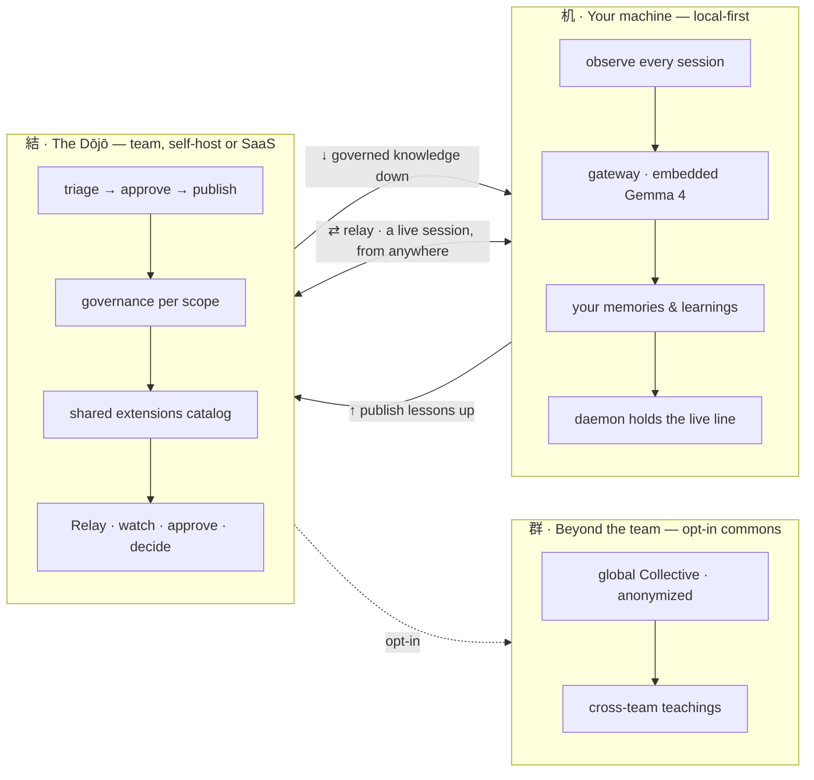
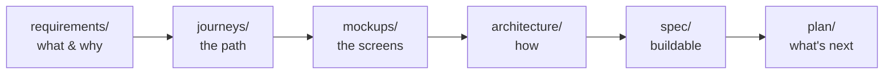

# Journeys

> **The visual perspective.** The flows a human walks through sensei — drawn as
> diagrams so the shape is obvious at a glance. Journeys sit between the
> [requirements](../requirements/README.md) (what/why) and the
> [mockups](../mockups/) (pixel-level screens): they show *how the segments
> connect into a path*.

## The whole loop — machine → Dōjō → beyond

The personal journey ([`sensei.md`](sensei.md)) and the team journey
([`dojo.md`](dojo.md)) are **two halves of one loop**, not two products. Knowledge
travels **up** (you publish a lesson), governed practice comes back **down** (it
lands where you work), and a **live** line lets you approve/decide/steer a running
session from anywhere — all through the same Dōjō. Full narrative:
[`../mockups/Sensei/Sensei End-to-End Journey.html`](../mockups/Sensei/Sensei%20End-to-End%20Journey.html).

```mermaid
flowchart LR
    subgraph M["机 · Your machine — local-first"]
        direction TB
        m1[observe every session] --> m2[gateway · embedded Gemma 4]
        m2 --> m3[your memories &amp; learnings]
        m3 --> m4[daemon holds the live line]
    end
    subgraph D["結 · The Dōjō — team, self-host or SaaS"]
        direction TB
        d1[triage → approve → publish] --> d2[governance per scope]
        d2 --> d3[shared extensions catalog]
        d3 --> d4[Relay · watch · approve · decide]
    end
    subgraph B["群 · Beyond the team — opt-in commons"]
        direction TB
        b1[global Collective · anonymized] --> b2[cross-team teachings]
    end
    M -->|↑ publish lessons up| D
    D -->|↓ governed knowledge down| M
    D <-->|⇄ relay · a live session, from anywhere| M
    D -.->|opt-in| B
```

Why it's worth building as one loop — the value case, who benefits, defensibility
and risks — is in [requirements/vision → Why it's worth building](../requirements/vision.md#why-its-worth-building--one-loop-not-two-products).

## Contents

- [`sensei.md`](sensei.md) — the personal journey: the core retrospective loop,
  the four segments (Bootstrap → First-run → Observatory → Project window), and
  the module lifecycles inside the daily app.
- [`dojo.md`](dojo.md) — the team journey: the Dōjō roles
  (developer · maintainer · admin · lead) and the contribute→distribute
  lifecycle, plus **Relay** (folded in — reach a live session through the Dōjō),
  the confidentiality principles, and the business model.
- [`relay.md`](relay.md) — **folded into the Dōjō** (a pointer). Relay is no
  longer a separate pair-once app; it reaches a live session *through* the Dōjō
  over realtime. See [`dojo.md` → Relay](dojo.md#relay--away-from-keyboard-through-the-dōjō).

## Visual sources of truth (mockups)

The diagrams here distill these interactive mockups — open them for the full
narrative:

- [`../mockups/Sensei/Sensei Journey Map.html`](../mockups/Sensei/Sensei%20Journey%20Map.html) — the personal journey + module lifecycles.
- [`../mockups/Sensei/Sensei Dōjō Journey Map.html`](../mockups/Sensei/Sensei%20D%C5%8Djo%20Journey%20Map.html) — the four Dōjō role journeys.
- [`../mockups/Sensei/Sensei Flow Walkthrough.html`](../mockups/Sensei/Sensei%20Flow%20Walkthrough.html) — a step-by-step click-through of the app.
- [`../mockups/Sensei/Sensei End-to-End Journey.html`](../mockups/Sensei/Sensei%20End-to-End%20Journey.html) — the whole loop (machine → Dōjō → beyond), Rin's + Keiko's journeys, and the "is it worth building?" case.

## Reading position

```mermaid
flowchart LR
    R[requirements/<br/>what &amp; why] --> J[journeys/<br/>the path] --> M[mockups/<br/>the screens]
    M --> A[architecture/<br/>how] --> S[spec/<br/>buildable] --> P[plan/<br/>what's next]
```
