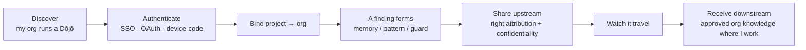
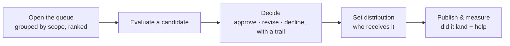
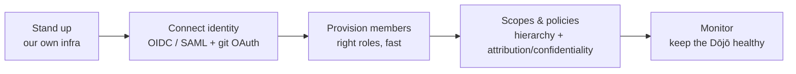
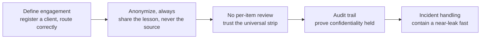
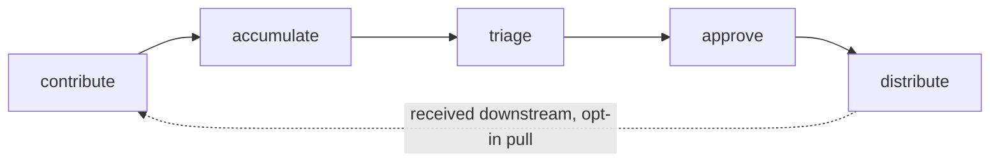

# The Dōjō journey

> How a team extends the same loop **without leaking client work**. Distilled from
> [`../mockups/Sensei/Sensei Dōjō Journey Map.html`](../mockups/Sensei/Sensei%20D%C5%8Djo%20Journey%20Map.html).
> Traces to [objectives DJ1–DJ5](../requirements/objectives.md#dōjō--the-cross-cutting-team-layer);
> the layer design is [architecture/dojo](../architecture/dojo.md).

The Dōjō is a **cross-cutting layer**, not a fifth segment: the developer's flows
live **in the Observatory**, plus a web **console**. Every user logs in
(developer · maintainer · admin · lead); the developer's is both in-app *and* a
personal console view. Deploys **in-house or as SaaS**.

**Membership contexts** — one developer, many orgs: *Employer · Client orgs ·
Communities · Personal.* The org boundary is the **membership**; client-precedence
is the tiebreaker.

## Developer (in-app)

## Maintainer (console)

## Org admin (console)

## Lead — client / engagement confidentiality (console)

> The role formerly called *client-lead* is now **lead**. It guards
> confidentiality on **client engagements** (the engagement concept is unchanged;
> only the role name shortened).

## The lifecycle — what flows through it

## The principles

From the journey map — the non-negotiables that make the boundary exact:

- **Identity is the discovery** — you learn your org runs a Dōjō by authenticating.
- **Pull, never push** — downstream knowledge arrives by opt-in, never forced.
- **Never blind, always preview** — nothing leaves without showing what leaves.
- **One universal strip** — the same anonymization runs on every client lesson; a lesson that can't be stripped doesn't leave.
- **Specificity wins conflicts** — distribution follows priority ladders, not a rigid hierarchy.
