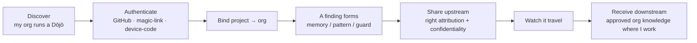
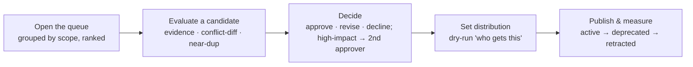
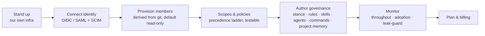
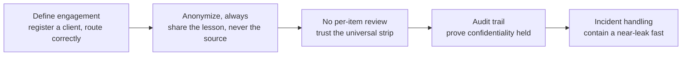
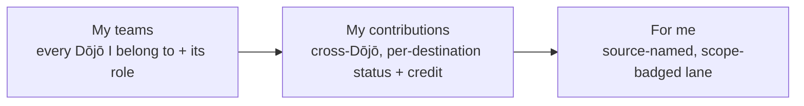
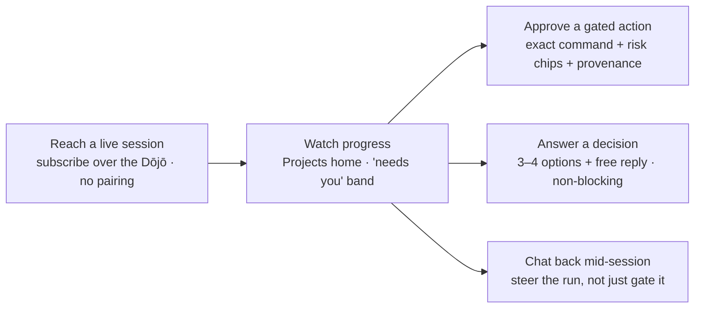
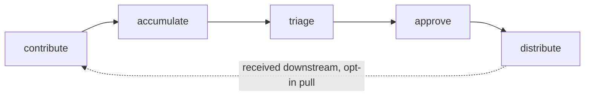

# The Dōjō journey

> The team's shared brain — and the surface for supervising it from anywhere.
> Distilled from [`../mockups/Sensei/Sensei Dōjō Journey Map.html`](../mockups/Sensei/Sensei%20D%C5%8Djo%20Journey%20Map.html).
> Traces to [objectives DJ1–DJ5](../requirements/objectives.md#dōjō--the-cross-cutting-team-layer);
> the layer design is [architecture/dojo](../architecture/dojo.md). The org lead's
> end-to-end path — Keiko, standing up the company Dōjō — is in
> [`../mockups/Sensei/Sensei End-to-End Journey.html`](../mockups/Sensei/Sensei%20End-to-End%20Journey.html)
> (see [journeys → the whole loop](README.md#the-whole-loop--machine--dōjō--beyond)).

The Dōjō is the **one shared tier** between the local, private device and the
global Collective — a **responsive SaaS site** (with optional self-hosting) that
holds a company's private hive-mind. It is a **cross-cutting layer**, not a fifth
segment: the developer's flows live **in the Observatory**, plus a web
**console**, plus **[Relay](#relay--away-from-keyboard-through-the-dōjō)** — the
away-from-keyboard surface, now folded into the Dōjō and reachable on phone and
console. Deploys **SaaS or in-house**.

**One account, many identities.** A person links several emails (GitHub, work
SSO, personal); memberships aggregate across them but **never cross** — an org
can't see you belong to another. Org URLs encode origin: `github/<org>`,
`other/<org>` (magic-link, non-GitHub), and `personal/<you>` — a **personal
Dōjō** that follows the individual across every linked email.

**Membership contexts** — one developer, many orgs: *Employer · Client orgs ·
Communities · Personal.* The org boundary is the **membership**; specificity wins
conflicts (org › team › project › personal).

## Developer (in-app)

## Maintainer (console)

## Org admin (console)

**Author the governance model** is the linchpin admin act: define the shared mind
per scope (org → team → project → stack, plus personal) — a **stance** (autonomy ·
sharing · review · anonymization) plus rules/guards, shared skills/agents/commands
and a project's memory — so a joiner **inherits the composed bundle on connect**
instead of being re-taught tribal knowledge. A *"what a new developer inherits"*
preview shows exactly what lands.

## Lead — client / engagement confidentiality (console)

> The role formerly called *client-lead* is now **lead**. It guards
> confidentiality on **client engagements** (the engagement concept is unchanged;
> only the role name shortened).

## Developer console — the individual, across every Dōjō

> Every user can sign in; the benefit is for teams, but a developer belongs to
> many. A personal, read-mostly view of all of them.

## Relay — away-from-keyboard, through the Dōjō

> Relay is **no longer a separate app to pair**. The daemon holds a live line to
> the Dōjō (Supabase realtime), so a phone or the console reaches a **running
> session** through it — no pairing, no install, no open ports. Per-user across
> every Dōjō; a native app coexists for **push and offline**. Only *filtered
> status* + gate prompts + replies cross — never code or transcripts.

Identical on phone and in the console; ranked by **what's blocked on me**, with
source-Dōjō attribution on every card. Architecture (realtime line · PWA + Web
Push · native wrapper · the relay data model) is in
[architecture/dojo → Relay](../architecture/dojo.md#relay--through-the-dōjō).

## The lifecycle — what flows through it

## Business model — free where public or personal

The line is drawn by **who the knowledge is for**, not by features. You pay to
**coordinate a group's private knowledge** — never to use sensei, never for tokens
(inference is BYO-key and runs locally).

| Tier | Who | Price |
|---|---|---|
| **Public / OSS** `公` | open-source projects & communities; `github/<org>` | **free forever** — full governance + Relay for your projects |
| **Personal** `己` | your own constitution & rules for your own projects; `personal/<you>` | **free** — private to you, across every linked email, Relay included |
| **Team** `組` | a private, **shared** org Dōjō on the SaaS | **paid per active contributor** (read-only free) — private scopes, role consoles, governance authoring, shared-team Relay, client engagements |
| **Enterprise** `企` | control & compliance | **custom** — self-host / VPC, SSO (OIDC/SAML) + SCIM, audit retention, self-hosted relay + SSO on mobile, SLA |

Relay stays a **hook, not a paywall**: the individual loop (watch · approve ·
decide · nudge · chat on your own projects) is free; the paid tiers meter the
**shared coordination** around it (team inbox, presence, concurrency, priority
realtime, approval audit) — where the real infra cost lives. *(Open pricing
questions — exact seat definition, self-host licence vs subscription, fair-use
limits, storage caps, non-profit / education pricing — are still unsettled.)*

## The principles

From the journey map — the non-negotiables that make the boundary exact:

- **Identity is the discovery** — you learn your org runs a Dōjō by authenticating (GitHub-org match, invite code, or git-remote claim); trust runs both ways (the server proves itself; the binding is pinned after first join).
- **Pull, never push** — downstream knowledge arrives by opt-in, never forced.
- **Never blind, always preview** — nothing leaves without showing what leaves (raw-vs-stripped redaction, the dry-run "who gets this", the conflict diff).
- **One universal strip** — the same anonymization runs on every client lesson; a lesson that can't be stripped doesn't leave.
- **Specificity wins conflicts** — distribution follows priority ladders (org › team › global › personal), the more specific rule winning; both rules shown, winner marked.
- **Relay lives in the Dōjō** — the daemon's live line carries away-from-keyboard work to any phone or console over realtime, no pairing; the native app stays for push + offline.
- **Your own Dōjō, your own rules** — governance scales down to one person; a personal Dōjō is the same authoring model as an org, sized for one, following you across every linked email.
- **Free where public or personal** — public/OSS and personal Dōjōs are free forever; a private, shared team Dōjō is where it's paid.
