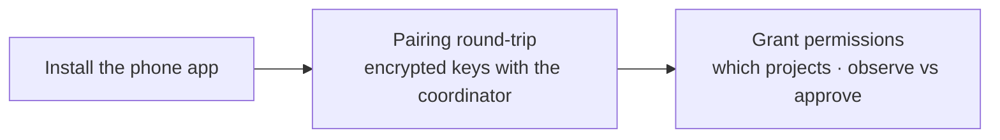
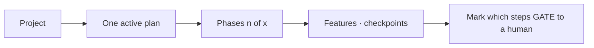
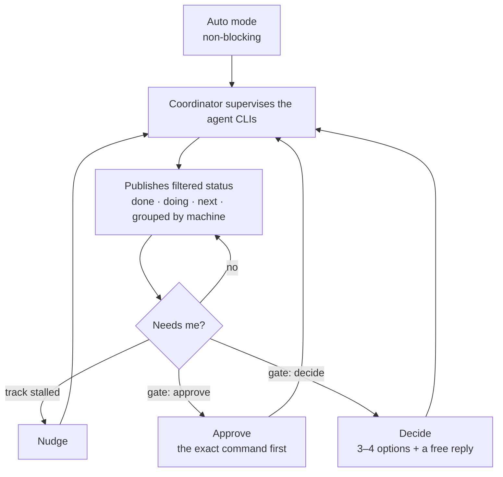
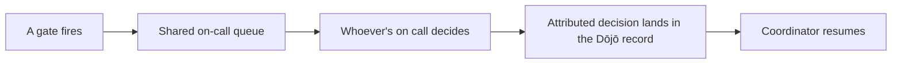

# The relay journey

> Supervising long, multi-agent runs from your phone — the away-from-keyboard
> round-trip. Distilled from
> [`../mockups/Sensei/Sensei Relay.html`](../mockups/Sensei/Sensei%20Relay.html).
> Traces to [objectives R1–R8](../requirements/objectives.md#relay--supervising-long-runs-from-anywhere);
> the layer design is [architecture/relay](../architecture/relay.md).

## Onboarding — pair once

## Author a plan — make the run modular

## Run &amp; supervise — the round-trip

Only *filtered status* crosses the **zero-knowledge relay** — code and
transcripts never leave your hardware.

## Team relay (Dōjō)

## The surfaces

**Phone:** Dashboard · Task detail (plan checklist + activity + gate) · Approve ·
Respond · Security · Pairing · Projects · Plan · Decisions · Nudge.
**Desktop (Observatory rail):** Coordinator (devices · published stream · pending
gate) · Plan authoring (mark gates).
**Dōjō:** shared gate queue with attribution.
