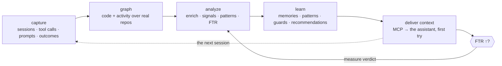
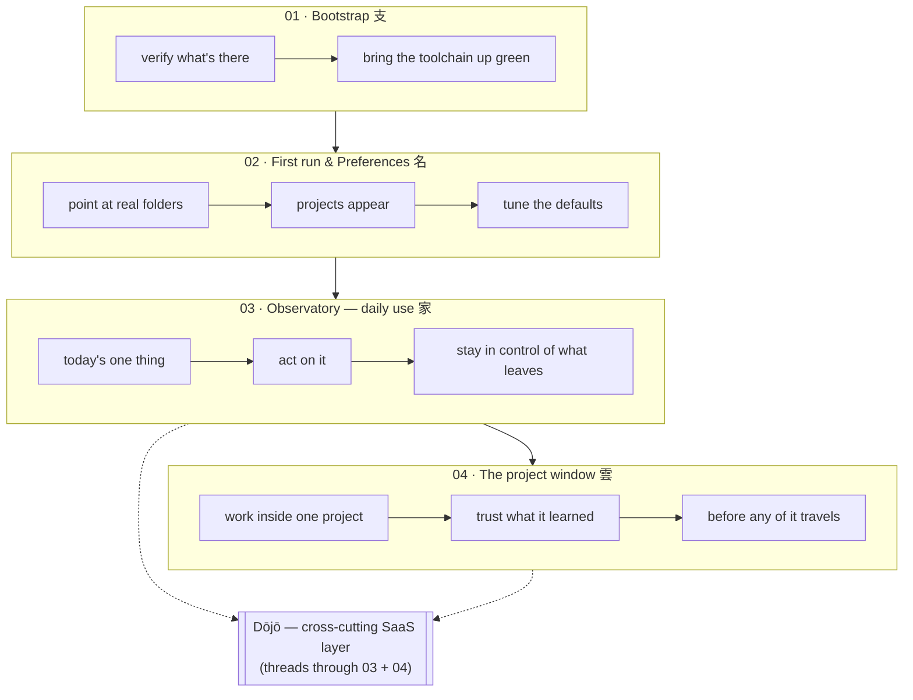
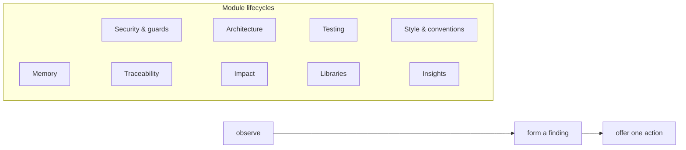

# The personal journey

> How one developer + their assistant move through sensei. Distilled from
> [`../mockups/Sensei/Sensei Journey Map.html`](../mockups/Sensei/Sensei%20Journey%20Map.html).
> Traces to [requirements/objectives](../requirements/objectives.md). The
> end-to-end version — Rin, working across several orgs — is in
> [`../mockups/Sensei/Sensei End-to-End Journey.html`](../mockups/Sensei/Sensei%20End-to-End%20Journey.html)
> (see [journeys → the whole loop](README.md#the-whole-loop--machine--dōjō--beyond)).

## The core loop — everything is one loop

Each layer of the [architecture](../architecture/README.md) exists to keep this
turning. The north-star, **FTR** (first-turn resolution), is the loop's scorecard.

## The four segments

**Value before setup** is literal: the first thing the user does is see *their
own projects* (segment 02), not a wizard. The old nine-stage wizard is gone —
tuning lives in Preferences, reachable but never blocking.

## The loops inside the daily app

The Observatory and project window aren't flat screens — each domain is its own
small retrospective loop (mockup: *"Module lifecycles"*). Each **observes →
forms a finding → offers one action** (Apply · Review · Dismiss):

## Where Dōjō threads in

At three points the personal journey touches the team layer — always opt-in,
always previewed: **bind** a project to an org (segment 04 · About), a **finding
forms** and is shared upstream (04 · Memories/Patterns), and approved knowledge
is **distributed back** (03 · Today/Upgrades). The full team path is in
[`dojo.md`](dojo.md).
