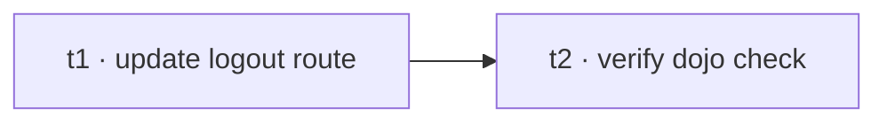

# Forward-port the robust /logout route to develop

## Goal

After the Phase-5 cutover merge (`163f6e27`), `main` carries the **robust polling**
`/logout` route (polls briefly for `signOut` so a full-navigation mount before kavach
hydration still logs out), but `develop` still has the earlier **immediate** call. Align
develop so it matches main and won't re-conflict on the next merge.

## Graph

## Phases → tasks

### Phase: Port

| id | title | agent | model | spec | verify | deps |
|----|-------|-------|-------|------|--------|------|
| t1 | Update develop's logout route to the robust polling signOut | general-purpose | sonnet | `tasks/t1.md` | file has the poll loop; no conflict markers; matches main | — |
| t2 | Verify the dojo builds clean | general-purpose | haiku | `tasks/t2.md` | `bun run check` = 0 errors / 0 warnings | t1 |

## Out of scope

No kavach.config or other dojo changes; this is a single-file alignment + verify.
