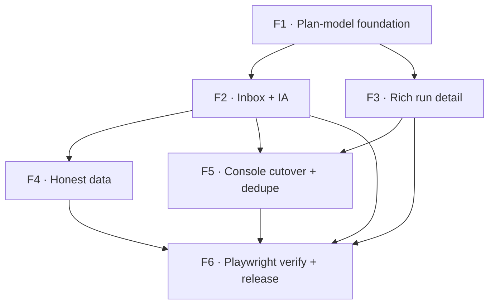

# Dōjō2 inbox build — close the mock↔impl gaps, clean the build, release

## Objective

Implement the Option B build worklist from the gap analysis: bring the shipped dōjō2 app up
to the updated mock — the **Inbox** IA and the **rich run detail** — port the missing
plan/inbox kit family, stop showing fabricated data, retire the duplicate legacy `(console)`
pages so the build is clean, verify the flow with Playwright, then bump a patch and release to
`main`. The five *mockup* gaps (states, critical paths, honest-data variants) are a parallel
designer track and are out of scope here except where a state is trivially built alongside a
component.

**Layers (dōjō web, D18 analog):** Worker `/v1` route → client data layer (`relay-data.ts`)
→ mapper (`*-map.ts`) → view/vocab logic (`kit/vocab.ts`, `*-view.ts`) → kit component
(`kit/*.svelte`) → route (`+page.svelte`/`.ts`) → test (vitest + Playwright).

**Two corrections (2026-07-27, from Jerry):**
1. **No `dojo2*` names.** The app isn't released, so there's no compat burden — drop the
   migration label. Rename `(dojo2)`→`(app)`, `dojo2-*.ts`→ drop the prefix, and
   `lib/components/dojo2/`→`lib/components/screens/`, done **early** (F1a below) so F2+ build on
   clean names. (`K2_`/`k2` kit-vocab prefix left for a later pass.)
2. **Verify against real data, never a test DB.** Pointing the daemon at a test DB makes every
   project/graph/run fabricated and feeds Claude fake data. Verification uses the **real daemon +
   real `sensei` DB + real user `hi@sensei-hq.com`**; only the local dōjō + its Supabase are
   seeded for this identity, showing a **real** federated run (see F6). This makes F4 (drop
   fixtures) central, not deferred.

## Features

### Feature 1: Plan-model foundation (kit vocab + types + PlanBar/PlanPips)
- **Issue:** #103
- **Layers:** view/vocab (`kit/vocab.ts`, `kit/types.ts`) → kit components (`PlanBar`, `PlanPips`) → test
- **Depends on:** none (foundation — everything below needs it)
- **Acceptance criteria:**
  - `kit/vocab.ts` exports the 7-state task vocab `K2_NODE` (done · active · needs_review · blocked · failed · skipped · pending) with tone/label per state, plus `STATE_ALIAS` (queued→pending, running→active, gate→needs_review).
  - Normalizers ported and unit-tested: `phases(plan)` accepts both the authored `{goal, phases:[{title,tasks}]}` and a legacy stage array; `tasks(plan)` flattens; `stageState(phase)` rolls a phase up to its most-urgent task state by `K2_NODE` order; `planProgress(plan)` returns `{done,total,pct,stage,stages,stageName}`; `runFlag(run)` returns the status label (Needs approval/Task failed/Blocked/Running/Waiting).
  - `kit/types.ts`: `KitRun` gains `plan`, `stale`, `last`; task `state` is the 7-state enum; a new `KitInbox` row type exists.
  - `PlanBar.svelte` renders a rail filled to `max(2,pct)%` tinted by `tone`. `PlanPips.svelte` renders one pill per phase tinted by roll-up state (a parallel phase → two thin pips), with an optional `done/total` caption.
  - `svelte-check` + `vitest` green; no fabricated-data import.
- **Test scenarios:**
  - Given an authored plan with two phases (one parallel, one sequential), When `planProgress` runs, Then it reports the right done/total/pct and current stage name.
  - Given a phase with a `failed` and a `done` task, When `stageState` runs, Then it returns `failed` (most-urgent wins).
  - Given a legacy stage array, When `phases` normalizes it, Then states map via `STATE_ALIAS`.

### Feature 1a: De-`dojo2` rename (clean names before building more)
- **Issue:** #110
- **Layers:** route group + file/dir renames → import updates → tests
- **Depends on:** none (mechanical; do before F2 so new work uses clean names)
- **Acceptance criteria:**
  - `(dojo2)` route group → `(app)`; `dojo2-*.ts`/`.spec.ts` → drop the `dojo2-` prefix;
    `lib/components/dojo2/` → `lib/components/screens/`. All 81 `dojo2` references updated.
  - No file, dir, route, or import references `dojo2`; `svelte-check` + `vitest` green (pure
    rename — no behaviour change, test count unchanged).
  - `K2_`/`k2` kit-vocab prefix untouched (separate, optional later pass).
- **Test scenarios:**
  - Given the rename, When `grep -r dojo2 dojo/src` runs, Then it returns nothing.
  - Given `bun run check` + `bun run test`, When run after the rename, Then both are green with
    the same test count as before.

### Feature 2: Inbox list + personal IA re-shape
- **Issue:** #104
- **Layers:** data (`listRuns`/`listGates`, existing) → mapper (`toKitInbox` in `dojo2-relay-map.ts`) → view (ranking) → components (`InboxRow`, `SubTabs`) → nav (`dojo2-nav.ts`) → route (`you/+page`, `you/[section]`) → test
- **Depends on:** Feature 1
- **Acceptance criteria:**
  - `dojo2-nav.ts` personal nav is `Inbox · Projects · Constitution · Rule packs · My dōjōs · Contributions`; the `Live runs / Approve / Decide / Chat` sections and the `ScrYourWork` dashboard landing are gone; the app lands on the Inbox.
  - `InboxRow.svelte` renders one row per in-flight session: status dot (accent when it needs you), `project · last-heartbeat age`, 2-line task, a why-surfaced line (`N need you` / `no heartbeat` / `blocked on a task` / `a task failed`), `PlanPips`, and `done/total`.
  - `k2InboxRow`/`k2InboxRows` rank rows: needs-you (0) → attention: stalled/blocked/failed (1) → running (2) → other (3) → done (4); the list renders in that order.
  - `SubTabs.svelte` filters `Needs you · Running · Finished · All`; a filter-miss shows the `EmptyState`; the all-clear shows a distinct "nothing in flight" empty.
  - Fetching shows a skeleton; a relay-fetch failure shows an error banner (not a blank/crash).
  - Old `/you/approve|decide|chat|runs` deep links redirect into the Inbox (no 404).
  - `svelte-check` + `vitest` green.
- **Test scenarios:**
  - Given runs where one has a pending gate and one is stalled, When the Inbox loads with the default `Needs you` filter, Then the gated run sorts first and both show a why-surfaced line.
  - Given the `Finished` filter, When selected, Then only terminal runs show.
  - Given a solo viewer with no membership, When the Inbox loads, Then it shows the honest empty, not fixtures.
  - Given a legacy `/you/approve` URL, When visited, Then it redirects to the Inbox.

### Feature 3: Rich run detail (plan outline/graph + activity)
- **Issue:** #105
- **Layers:** data (`getSegments`, existing) → mapper (segments→plan shape) → components (`PlanNode`, `PlanStage`, `PlanGraph`, `PlanOutline`, `RunActivity`) → route (`you/runs/[run_id]`) → test + Playwright
- **Depends on:** Feature 1
- **Acceptance criteria:**
  - The run detail renders phases→tasks as a `PlanOutline` built from segment `parent_id`/`seq`: each task shows its `K2_NODE` state icon, title, `is_gate`→`gate · advisory|blocking` chip, `agent · model · spec_ref` meta, and `waits on {deps}`.
  - A `PlanGraph` view lays stages left→right (wrap) / top→bottom (mobile) with a parallel (fan) vs sequential (arrow-chain) indicator derived from `deps`, plus a state legend.
  - `RunActivity` renders the run's event feed newest-first (icon · text · timestamp).
  - The header shows progress: `PlanBar` + `Phase X of Y` + `done/total · pct%`.
  - Pending gates remain answerable in place (existing gate-card behaviour, one gate-card component only).
  - States: "no outline yet" empty, loading, and error all render; realtime refresh (`subscribeRelay`) still works.
  - `svelte-check` + `vitest` green.
- **Test scenarios:**
  - Given segments with a parent phase and three child tasks (one parallel set), When the detail renders, Then the outline groups them under the phase and the graph shows a parallel indicator.
  - Given a run with zero segments, When the detail loads, Then the "no outline yet" empty shows (not a crash).
  - Given a pending approval gate, When the viewer answers in place, Then the reply posts and the run refreshes.

### Feature 4: Honest data — drop fixtures from user-facing surfaces
- **Issue:** #106
- **Layers:** view (`personal-home-view`, `personal-view`) → route (`you` landing, `contributions`, `projects`, org `[section]`) → real `data.user` → test
- **Depends on:** Feature 2
- **Acceptance criteria:**
  - No surface a real user sees renders fabricated data: the landing stat strip drops `↑ from 9` / the hardcoded incident count (reads real or is hidden); Contributions drops `helped 612`; Projects/Contributions show an honest empty when there's no backing data.
  - The audit "me" label and chat author use the authenticated user from `loadConsoleContext`, not the fixture `"Rin Saito"`.
  - User-facing org surfaces don't silently fall back to Acme's fixture blob (`x[slug] ?? x.acme`) — an unknown/empty org shows an empty state.
  - A vitest guard asserts the user-facing view paths for these screens import no fixture module.
  - **Out of scope (next slice):** the full `/v1` read-routes for projects + contributions (federating `list_projects` + the promotions ledger) — this feature removes dishonest data; wiring real data follows.
- **Test scenarios:**
  - Given a signed-in user "Alex", When the run detail chat and audit render, Then the author/label read "Alex", never "Rin Saito".
  - Given a user with no projects, When Projects loads, Then "No projects yet" shows, not fake repos.

### Feature 5: Console cutover + dedupe (clean build)
- **Issue:** #107
- **Layers:** routes (redirects + deletions in `(console)/`) → component retirement (`kit/` supersedes legacy) → test + build
- **Depends on:** Feature 2, Feature 3 (dōjō2 must reach parity before the legacy pages retire)
- **Acceptance criteria:**
  - `(console)/console/*` routes redirect to their dōjō2 equivalents (or are deleted); nothing links to a surviving legacy console route.
  - Duplicate components are reconciled to one: the run detail uses a single gate-card (retire the `RelayGateCard`/`kit/GateCard` duplication); `ConsoleNav`/`ConsoleTopBar`/`ConsoleHead`/`ConsoleBanner` are removed in favour of `kit/NavPane`/`TopBar`/`SectionHead`/`Banner`; `DojoChip` → `kit/Chip`.
  - `svelte-check`, `vitest`, and `vite build` all pass with no new warnings and no references to a deleted component.
- **Test scenarios:**
  - Given a legacy `/console/relay/<id>` URL, When visited, Then it redirects to `/you/runs/<id>`.
  - Given the build, When `vite build` + `svelte-check` run, Then both pass with zero unresolved-import or unused-export warnings.

### Feature 6: Real-data Playwright verify + patch release
- **Issue:** #108
- **Layers:** real daemon + real DB → real federated run → local dōjō (real Supabase) → Playwright → release
- **Depends on:** Features 1–5
- **Real-data verification (no test DB, no fabricated data):**
  - Keep the **real sensei daemon on the real `sensei` DB**; identity is `hi@sensei-hq.com` (MCP/daemon `/api/user` for the `sensei` repo). Never point the daemon at a test DB.
  - The daemon already federates to a **local dōjō** (membership `http://localhost:5173`, tenant `personal/jerry`). Run the local dōjō (`CF_PAGES=1 bun run build` → `wrangler dev --port 5173`) with its Supabase seeded with a membership for **`hi@sensei-hq.com`** under `personal/jerry`.
  - Start a **real** relay run via the daemon (`start_run` for the `sensei` project) so real segments/plan federate to the local dōjō.
- **Acceptance criteria:**
  - Playwright signs in as `hi@sensei-hq.com` and walks: Inbox shows the **real** in-flight run → open it → the plan outline + activity render from the **real** federated segments → a real gate is answerable. Screenshots captured. No `relay-jerry@local.test`, no fixture rows.
  - `bun run check` + `bun run test` + `bun run build` in `dojo/` all green (zero-errors policy).
  - `make bump v=patch` bumps `VERSION` + manifests + tag.
  - `develop` merges to `main` and is pushed.
- **Test scenarios:**
  - Given the real daemon federating a real run to the local dōjō, When Playwright signs in as `hi@sensei-hq.com`, Then the Inbox row, the plan outline, and the activity feed show that run's **real** data (matching what the MCP reports for the run).
  - Given all checks pass, When `make bump v=patch` runs, Then the version increments and the tag is created before the merge to `main`.

## Dependency graph

Build order: **F1 → F2 → F3 → F4 → F5 → F6.** F4 can run alongside F5 once F2/F3 land; F6 is the gate on everything.
