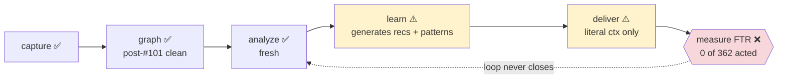
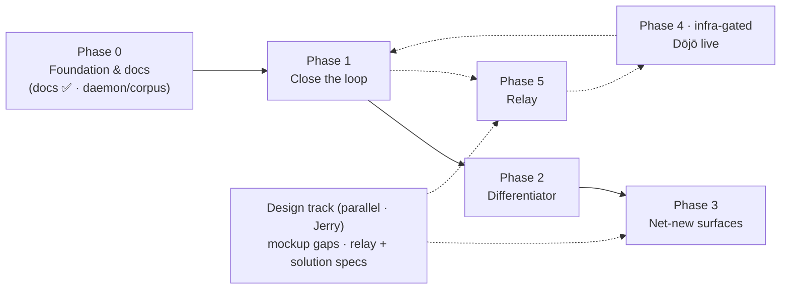

# Open issues — implementation vs vision → the plan

> A **living** gap analysis. It measures the current build against
> [`vision.md`](../requirements/vision.md) + [`objectives.md`](../requirements/objectives.md), ranks the gaps by
> FTR value, and organises the work into sequenced workstreams. Updated as
> workstreams land. Evidence date: **2026-07-14** (four live audits: UI, daemon,
> MCP, docs — against the running daemon on :7744 + `sensei` DB).

## The core finding

The surfaces are largely **built**; the **learning loop never closes** and
several signals feeding the surfaces are **noise or empty**. The original
"ship 6–8 screens" framing is spent — 25 screens are live. The value now is in
**closing the FTR loop and raising signal quality**, not more surface area.

## Snapshot

| Layer | State |
|---|---|
| **UI** | 25 shipped · 2 partial · 10 not-built · 4 Dōjō-web. Observatory + project window essentially complete. |
| **Daemon** | capture/analyzer/FTR/patterns/signals/insight-copy/libraries/icons all **producing fresh**. Loop-closing + promotion + drift-quality are the holes. |
| **MCP** | core loop real; G5a/G5b silent-empty bugs FIXED; hybrid semantic `search` + `context_pack` DONE (G4). *(2026-07-15)* |
| **Docs** | spec is the real SoT but README points elsewhere; Dōjō scattered; being restructured (this folder). |

## Ranked gaps

Each gap: the objective it violates, the FTR impact, and the approach.

### G1 — The FTR loop never closes *(objectives O3, P1; north-star)* — ✅ LOOP CLOSED 2026-07-15 (`26fe8d9b`)
Was: 362 recs `pending`, 0 acted/measured. The accept path (`accept_recommendation` → `acted_at`, app UI `api.ts` + insights-board, the Impact page), `MeasureVerdicts` (FTR-delta → verdict, 3-day window), and the **negative** feedback (regression → challenge source memory) all already existed — but nothing closed the **positive** half: a proven rec never reinforced its source memory, so the loop's learning output was dead.
**Fixed:** `reinforce_source_memory_for_rec` — on a **positive** verdict, record an `applied` memory_outcome (mirror of the negative challenge). The existing `memory_outcome_apply` trigger then bumps `reinforced_count`/`strength` and promotes the memory (this is the G1→G2 bridge).
**Verified live end-to-end:** accepted a real rec (→`acted_at`); and a controlled temp scenario ran through `MeasureVerdicts` → verdict **positive** (current_ftr 1.0 vs baseline 0.2) → source memory reinforced → **battle_tested** (strength 3.6→4.1, reinforced_count 0→1), then cleaned up. *Real-data verdicts* mature naturally (the accepted rec needs its 3-day / ≥3-session window).

### G2 — Memory promotion is dead *(objectives O5, P2, theme 4)* — ✅ UNBLOCKED 2026-07-15 (via G1 `26fe8d9b`)
Was: 9 memories all `active`, `reinforced_count=0`. **The promotion ladder was already fully implemented in the `memory_outcome_apply` DB trigger** (`applied` → reinforced_count++/strength+0.5 → `battle_tested` at strength≥4.0 & no violations; `violated` → challenged/archived; challenged→reinforced recovery). It was dead only because **nothing recorded a positive (`applied`) outcome** — only the negative side was wired.
**Fixed:** the G1 positive-reinforcement bridge now records `applied` outcomes when a rec proves out, so memories promote automatically as their recommendations are validated. **Verified live:** a memory went `active → battle_tested` on one confirmed rec. *Residual:* the manual `/reinforce` + `/promote` HTTP endpoints and cross-scope promotion (`promote_memory`) already existed; a time/relevance-based lighter reinforcement signal (beyond rec-verdicts) remains an optional future enhancement.

### G3 — Doc-drift signal is noise *(objective P2, theme 4)* — ✅ FIXED 2026-07-15 (`0d8d4b98` + symbol-history follow-up)
Was: the drift scan flagged **~all** backtick doc mentions `broken` because the known-symbol set was (a) this-project only and (b) 7 kinds only — so real symbols of other kinds, every indexed **dependency** symbol (e.g. rokkit components), env vars, and DB schema identifiers all over-fired.
**Fixed:** match the known-symbol set **globally** across **all** code-symbol kinds; drop SCREAMING_SNAKE env-var tokens; union in **DB schema identifiers** (table/column/view/enum-label). **Live: sensei drift 594 → 408 broken** (deps + DB-schema + env-var false positives gone).
**Residual closed — symbol-history model** (2026-07-15). The remaining ~408 (identifiers that exist but are **not** indexed as code-symbol nodes — MCP tool-name strings, Rust enum variants, serde-renamed camelCase fields) were false positives: the old rule flagged "mentioned in a doc but not in the graph." Replaced with *previously-indexed, now-missing*: a new global `sensei.symbol_names` registry (every symbol name ever indexed, monotonic) gates drift — a mention is `broken` only when it **was** a real symbol (in the registry) and no longer resolves. Names that were never symbols are prose/config, not drift. New: `PgStore::record_symbol_names` (upsert current symbols each scan) + `analysis::doc_drift::is_broken_drift` (pure gate, used for insert AND resolution so the false-positive backlog auto-clears). **Live: a sensei drift scan resolved 396 → 0 open-broken, recorded 52,615 symbol names, flagged 0 new** (correct — nothing was symbol-then-removed on the first pass); the flow test proves a genuinely removed symbol still flags. Other projects clear on their next scheduled drift scan. Tradeoff: symbols removed *before* tracking began aren't retroactively flagged (accepted — de-noise over recall).

### G4 — Semantic search + context-pack *(the differentiator; objective O-core)* — ✅ DONE 2026-07-15 (`94efb0f5` + `88ac3d00`)
Was assessed "unbuilt", but the **hybrid fusion already existed** in `query_general` (`/api/query`): embed the query + RRF-fuse embedding NN (`semantic_search_nodes`, 123k embedded nodes) with lexical ILIKE, fail-open. The gaps were narrower than the audit thought:
- **G4a — MCP `search` was lexical-only** (`94efb0f5`). The `search` tool an assistant calls was a separate arm that never fused; now it delegates to `query_general`. **Live: concept queries with zero substring overlap now return relevant symbols** ("strengthen a memory after a positive outcome" → `reinforce_memory`; "find files tagged with a framework pattern" → `tag_file_nodes_by_framework_kind`).
- **G4b — `context_pack` built** (`88ac3d00`). New MCP tool: top-8 hybrid hits + their on-disk code snippets (clamped, 40-line cap) in one call — concept-level retrieval with ready code, not just locations. **Live: verified returning symbols + 9–23-line snippets.**
- **G4b+ — content-grep floor added** (2026-07-15). `context_pack` gained a second recall arm: a bounded, in-process raw file-content grep (ripgrep's `ignore` walker, respects `.gitignore`) over the scoped repo roots, so concepts that live only in file *content* — comments, string literals, config values, Rust enum variants, string-dispatched MCP tool names, serde-renamed fields (the G3 recall gap) — are retrievable even though they're never indexed as a symbol node. Each item is tagged `via: "symbol" | "grep"`; the grep arm skips files already packed by the symbol arm. Fail-open + hard-bounded (`GrepOpts`: max matches/per-file/files/bytes). New: `content_grep` + `PgStore::scope_repo_roots`. **Live: `context_pack("keep_vars")` → the JSON key in `dojo/wrangler.jsonc`; `context_pack("battle_tested memory promotion")` → 6 hits across DDL enum/function/table + `design.dbml` — all invisible to the symbol arm.** Residual: the `search` tool itself is still symbol-only (grep arm is context_pack-only, to keep the hot path free of FS latency).

### G5 — Two MCP tools silently empty *(objectives O5, context delivery)*
- **G5a ✅ FIXED 2026-07-14 (`46a58a79`).** `get_communities` was the MCP dispatch path using `resolve_folder_id` (a single lowest-UUID leaf). New `PgStore::list_communities_scoped` aggregates across all scope folders; both callers repointed. **Live: 0 → 337 communities** on the sensei project (verified via the MCP surface).
- **G5b ✅ FIXED 2026-07-14 (`d4e41988`).** `get_patterns` (→ `get_file_tags`) returned empty: `sensei.file_tags` is a **view** over `nodes.tags` for file nodes, and nothing populated those tags (0 tagged). New `PgStore::tag_file_nodes_by_framework_kind` tags each file node with the framework kinds of the symbols it contains — reusing the classifier's existing `hook`/`component` node-kinds (no separate detector) — recomputed per file, run in the scan reconcile. **Live: 1207 `component` + 533 `hook` files tagged; `get_file_tags(sensei, component)` now returns real files** (e.g. `app/src/lib/components/*.svelte`). **Residual closed 2026-07-15:** `route`/`middleware` are **file-level roles**, not symbol node-kinds, so the tagger now also derives them from **per-framework path conventions** (SvelteKit `+page`/`+layout`/`+server`/`+error` + Next `page`/`route` → `route`; SvelteKit `hooks.{server,client}` + Next `middleware` → `middleware`), merged into the same self-correcting `tags` (one CTE, idempotent). No node_kind/scanner change. **Live: 801 `route` + 26 `middleware` files tagged across the index; `get_file_tags(sensei, route)` → 124 real files (`app/src/routes/…/+page.svelte`), `get_file_tags(alert-platform, route)` → 139 (Next `page.tsx`), `middleware` → `hooks.server.ts`** — the daemon's own scan produced them.

### G6 — Corpus starved *(all FTR-downstream)*
Session corpus shrank **216 → 25** (a reset); local daemon is **v0.3.1** while source is **v0.3.4** (newer endpoints + the #101 self-heal aren't live locally).
**Approach:** `make install-service` to current; re-synthesize historical sessions (the #75 backfill path) so FTR/model-effectiveness aren't history-starved.

### G7 — Orphaned + unbuilt intelligence *(various)*
`inference.insights`/`insight_batches` have no writer (superseded by `insight_copy`); governance Tier-2 consolidation unwired (`consolidated_rulesets`=0); impact writer is manual-only; testability + benchmarks are spec-only.
**Approach:** drop/relabel the orphaned tables; wire Tier-2 consolidation to the scheduler; decide impact = manual-note vs MeasureVerdicts-delta; defer testability/benchmarks.

### G8 — Net-new surfaces *(lowest)*
Solution segment (3 screens), Bootstrap splash (2), consolidation screen, insights-reasoning drawer, first-run polish.
**Approach:** build after the loop closes; each is only as good as the data behind it.

### G9 — Capture + index-reliability residuals *(objective F2, foundation)* — ✅ CORE FIXED 2026-07-15 (`c7dd217f`); residuals remain
**Was (diagnosed + confirmed):** the watcher didn't just enqueue too few tasks — the ones it enqueued **silently no-op'd**. `process_batch` passed the watch-root **NAME** as `folder_path`; handlers resolve via `get_repo_by_path` (`WHERE abs_path=$1`) → a name never matches → `folder_id=None` → writes no-op. Empirical: **26k+ `process_file` + 6k `resolve_edges`** with bare-name `folder_path`. So the graph updated only on full scans, never on live edit.
**Fixed:** `process_batch` now resolves each changed file to its owning indexed repo via `PgStore::repo_root_for_path` (nearest git/standalone/subtree ancestor, skips workspace-member subdirs — one-owner), groups by repo, and enqueues `ProcessFile`/`DeleteFile`/`DeleteFolder` targeting the repo abs_path (as the full scan does) — a change in `~/Dev/kavach/src/x.ts` → the kavach repo. Exclusions checked **before** enqueue; unindexed paths skipped; the post-processing barrier now adds **`EmbedNodes`** (not just `ResolveEdges`) so an edit hits the graph AND semantic search live. Watcher gained a PgStore handle (boot + watchdog). **Verified live: a probe fn dropped into `~/Developer/dbd-rs` indexed in 9s with `process_file folder_path=/Users/Jerry/Developer/dbd-rs, items=1`** (a real path).
**Residuals — reassessed 2026-07-15:** two of the listed items are **already built**: (a) **overflow→force reconcile** — `root_watcher.rs` handles the notify `need_rescan()` flag (FSEvents overflow / dropped events) via `rescan_reconcile_roots` → forces reconcile of the affected roots; (b) **downtime catch-up** — `reconcile_scheduler.rs` runs a **boot reconcile** on every start ("a restart must never miss changes", drift-safety) plus a frequent watcher safety-net. Together these achieve the FSEvents-cursor goal (never silently miss a change across a restart/overflow) **without** replacing the `notify` crate — so dedicated **FSEvents cursor persistence is now low-value** (the `notify` abstraction doesn't expose the `since_when` id; the boot+overflow reconciles cover it). Genuinely open + low-priority: the **`.git/HEAD` branch-switch** watch (partial via `is_branch_switch`) and the small **twinless residue-node sweep** (structural-folder nodes with *no* repo-owner twin — distinct from the #101 `dedup_structural_folder_nodes` which prunes nodes that *do* have a twin). `BuildConnections`/`DetectCommunities` stay periodic by design.

### G10 — Command-governance overlay *(Dōjō-gated)*
The command surface shipped (`get_commands`, `project_commands`, per-adapter `parse_commands`). Unbuilt: `dojo_preferences` (capability→preferred-tool bias in `get_commands`, user-scope until a Dōjō exists) and `dojo_policies` + skill/agent hooks (a `dojo/db-schema-migration-review` skill, a `dojo-security-reviewer` agent consuming policy definitions).
**Approach:** user-scope preference bias now; policy enforcement folds into the external-blocked Dōjō track.

## External-blocked (do not count as missing local work)

`collective-intelligence` and `dojo-lifecycle` are substantially **built**
(anonymize, contribute staging, outbox, memberships, routing, federation pull)
but (a) paused by default (`contribute_scheduler` is a no-op until opt-in) and
(b) need a remote Dōjō server (`dojo.sensei-hq.org`) that isn't running. All
dojo/collective tables are 0 for this reason, not absence of code. **Defer live
activation** to the SaaS-infra decision.

## The plan — workstreams

Sequenced. **E (docs) is ✅ done**; the next lead is **D** (get the floor current)
then **A + B** (close the loop + de-noise).

| WS | Theme | Gaps | Effort | Deps |
|---|---|---|---|---|
| **E** | Docs restructure | docs | M | ✅ done |
| **D** | Foundation + corpus | G6, silent-error audit | S–M | — |
| **A** | Close the FTR loop | G1, G2 | M | daemon current |
| **B** | Raise signal quality | G3, G5, G7-orphans, G9/G10 | S–M | — |
| **C** | Semantic search + context-pack | G4 | L | embeddings (present) |
| **F** | Net-new surfaces | G8 | L | A/B (data first) + design track |
| **G** | Relay | R1–R8 | L | P1 proven + relay specs |

**Recommended order:** D (floor current) → A + B (close loop + de-noise, make
shipped screens truthful) → C (the differentiator) → F / G (net-new + relay,
gated on the design track). Dōjō live (Phase 4) + Relay (Phase 5) are strategic
tracks that run parallel once their prerequisites land.

## Implementation phases

Workstreams sequenced into phases. Each phase has a **theme**, an **exit
criterion** (how we know it's done), and folds in the cheap fixes it unblocks.

### Phase 0 — Foundation &amp; docs
**Theme:** a clean map + a current, trustworthy floor to build on.
- ✅ **Docs restructure (WS E) — DONE.** Six-folder canonical set (requirements · journeys · mockups · architecture · spec · plan); `llm-spec → spec`; `client-lead → lead`; `archive/` deleted (git = backstop); the Relay vision added.
- ✅ **Backlog cleaned** — shipped issues closed (incl. #101), 12 open.
- **Remaining:** daemon to current (G6, `make install-service`); re-synthesize the 216-session history (via the #75 backfill path); the two cheap MCP fixes — `get_communities` scoping (G5a) + the framework-pattern tagger (G5b).
**Exit:** local daemon = source version; corpus no longer starved; the two silent-empty MCP bugs fixed.

### Phase 1 — Close the FTR loop *(highest value)*
**Theme:** the loop generates *and* validates; the shipped screens become truthful.
- WS A: recommendation acceptance → `acted_at` → `MeasureVerdicts` (G1); memory promotion ladder (G2).
- WS B: doc-drift threshold (G3); retire orphaned `inference.insights` (G7).
**Exit:** at least one recommendation shows a measured FTR delta; Memories shows real promoted memories; drift `broken` count reflects real drift.

### Phase 2 — The differentiator
**Theme:** concept-level context, not just literal.
- WS C: hybrid semantic search over the 157k embeddings + a `context_pack` MCP tool with grep fallback (G4).
**Exit:** `search` returns concept matches an assistant can act on; `context_pack` never worse than grep, with a confidence signal.

### Phase 3 — Net-new surfaces
**Theme:** breadth, now that the data behind each surface is real.
- WS F: Solution segment (3 screens), Bootstrap splash, consolidation screen, insights-reasoning drawer, first-run polish (G8). **Needs the design track** (solution + bootstrap mockups).
**Exit:** the not-built cluster is closed; every new surface renders real data.

### Phase 4 — Dōjō live activation *(external-blocked)*
**Theme:** extend the loop across a team, exactly.
- Stand up a Dōjō server (localhost first), exercise memberships → contribute → triage → distribute end-to-end; wire the console.
**Exit:** a finding travels dev → maintainer → downstream with anonymization + preview, on real infra. Gated on the SaaS-infra decision — parallel to Phases 1–3, not blocking them. **Team relay (R8) rides on this.**

### Phase 5 — Relay *(new surface — WS G)*
**Theme:** supervise long, multi-agent runs from anywhere, without leaking code (objectives R1–R8; [architecture/relay](../architecture/relay.md)).
- **Specs first** — `docs/spec/screen/relay-*.md` (14 mockups, 0 specced) via the design track.
- **Coordinator** — supervise the agent CLIs + run the active plan in auto mode + publish filtered status + raise gates (grows the daemon; new Observatory rail item).
- **Zero-knowledge relay** — encrypted pairing + scoped/revocable permissions; filtered status only; daemon outbound-only; adopt Apache-2.0 **ACP** (not Zed's GPL crate).
- **Planner** — the plans→phases→features/checkpoints/gates model + plan authoring (app).
- **Mobile companion** — the phone surfaces. Team relay (R8) folds into Phase 4.
**Exit:** a long run is planned modularly, runs in auto mode, and is watched + gated from the phone; zero code leaves the machine.
**Sequencing:** strategic ("near future"); after the core loop (P1) proves value; can run parallel to P2/P3 once specced.

### Design track *(parallel · Jerry-owned)*
The [mockup gaps](../backlog.md#mockup-gaps-design--for-jerry) — stale component refs, the 3 solution screens, relay specs, Dōjō per-role split, prune superseded orphans, empty/loading/error states. Unblocks Phases 3 + 5.

## How this doc stays honest

Update a gap's status inline when a workstream lands (e.g. `G5a ✅ fixed
2026-07-xx <commit>`); move fully-closed gaps to a "Closed" section with the
commit. Never delete a gap silently. This is the roadmap's ground truth —
[`../backlog.md`](../backlog.md) tracks the GitHub-issue index; this tracks the
vision-alignment.
