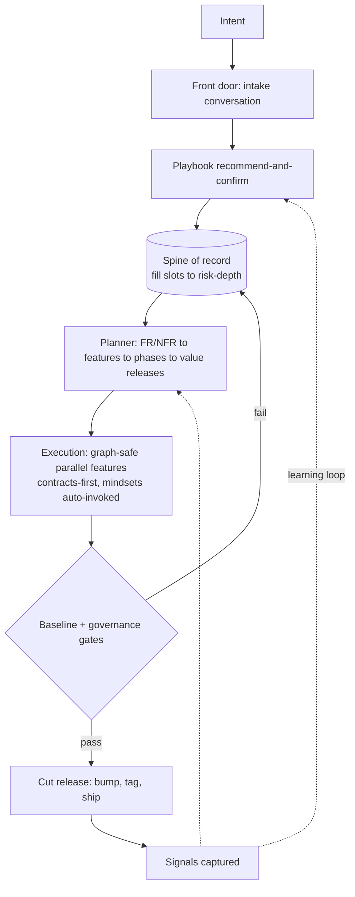
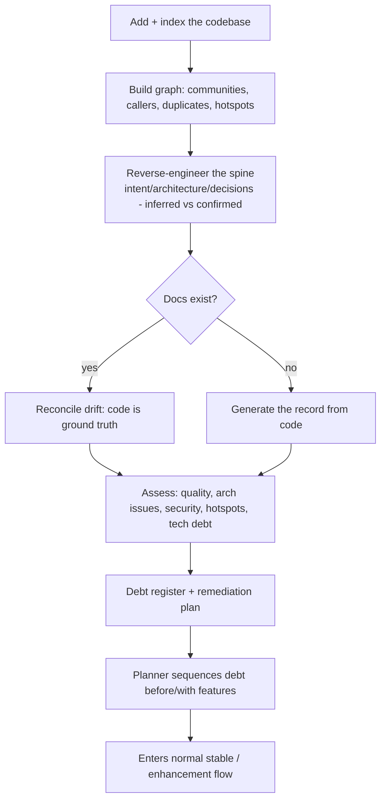
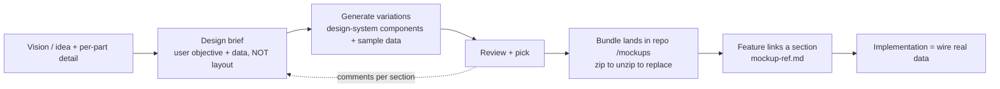

# Sensei Operating Model

> This is a **strategy reframe**, not a feature spec. It restates what
> Sensei + Dōjō *is*, defines the single way a project runs under it, and maps
> the gap between that model and today's build. Each numbered pillar spawns its
> own focused sub-spec. It reframes [`vision.md`](../vision.md)
> and feeds [`plan/README.md`](README.md)'s ranked-gap roadmap.

---

## 1. Vision reframe — the OS for AI-assisted work

With AI, **everyone is a developer** — but most people don't know what *good*
looks like: maintainability, separation of concerns, config, design-token
discipline, security. Left alone, "everyone can build" becomes "everyone ships
insecure, unmaintainable software that churns for months before it's real."

**Sensei + Dōjō is the operating system for AI-assisted work.** It sits between
the human and the agents and **carries the process weight** so the human only
brings *intent*. It injects context, installs the scaffold, picks the method,
plans the product, captures the metrics, and gates on governance.

The one-sentence payoff:

> The discipline that used to require a whole team is carried by Sensei's roles,
> so one person gets a team's rigor at near-zero overhead.

Center of gravity: **Sensei drives** (the OS). The *adaptive methodology engine*
is how it drives. *Quality + governance* is a non-negotiable pillar, not advice.

### The two false choices it resolves

| Tension | The trap | Sensei's answer |
|---|---|---|
| Guidance vs freedom | Rigid process (scrum) restricts + adds overhead; no process (vibe) is fast then rots in month 2–3 | **Adaptive process** — Sensei dials ceremony to the project's type, risk, size, and the user's skill |
| Speed vs quality | Vibe ships greenfield fast but takes months to production-ready | **Depth-proportional-to-risk** — spend ceremony exactly where blast radius is high, nowhere else |

### Why even the flagship agent skips Sensei's own tools

The clearest symptom of the current model: Claude Code, wired to the full Sensei
MCP surface, still reaches for `grep`/`read` instead of the graph, memories, and
mindsets. Diagnosis — the intelligence is **offered, not routed**:

- Tools are *pull*, not *push* — they wait to be queried.
- MCP tools are *deferred* — schemas aren't even loaded until searched for.
- No feedback loop rewards using them or notices skipping them.
- Mindsets are manual `/sensei:agent` calls, not a default cadence.

**The same reason the agent skips the tools is the reason a non-dev won't get
quality: the system sits *beside* the work instead of *inside* it.** Every design
choice below exists to move intelligence *into the path of work* — push, not pull.

---

## 2. Principles

1. **Push, not pull** — context, mindsets, and metrics are injected into the work, never offered on the side.
2. **One product, many skill levels** — the *same* system serves a non-dev and an org, dialed differently.
3. **Governance runs throughout** — a strictness layer over everything, not a final gate.
4. **Depth proportional to risk** — the anti-rework lever, applied at both the product and feature tier.
5. **Docs are the invariant** — the structure of the record never changes; only the method that fills it does.

---

## 3. Operating model

### 3.1 Two layers: invariant record + variable method

The crux that makes consistency and zero-overhead coexist:

| Layer | What it is | Changes? |
|---|---|---|
| **Spine of record** | The canonical doc structure — same shape every time | **Never.** It is the memory substrate that kills rework. |
| **Method (playbook)** | The steps to fill that structure for one work chunk | **Per chunk**, Sensei-guided |

A project passes through *many* methods over its life — vibe to clarity,
mockup-first to shape UX, spec-driven to build, change-flow once stable. What
must not change is the *structure of the record*. The method only decides how
deep, in what order, and up-front vs backfilled each slot gets filled. **Same
slot, different fill strategy** — which is what lets you switch methods
mid-project without losing the thread.

### 3.2 The spine of record (fractal)

The same slot-set at project scope, mirrored (lighter) at feature scope, so a
fresh agent picking up feature #12 gets the *identical doc shape* it would for
the whole project:

| Slot | Project scope | Feature scope |
|---|---|---|
| **Intent** | Vision / objective | This chunk's goal |
| **Audience** | Personas | (inherits) |
| **Outcomes** | Journeys | Acceptance criteria |
| **Structure** | Architecture | Design — *depth dialed by risk* |
| **Constraints** | Governance / rules | Gates that apply here |
| **Decisions** | Decisions log (append-only) | Chunk decisions + learnings |
| **Signals** | Metrics dashboard | Coverage / tests for this chunk |

Two consequences:

- **The spine *is* the memory.** L0/L1/L2 knowledge and the memory system anchor
  *to these slots*, not a side store. (This is the real fix for "why the agent
  skips memories.")
- **Dual-audience for free.** Markdown + frontmatter is human-readable *and*
  LLM-targetable — one file, both consumers.

**Slots materialize differently — the spine is the *logical* structure, not always
files.** Most slots are markdown; two are **live**:

- **Signals (metrics)** — dynamic historical / trend dashboards on the Sensei +
  Dōjō surfaces (quality · coverage · churn · velocity, at daily / weekly /
  monthly granularity), queried from captured data. **Never a `metrics/` folder.**
- **Constraints (governance)** — the governance plane, resolved **live** via
  `get_rules` from multiple sources (local `.sensei/rules.md`, org/Dōjō
  **top-down**, **contributed** bottom-up). **Never a `governance/` docs folder.**

### 3.3 Playbooks — the front door + the method catalog

Every work chunk enters through an **intake conversation**: intent in → clarifying
dialogue → resolve ambiguity → land on a playbook *with reasoning* →
**recommend-and-confirm**. (This is exactly the analyst mindset / `/sensei:idea`
+ `/sensei:brainstorm` we already have — the gap is making it *always* the entry
and making it *emit a chosen playbook*.)

Sensei reads **lifecycle stage × chunk intent × risk** and recommends:

| Chunk situation | Guided method |
|---|---|
| Greenfield, objective fuzzy | Vibe / spike → extract learnings (discardable) |
| Greenfield, UX-heavy | Mockup-first → spec |
| Clear + high blast-radius | Spec-driven, forced deep design |
| Known feature, low risk | GSD (lean plan → build) |
| Stable product, enhancement | Change-flow (impact analysis → targeted design) |
| Stable product, bug | Debug-flow (repro → fix → regression test) |

**Recommend-and-confirm** is the default (rationale shown, one-tap, human in the
loop where blast radius is high); low-risk chunks may auto-select once trust is
established. The recommender **learns** — see §9.

**Not playbooks** (a deliberate scoping call):
- **Caveman coding** is a *user-interfacing style* — how the human phrases intent, not how a chunk is built.
- **Token reduction** is an *emergent benefit*, not a method — it falls out when the LLM uses the Sensei toolkit (pushed context, less flailing) and the gateway routes to **local models alongside paid** ones.
- **Wiki-style** is a *doc-structure influence* — it either already matches the interlinked spine of record (§3.2 / §5) or gets learned into it; not a separate playbook.

### 3.4 The Planner — product planning (scrum master / project lead)

The Planner does not schedule execution; it **plans the product**. It takes
**FRs + NFRs → groups cohesive features → phases → value-delivering releases**.
Each release is a *coherent value increment* (a theme, an outcome), never a
random bundle. It is continuous — re-planned as things change.

"Release" has two faces (previously conflated):

| | Owner | Nature |
|---|---|---|
| **Planned release** | Planner | strategic — *what value ships together, in what order* |
| **Cut release** | Delivery policy | mechanical — tag/bump/ship when the planned features are done |

**Rework has two tiers**, and depth-by-risk applies to both:

- **Product tier** — incoherent releases, or NFRs discovered late → replan + rebuild. *Owned by the Planner.*
- **Feature tier** — shallow feature design → rebuild the feature. *Owned by the build playbook + Structure slot.*

**NFRs thread through three places at once**: the spine (*Constraints* slot), the
baseline (enforced as gates), and the Planner (which *schedules* the hardening —
"perf pass before the scale release, security audit before the payments release").

### 3.5 Delivery

| Concept | Scope | Owner |
|---|---|---|
| **Delivery policy** | project, set once | mechanical branching/bump/tag rules (git-flow / trunk / worktree / custom) |
| **Cut release** | per release | executes the planned release; bump = max of bundled feature impact hints |
| **Patch lane** | reactive | fast-track; **skips product planning** (debug-flow → patch release) |

Each feature carries a semver **impact hint** (none/patch/minor/major) Sensei
derives from its diff; the *release* owns the bump, not the feature. Parallel
feature dev → combined release falls out for free: features are independent units
in a "ready" pool; a release event bundles whichever are done. This generalizes
Sensei's own `develop → main` + `make bump` cadence.

### 3.6 Baseline + governance

The baseline is a **capability contract, not a fixed toolset** — installed once
at project start (recommend-and-confirm), then it's just `bun run x` / `make x`:

| Capability | Code adapter | Non-code adapter (e.g. a book) |
|---|---|---|
| Format | prettier / rustfmt | style-guide conformance |
| Lint | eslint / clippy | grammar / tone |
| Unit test | vitest / cargo test | fact / continuity check |
| Integration | — | chapter-to-chapter coherence |
| Flow test | Playwright e2e | full read-through / arc check |
| Coverage | coverage % | outline coverage |
| Quality | qlty.sh score | readability / pacing |
| Security | semgrep / deps scan | (n/a) |
| Churn + velocity | git signal | draft-revision signal |
| **Design system** | rokkit tokens + component catalog | template / layout system |

Sensei detects the stack (rides the manifest-adapter / `get_commands` /
`detect_toolchain` direction), installs concrete tools, scores conformance as a
**project health score**, and streams metrics into the *Signals* slot → the
learning loop. **Governance = the strictness layer** over the baseline (and the
spine + playbooks): Dōjō (org) sets what's **mandatory** = hard gate,
non-overridable (matches the existing rules hierarchy); a personal project
inherits a default bundle; the rest are **guided targets that ratchet up**.

**Governance is a *dynamic plane*, not static files.** Rules resolve **live** at
the point of work (`get_rules`) from multiple, changing sources — **top-down**
(org / Dōjō mandated, federated down) and **contributed bottom-up** (a proven
pattern / memory promoted into a rule). Precedence: mandatory rules are
non-overridable; more-specific scopes refine the rest. A folder of static files
can't capture multi-source, evolving, resolved-at-runtime rules — which is why
governance is a plane, not `docs/governance/`.

**Default gate line:** security scan + a **≥80% test-coverage floor** (org-tunable
via Dōjō) + a quality floor **block**; everything else installed + guided. Orgs
tighten via Dōjō; individuals loosen only the non-mandatory parts.

### 3.7 Execution — vertical features, graph-safe parallelism

A feature is a **vertical slice** (db → api → ui). The agent pool works **one
release at a time**, one or more features. Sensei's unfair advantage is that it
**already has the code graph**:

- **Overlap detection** — disjoint features (no shared nodes) run in parallel; overlapping features serialize. Conflict-free by construction, decided from the graph.
- **Contracts first** — the cross-layer contract (schema + api shape) is fixed in the feature's *Structure* slot *before* code, so db/api/ui sub-agents build against an agreed interface and don't diverge. That contract IS the design depth that prevents integration rework.
- **Continuous integration** — baseline flow-tests run per feature; cross-layer breakage surfaces immediately, not at release end.
- **Mindsets get a home** — the executor **auto-invokes** them from graph blast-radius: touches auth → security; touches a hot path → performance; touches UI → ux. Push, not pull. Rides **Relay + the P3 daemon run-engine**.

### 3.8 Team-role mapping

| Traditional role | Sensei mechanism |
|---|---|
| Product lead / scrum master | **Planner** — phases, releases, what ships |
| Architect / tech lead | design-depth step + graph-informed contracts (*Structure* slot) |
| Dev team | agent pool running build playbooks, one release at a time |
| Specialists (security / perf / ux / devops) | **Mindsets**, pulled in by what the feature touches |
| QA | acceptance-tester mindset + baseline gates |
| Release manager | delivery policy + cut-release |

### 3.9 The model in one flow



### 3.10 Graph-derived architecture analysis

The code graph doesn't just enable safe parallelism (§3.7) — it makes the **true
architecture measurable**. This is proven in practice: architecture reviews
surface real problems directly from graph structure, across **mono-repo *and*
multi-repo** (the graph spans repos).

| Signal | What it catches |
|---|---|
| **Cycles** | circular dependencies between modules / packages |
| **Depth / layering** | over-deep call chains; layers violated (ui → db directly) |
| **Module boundaries** | wrong cohesion / coupling; god-modules; features smeared across modules |
| **Fan-in / fan-out** | unstable hubs; wrong dependency direction (should point toward stable) |
| **Cross-repo topology** | how services / packages actually depend across a multi-repo system |

The core move: compare the **emergent architecture** (what the graph shows)
against the **intended architecture** (the *Structure* slot). **The delta is
architectural debt** — and it feeds three places: the brownfield assessment
(§4 step 5), the Planner (schedule the refactor), and the ongoing NFR gate
(regressions in cycles / depth / coupling warn or block). Rides
`get_communities`, `get_callers`/`get_callees`, `get_duplicates`.

### 3.11 The three planes — Sensei · Dōjō · Relay as one product

Sensei + Dōjō is **one product with three planes**; the operating model runs
across all three, and none is a bolt-on:

| Plane | What it is | Role in the model |
|---|---|---|
| **Sensei** (local daemon + app) | the single-user OS | indexes the graph, holds the spine, runs playbooks / planner / baseline / learning-loop, wears the mindsets |
| **Dōjō** (cloud) | the team / org plane | governance (mandatory + federated rules), **collective intelligence** (patterns / memories / insights promoted across projects + teams, k-anonymized), the org-wide baseline standard, findings travel dev → maintainer → downstream |
| **Relay** | the execution / supervision plane | runs long multi-agent work + supervises it remotely (phone), progress-over-asking, raises gates to a human, zero-knowledge |

The "one product, many skill levels" dial (§1) maps onto the planes: a solo user
runs **Sensei** alone; an org turns on **Dōjō** to enforce consistency and share
learning at scale; **Relay** is how anyone supervises the agent pool (§3.7)
without being at the desk.

Two couplings make it cohesive rather than three tools:
- **Relay is the runtime for §3.7 execution** — the daemon-owned run engine (P3) *is* how features get built one release at a time under supervision.
- **Dōjō is the org scope of §3.6 governance + §9 learning loop** — the compounding payoff is **collective intelligence**: a proven pattern/memory doesn't just help one project, it promotes up the federation so every team inherits what works.

---

## 4. Project entry modes — greenfield & brownfield

Two ways a project enters the model. Both converge on the **same spine of
record**; they differ only in how the spine gets *populated*.

| Entry | Starting point | Spine of record is… |
|---|---|---|
| **Greenfield** | Intent (an idea) | **filled forward** as you build |
| **Brownfield** | Inherited code | **reconstructed backward** from the code |

**"Inherited code is not the same as old code."** Old code is code *you* wrote
that has aged — the context still exists (in your head, in git, in the record).
Inherited code is code whose **intent was never captured or has drifted** — the
spine of record is *missing or untrustworthy*. So brownfield's first job is not
"read the code," it's **trust calibration**: establish ground truth (the code +
graph are the only reliable source), then rebuild the record around it, tagging
every slot **inferred** vs **confirmed**. The **trust baseline is doc↔code drift
= zero** — once the record matches the code, it's trusted; only then does the
**Planner** step in to define the *to-be* architecture, compute the gap vs the
emergent architecture (§3.10), and sequence remediation (**as-is → to-be → gaps →
plan**).

### Brownfield onboarding pipeline



1. **Index** — add the repo; the daemon indexes it (rides `codebase-indexing`).
2. **Graph** — communities, call graph, `get_duplicates`, complexity hotspots reveal the *real* architecture, not the claimed one.
3. **Reverse-engineer the spine** — reconstruct Intent / Outcomes / Structure / Decisions from code into the doc slots (rides the `reverse-engineering` + `extract-docs` skills), each tagged **inferred** or **confirmed**.
4. **Reconcile drift** — where docs exist but disagree with code, **code is ground truth**; the doc-drift signal (G3) already *detects* this — extend it to *reconcile*, not just flag.
5. **Assess** — quality (qlty.sh), architectural issues (cycles / depth / layering — §3.10), security scan, duplication, hotspots → a **debt register** (rides `analyze` / codebase health check).
6. **Remediation plan** — the **Planner treats tech debt as first-class work items** and sequences it *before or alongside* feature work. You cannot safely add features on unstable ground — depth-by-risk says stabilize the high-blast-radius debt first.
7. **Stabilize → normal flow** — once the record exists and critical debt is addressed, the project enters the standard stable / enhancement lifecycle.

This is almost entirely an **orchestration of capabilities Sensei already has**
(indexing, graph, drift, reverse-engineering, analyze) into one onboarding
playbook — plus the net-new **debt register + Planner integration**.

---

## 5. Canonical doc structure — the one that sticks

**Why prior structures didn't stick:** they organized by *type* (a documentation
library), so every new doc raised "where does this go?" A structure sticks when
it's aligned to the **workflow stage that produces the doc**, and when it's
**fractal** (project + feature share one shape). Proposed layout:

```
docs/
  vision.md                 # Intent — the why/objective (living)
  personas/                 # Audience
  journeys/                 # Outcomes — user flows
  roadmap/                  # Planner output: phases + value releases
  design/                   # project Structure: architecture + design-system reference
  mockups/                  # system-wide mockup + design system — ONE cohesive artifact
                            #   (repo-resident bundle; features link a section — see §6)
  features/                 # the FR/NFR registry — the "what"
    <feature>/              # a self-contained dossier, mirrors the project shape
      brief.md              # intent-level (user objective + data) — feeds design + build
      design.md             # depth-by-risk; cross-layer contract
      mockup-ref.md         # link to section(s) of the system mockup — OPTIONAL,
                            #   added once mockups exist (none at requirement stage)
      plan.md               # tasks
      tests/                # acceptance
      decisions.md          # learnings → memory
  decisions.md              # project-level append-only log
                            #
                            # NOT folders — materialized as LIVE surfaces (see §3.2, §7):
                            #   Signals (metrics)   → historical/trend dashboards on Sensei/Dōjō
                            #   Constraints (rules) → governance plane: .sensei/rules.md + Dōjō
```

- **Features / Phases / Plan are three views of one feature set**, not three folders: `features/` = *what*, `roadmap/` = *when + value*, and the active Plan = *now* (WIP + sequencing) derived from both.
- The per-feature dossier is why context is portable and rework drops — nothing to re-derive; every slot is already there, filled to the depth its risk warranted.
- **Mockups are system-wide, not per-feature** — one cohesive mockup keeps the whole app consistent; a feature *references a section* via `mockup-ref.md`, only once mockups exist (a requirement-stage feature has none). Repo-resident bundle — see §6.
- **Not every slot is a file.** *Signals* (metrics) and *Constraints* (governance) are **live surfaces, not folders** (§3.2). The tree holds what is *authored*; dynamic data is *queried*, never stored as docs.
- Sensei **scaffolds this structure** at project start as part of the baseline (§3.6), for code and non-code projects alike.

*(Migration note: the current `requirements/ journeys/ mockups/ architecture/
spec/ plan/` layout maps forward — `requirements → vision + personas`,
`architecture → design`, `spec → features/*`, `plan → roadmap` — but that's a
follow-on task, not a prerequisite.)*

---

## 6. Design / mockup subsystem

The observed pain: `claude.ai/design` and ad-hoc mockup generation **don't follow
the design system** — they hand-roll components (hand-rolled buttons every time)
→ inconsistency in the implemented product → **another correction cycle**. The
fix is architectural: **generate mockups *against* the design system + component
catalog, so implementation is "just wire the data."**

### 6.1 The flow



1. **Design brief** — captured at the **intent level**: the user's objective, the
   job-to-be-done, the content/data. *Not* "a card here, a box there." This is
   what you hand a designer.
2. **Vision-change communication** — when the vision shifts, Sensei emits (a) an
   **outline of how the vision changed** + the app's parts, and (b) **per-part
   detail** — the exact packet a designer needs.
3. **Variation generation** — layout variations for a **section of the system
   mockup**, built from the **design-system tokens + component catalog** (Sensei:
   rokkit, via `get_lib_docs`/`search_lib_docs`), populated with **sample data**.
4. **Review + choose** — via the mockup viewer (§7); pick what makes sense;
   per-section comments feed back into the brief → the cycle.
5. **Persist in the repo** — the mockup is a **versioned bundle that lands in the
   top-level `mockups/` folder** (§6.3), not an on-the-fly handoff.
6. **Link + implement** — a feature references the chosen section via
   `mockup-ref.md`; because the mockup uses real components, implementation is
   data-wiring, not re-building.

### 6.2 The hard constraint

- The generator is **fed the component catalog + tokens as context** and
  constrained to them.
- **No hand-rolled primitives** is a **governance gate** — a lint/review check on
  both mockups and implementation (hand-rolled button where a `<Button>` exists →
  fail). This closes the correction cycle at its source.
- Design system is installed as a **baseline capability** (§3.6) for any UI
  project, so there is always a catalog to generate against.

### 6.3 Persistence — the mockup lives in the repo

Mockups are **system-wide and cohesive** (one mockup for the whole app keeps it
consistent) and must **stay with the codebase**. Two handoff paths tried:

| Path | Result |
|---|---|
| `claude.ai/design`, read on-the-fly | ❌ ephemeral — doesn't stay with the codebase |
| Download as **zip → unzip → replace `mockups/`** | ✅ mockup is a **versioned repo artifact** |

So the subsystem produces a **downloadable, versioned bundle** that lands in the
top-level `mockups/` folder. Features at requirement stage have **no mockup**;
once generated, a feature links a **section** via `mockup-ref.md`. Because the
bundle is design-system-constrained (§6.2), it is the same components the
implementation reuses.

---

## 7. Human surfaces

The human-in-the-loop layer over the spine + plan:

- **Project / repo tree + file view** — browse the folder tree, open and render any file (markdown, mockups, metrics).
- **Doc viewer / review / comment** — read + comment on any spine slot.
- **Plan viewer with per-section chat** — select a section/segment, comment or
  converse, feed it back → the plan refines → *the cycle*.
- **Mockup review** — see variations with sample data, pick, comment.
- **Metrics dashboards** — dynamic historical / trend views (daily / weekly /
  monthly) of quality, coverage, churn, velocity, and the project health score;
  on Sensei, rolled up across teams in Dōjō.

Key rule: **comments anchor to spine slots and become part of the record**
(decisions / memory), so human feedback is never lost between sessions — the same
anti-rework principle as everything else.

**Scope — a review + steer surface, not an editor.** Building a text editor is a
big lift and a solved problem the user already has (their real editor + git).
Sensei's surface is **view · render · comment · annotate** (plus per-section chat
to steer the agent); **edits are applied by the agent** from those comments (or by
the user in their own editor), then the
spine re-renders. This keeps the surface consistent with the model (Sensei drives,
the agent executes) and avoids the editor build. If light inline editing is ever
warranted, **embed an existing component (Monaco / CodeMirror) — don't build one.**

---

## 8. Non-code projects

The spine, playbooks, planner, and baseline are **domain-agnostic**; only the
*adapters* specialize (see the non-code column in §3.6). A book or screenplay is a
project: features = chapters/arcs, releases = drafts, quality gates = continuity /
pacing / readability, mockups = outline/structure variations. Validating one
non-code project end-to-end is a milestone that proves the model isn't
code-specific.

---

## 9. Learning loop mechanics

The loop that makes the system *compound*, not just consistent:

```
recommend playbook → confirm/override → chunk runs → outcome-metrics return
→ attribute to (user × project-type × chunk-nature × playbook) → sharpen next recommendation
```

- **Fuel** = the baseline metrics (§3.6). No metrics → no learning.
- **It teaches the user too** — shows which approaches produced low rework + high quality.
- **Rides the existing analyzer + FTR loop.** Today Sensei learns
  *recommendation → outcome* (G1/G2: the FTR loop closes, memories promote). This
  extends the same machinery to *playbook → outcome* attribution — the playbook
  recommender becomes the consumer of signals that currently have almost no
  consumer.

---

## 10. Capability map — existing · planned · net-new

The model is mostly a **reorganization of capabilities Sensei already has** into
one coherent whole. Status: ✅ shipped · 🟡 partial / planned · ❌ net-new.

**Capture & graph (L0)**

| Capability | Status | Role in the model |
|---|---|---|
| Indexing — code graph (files/functions/components/hooks/docs) | ✅ | foundation for every pillar |
| Embeddings (~157k nodes) | ✅ | semantic search + context (§3.3) |
| Incremental watcher · scan/reconcile | ✅ | keeps the graph live |
| Sessions · transcripts · events capture | ✅ | learning-loop fuel (§9) |

**Knowledge & learning (L1/L2)**

| Capability | Status | Role in the model |
|---|---|---|
| Patterns + **anti-patterns** (`get_patterns`/`match_pattern`) | ✅ | playbooks + baseline + review; design conformance |
| Conventions (`get_project_conventions`) | ✅ | baseline house-style (§3.6) |
| Insights + insight-copy (mentor voice) | ✅ | human surfaces (§7) |
| Memories + promotion ladder | ✅ | **anchor to spine slots** (§3.2) |
| Recommendations + FTR loop | ✅ (G1) | learning loop (§9) |
| Impact / verdicts | ✅ | learning loop (§9) |
| Signals (churn · correction-prone · rule-candidates) | ✅ | baseline metrics + Planner |
| Duplicates (`get_duplicates`) | ✅ | architecture debt (§3.10) |
| Communities (`get_communities`) | ✅ | architecture analysis (§3.10) + execution (§3.7) |
| Doc-drift (G3) | ✅ | **extend to reconcile** for brownfield (§4) |
| Graph architecture metrics (cycles/depth/layering) | 🟡 | **inference layer** (§3.10) |
| Traceability · inferencing · benchmarks | ✅/🟡 | decisions record + model routing |
| Collective intelligence (cross-project/team learning) | 🟡 (Dōjō) | compounding loop (§3.11, §9) |

**Libraries · context · workflow**

| Capability | Status | Role in the model |
|---|---|---|
| Library intelligence (`get_lib_docs`/`search_lib_docs`/`add_library`) | ✅ | **design-system catalog for the mockup generator** (§6) + context |
| Hybrid semantic `search` + `context_pack` | ✅ (G4) | front-door context (§3.3) |
| `get_layered_context` · callers/callees/call_flow | ✅ | execution + architecture |
| Clarification-prompting | 🟡 | **the intake conversation** (§3.3) |
| Mindsets (analyst/dev/tester + specialists) | ✅ | **auto-invoke from blast-radius** (§3.7) + team map (§3.8) |
| Workflow commands (`/sensei:idea…validate`) | ✅ (fixed pipeline) | **become adaptive playbook steps** (§3.3) |
| Reverse-engineering / extract-docs / analyze skills | ✅ | **orchestrate into brownfield onboarding** (§4) |

**Dōjō plane (team / org)**

| Capability | Status | Role in the model |
|---|---|---|
| Rules hierarchy (mandatory · scopes · promotion · federation) | ✅ | **strictness layer** (§3.6) |
| Federation backend (dojo Worker `/v1` — rules + artifacts; the `dojo-mind` Rust service was removed, ported here) | ✅ | collective-intelligence transport (§3.11) |
| Dōjō console · tenants · policies (`/v1` in Worker) | 🟡 port in progress | org governance surface (§3.11) |
| Default governance bundle | 🟡 planned | baseline default rules (§3.6) |
| DORA delivery module | 🟡 planned | delivery metrics → Planner (§3.4) |

**Relay plane (execution / supervision)**

| Capability | Status | Role in the model |
|---|---|---|
| Relay P0–P2 (phone UI · segments · gates · nudge) | ✅ | remote supervision (§3.11) |
| Relay P3 daemon run-engine | 🟡 planned | **execution runtime** (§3.7) |
| Relay P4–P6 (push · realtime · multi-assistant · team) | 🟡 planned | scale-out |

**Gateway**

| Capability | Status | Role in the model |
|---|---|---|
| LLM routing · gemma4 · ollama · consensus/infer/embed | ✅ | model tier for every LLM step |
| HF model support | ❌ planned | cross-cutting track |

**Net-new (the reorganization work)**

| Capability | Status | Section |
|---|---|---|
| Playbooks (adaptive selection) | ❌ | §3.3 |
| Planner (FR/NFR → value releases) | ❌ | §3.4 |
| Baseline capability-contract scaffold | 🟡 (manifest-adapter seed) | §3.6 |
| Canonical doc scaffold | ❌ | §5 |
| Design/mockup subsystem | ❌ | §6 |
| Doc/plan viewer + per-section chat | ❌ | §7 |
| Debt register + remediation planning | ❌ | §4 |
| Playbook→outcome learning attribution | ❌ (extends FTR loop) | §9 |

---

## 11. Roadmap (proposed sequence)

Each phase ships value on its own and rides an existing capability where possible.

1. **Foundations** — canonical doc scaffold (§5) + spine slots + memory anchored to slots (§3.2). *Makes push-not-pull real; low risk, high leverage.*
2. **Front door + playbooks** — intake emits a playbook; method catalog; recommend-and-confirm (§3.3).
3. **Baseline + governance** — capability-contract scaffold + gates + design-system-as-baseline (§3.6). *Rides manifest-adapter.*
4. **Planner** — FR/NFR → features → phases → value releases; two-tier depth (§3.4).
5. **Brownfield onboarding + architecture analysis** — reverse-engineer the spine, reconcile drift, graph architecture metrics (cycles/depth/layering), debt register → Planner (§4, §3.10). *Mostly orchestrates existing capabilities.*
6. **Execution** — graph-driven parallelism + contracts-first + mindsets auto-invoked (§3.7). *Rides Relay P3.*
7. **Design/mockup subsystem** — brief → variations-on-design-system → review → lossless handoff (§6).
8. **Surfaces** — project tree + doc/plan/mockup/metrics view + per-section chat; **view + comment, no editor** (§7).
9. **Learning loop** — playbook→outcome attribution (§9). *Extends FTR loop.*

**Cross-cutting tracks:** **Dōjō org-plane** (governance federation + collective intelligence + console `/v1` port) — parallel; **Relay** execution/supervision (P3 run-engine feeds phase 6; P4–P6 scale-out); gateway HF support (separate track — gateway repo); non-code adapter validation (after §3–§6 stable).

---

## 12. Open decisions

- ✅ **Gate line defaults — RESOLVED:** default **≥80% test-coverage** floor + security scan **block**; **org-tunable via Dōjō**.
- ✅ **Playbook catalog — RESOLVED:** the §3.3 build-method list stands; caveman (interaction style), token-reduction (emergent via toolkit + local-model routing), and wiki-style (doc-structure influence) are **not** playbooks.
- ✅ **Doc-structure migration — RESOLVED:** lazy / incremental — **scaffold the structure for Sensei first**, then a few other projects. Test bed: **`~/Developer/strategos/monorepo`** (bun + cargo monorepo — apps/packages/services, mockups present, docs sparse → exercises **brownfield onboarding** + the doc scaffold + `mockup-ref` linking + reverse-engineering). Migrate Sensei's own existing docs opportunistically (requirements→vision+personas · architecture→design · spec→features/* · plan→roadmap).
- ✅ **Planner autonomy — RESOLVED:** auto-plan as much as possible; **confirm once at the plan level**, then run autonomously. Material re-plans (scope / release changes) re-surface for confirmation; minor resequencing is automatic.
- ✅ **HF gateway — RESOLVED (out of scope here):** handled separately in the **gateway repo**; this plan just consumes it via the existing gateway routing.
- ✅ **Brownfield trust calibration — RESOLVED:** the baseline is **doc↔code drift = zero** (record matches code = ground truth). Only then does the **Planner** step in — define the *to-be* architecture, compute gaps vs the emergent architecture (§3.10), and sequence remediation (as-is → to-be → gaps → plan).
- ✅ **Doc surface depth — RESOLVED:** **view · comment · annotate** — no editor; edits are applied by the agent (or the user's own editor).
