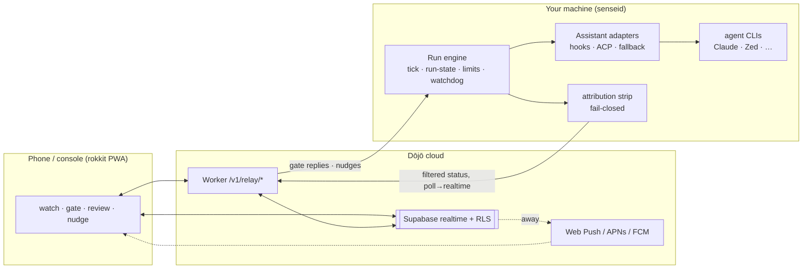
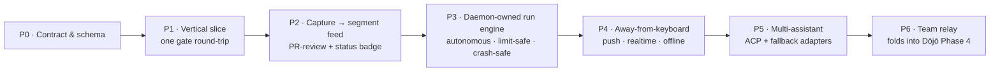

# Plan · The Relay engine — end-goal design + phased build-up

> The autonomous **run engine** (daemon-owned) plus its **remote supervision
> surface** (phone/console over the Dōjō). One system: sensei executes a deep,
> phased plan on your machine, and you watch/steer/gate it from anywhere — with
> **zero code leaving the machine**.
>
> Consolidates and supersedes the earlier `relay-personal-beta.md` +
> `autonomous-run-engine.md` drafts. Grounds in
> [architecture/dojo → Relay](../architecture/dojo.md#relay--through-the-dōjō),
> [journeys/dojo → Relay](../journeys/dojo.md#relay--away-from-keyboard-through-the-dōjō),
> and the manual [`spec/EXECUTION-PLAN.md`](../spec/EXECUTION-PLAN.md) (the 5-day
> vacation run this rebuilds). Direction set 2026-07-16. Feeds
> [plan/README → Phase 5](README.md#phase-5--relay-new-surface--ws-g).

---

## 1. North star (the end goal)

A person authors a **deep, phased plan**. The **daemon executes it autonomously** —
advancing feature-by-feature through a spec-first gated loop, committing/pushing per
feature, **pausing and auto-resuming on provider limits**, surviving crashes, and
**defaulting-and-flagging on unknowns** (hard-blocking only on irreversible
actions). Any of the person's assistants (Claude Code, Zed, …) is driven through a
**uniform contract**. From a **phone**, over the Dōjō's zero-knowledge realtime
line, the person sees **filtered logical progress**, answers **gates** and reviews
**advisory flags** section-by-section, **nudges** to steer, and always sees
**running / paused / crashed** — and **no code or transcript ever crosses**.

**Guarantees (non-negotiable):**
- **Outbound-only + zero-knowledge** — daemon opens the connection; only *filtered
  status* + gate prompts + replies cross. Never code, diffs, or transcripts.
- **Progress over asking** — autonomous by default; asking is the rare exception.
- **Survivable** — the run outlives the laptop session; limits and crashes are
  recovered, not fatal.
- **Reviewable** — every autonomous assumption is logged and reviewable *without*
  having blocked.

---

## 2. End-state architecture



Two halves, one system:
- **Run engine** (§5) — the daemon-owned autonomous executor.
- **Remote surface** (§6) — what the phone renders and how the person responds.

The daemon reaches the cloud through its **existing** outbound client
(`crates/senseid/src/dojo/client.rs`, device-token, poll-first) — Relay adds methods
+ `/v1/relay/*` routes; the Worker owns Supabase + RLS. Realtime is a later
phone-side swap; the daemon never talks to Supabase directly.

---

## 3. Principles & locked decisions (2026-07-16)

| # | Decision |
|---|---|
| D1 | **Transport = existing daemon→Worker `/v1` device-token client, poll-first.** Realtime is a later phone-side swap; daemon never touches Supabase directly. |
| D2 | **Schema extends `dojo.*`** (no separate `relay` schema). |
| D3 | **One `notification_prefs`** governs both console notifications and relay pushes. |
| D4 | **Beta = single-user personal Dōjō**; seed a membership + device token (tracked temporary — [decisions.md](decisions.md); must not become a prod auth path; real join flow = Dōjō Phase 4). |
| D5 | **Relay `/v1/relay/*` is decoupled** from the Phase-4 console `/v1` port. |
| D6 | **Gate source: hook (Claude PreToolUse) first, ACP later — sequential.** |
| D7 | **No agent runtime of ours** — the engine *supervises + normalizes* existing agent CLIs; never reimplements the agent loop or task decomposition. |
| D8 | **Daemon owns the tick** — fixes the vacation run's session-coupled death. |
| D9 | **Progress over asking** — advisory-flag-and-continue by default; hard-block only for irreversible/safety/out-of-scope. |
| D10 | **Filtered feed carries logical cadence only** — never diffs or raw tool output. |
| D11 | **UI = rokkit** (schema/conversational forms, list badges, sparklines); patching `~/Developer/rokkit` is authorized for this work (scoped override of the raise-an-issue rule). |
| D12 | **Quality gates never degrade** — reviewer/gate agents are pinned to the **strong model** (Opus), exempt from local-first + degrade-on-limit; under a limit the **review step waits**, it never downgrades. |
| D13 | **Goal-anchored** — the plan's objective travels with the run; the depth bar and every reviewer gate check **alignment to the goal + drift**, not just local correctness. |
| D14 | **Done = backlog empty; no self-imposed caps.** The run continues until every planned item is terminal (shipped / hard-blocked / advisory-flagged). Soft targets ("~8 features", "if time allows") are **guidance, never stop conditions** — the agent may not declare "done" while runnable open items remain. *(This is what stopped the 5-day run at 8.)* |
| D15 | **Security gate every phase.** A security + vulnerability assessment (`sensei-security-reviewer` + `semgrep` over the phase diff) with findings **resolved before merge** — injection, authz, secret exposure, SSRF, unsafe deserialization; prefer secure-by-default libraries. **No known vulnerability ships.** |

---

## 4. Data model (`dojo.*` + `activity`/`sensei`)

**Two layers, deliberately separate** — the granular private capture is never
rendered remotely:

| Layer | Holds | Where | Remote? |
|---|---|---|---|
| **Capture** (private, granular) | every tool call + turn + `TodoWrite` | `activity.sessions` + `activity.assistant_events` (+ `snapshots`, `workflow_state`) — **built** | never — feeds the *learning* loop; un-stripped |
| **Relay view** (published, simplified) | `Execution → Segment → Item` outline + gates | new `dojo.relay_*` | yes — filtered via `attribution.rs` |

**New tables & enums:**

| Object | Purpose |
|---|---|
| `dojo.relay_sessions` | execution ↔ daemon ↔ user + heartbeat/presence; drives the **running/paused/crashed** indicator |
| `dojo.relay_segments` | the phone-renderable outline: `(execution_id, seq, parent_id, title, summary, detail, state, is_gate, gate_severity, response_verdict, response_note, submitted_at)`; nestable (segment→item) |
| `dojo.relay_inbox` | live interaction rows: approvals / decisions / chat / nudges / stalls; `direction`, `status`, `payload` (the rokkit form schema), `reply` |
| `dojo.notification_prefs` | one table — console notifications *and* relay pushes; quiet hours, per-Dōjō mute |
| `dojo.push_subscriptions` | per user×device Web-Push/APNs/FCM tokens (unused until P4) |
| `sensei` run-state (grow `workflow_state` → `run`) | plan_ref · project · **status** · `paused_until` · current phase/feature |
| `run_event` (append-only) | cadence log: `feature_started·gate_passed·committed·pushed·paused_on_limit·resumed·flagged·blocked·crashed` — the filtered feed *and* the audit trail |
| enum `run_status` | `running · paused · blocked · crashed · done · failed` — **`crashed`** = unexpected death (distinct from `failed` = terminal work verdict) |
| enum `gate_severity` | `blocking` (hard-block, halts) · `advisory` (async review, never halts) |

**Schema spans two databases** (from `database/design.yaml`): the `dojo.*` relay
tables live in the **cloud Supabase** (`dojo` scope) while run-state (`runs`/
`run_events`) is **daemon-local** (`activity`/`sensei`, `default` scope). **No
cross-DB FK** — `relay_sessions.run_id` is a plain uuid mirroring the local run
(cf. `sensei.projects.dojo_id`); the daemon holds the authoritative `run_status` and
*mirrors* status/progress to the cloud for display.

All DDL is full-file (no `alters`), applied with `dbd`; RLS = user owns their
`relay_*` rows; the daemon writes via `/v1` (service-role behind the Worker).

---

## 4.5 Learnings — the 5-day run (what broke → the fix)

Every stop/degradation observed in the manual run
([`spec/EXECUTION-PLAN.md`](../spec/EXECUTION-PLAN.md)), and where it's now handled:

| Observed | Fix |
|---|---|
| **Self-imposed feature cap** — stopped at 8, left open items unbuilt *(pre-vacation stop)* | **backlog-driven completion, no soft-target stops** — D14 |
| Rate limit **with reset time** → run *stopped* *(day 3)* | pause + **auto-resume at reset** — §5 |
| **Weekly cap** (*"Limits will reset at 11:29 AM"*) | same; long pause the daemon survives + **local-first carries work** — §5 / §6.5 |
| Rate-limit **pressure** | **adaptive concurrency** — throttle to a single sub-agent + local-first *before* pausing — §5 |
| Limit surfaced as **CLI text, not a 429** | parser reads Claude Code's limit-message format — §5 |
| Tick **died with the session** | **daemon owns the tick** — D8 |
| **Disk filled up** mid-run | **per-phase disk housekeeping** + disk-pressure health signal — §5 |

The throughline: an away-from-keys run must **degrade, never stop** — throttle,
offload, pause-and-resume, clean up — and only ever truly stop when the backlog is
empty or a hard-block needs the human.

## 5. The run engine (daemon-owned)

**Ownership.** `senseid` is a long-lived local service with a durable task queue +
run-state — it survives laptop/session death (the vacation run's fatal flaw).

- **The tick** — a daemon `AdvanceRun` task per active run: if `running` and not
  `paused_until > now`, advance the next feature → run the gate-agent loop
  (`spec-doc-reviewer → implement → done-gate-verifier + wrong-gate-hunter →
  sensei-persona-reviewer → commit + push`) → emit `run_event`s. Serial per run.
- **Driving the agent** — spawn/supervise an **existing** agent CLI headless per
  feature (Claude Code first; ACP + adapters later, §7). Drives the *cadence*, never
  the agent's loop.
- **Limit handling** *(the thing that broke — twice)* — Claude Code surfaces limits
  as a **CLI text message**, not a structured 429 (e.g. *"Paused — you've hit your
  limit. Limits will reset at 11:29 AM · View usage"*), so the parser recognizes that
  message format at the agent-invocation boundary (and the gateway for gateway-routed
  calls). Two tiers:
    - **Rate limit** (reset in minutes–hours) → `paused`, `paused_until = reset +
      jitter`, schedule a resume tick, auto-resume.
    - **Weekly cap** (reset possibly *days* out) → same, but a long pause the daemon
      survives (persistent run-state) — and **local-first routing carries the
      structured work through it** (§6.5), so the run keeps progressing on
      gemma4/qwythos while Claude is capped.
    - **Unparseable / ambiguous reset** (bare time, no date) → assume next
      occurrence; if still uncertain, capped backoff + re-check.
    - **Graduated response (before any pause):** on rate-limit *pressure* the engine
      first **throttles concurrency to a single sub-agent** and **routes local-first**
      (§6.5); a full pause is the *last resort* — only when even one cloud call can't
      proceed. *(Dropping to one sub-agent under pressure was a real coping move in
      the 5-day run — now automatic.)*
  The run **never dies**; the feed shows `paused until <T> (<tier>)`.
- **Watchdog / crashed** — per-run heartbeat. A hung invocation is killed + retried
  (bounded). Unexpected death (agent gone, heartbeat stale, daemon restart) →
  `crashed` + **bounded auto-recovery** (resume from last committed checkpoint); if
  unrecoverable, surface `crashed` + push.
- **Per-phase housekeeping** — at each phase boundary, reclaim disk (build artifacts,
  stale worktrees, caches, logs). A long run otherwise **fills the disk** (a real
  5-day-run failure); **disk pressure is a monitored health signal** (low disk →
  clean; if still low → pause + alert, don't crash blindly).
- **Delivery events** — commit/push per feature surface as status; **never merge
  `main` autonomously** (a hard-block gate).

### Control channel — how a reply reaches the agent

There is **no shared channel into a running assistant**, and Claude has no loop that
polls a file on its own (no `interrupt.md` it reads on a timer — it has no timer). The
**only bridge is hooks**: Claude Code runs a shell command at lifecycle points
(SessionStart · UserPromptSubmit · PreToolUse · PostToolUse · PreCompact · Stop). The
sensei plugin already registers these (today fire-and-forget telemetry → daemon
`:7744`). Two hook properties make them a control channel, not just telemetry:

1. **PreToolUse blocks.** Claude spawns the hook *before* a tool call and **waits for
   it to exit**; the hook's output decides allow / deny / ask.
2. **SessionStart & UserPromptSubmit inject.** Their stdout is added to Claude's
   context on the next turn.

So a gate needs **nothing pushed into Claude** — Claude is already parked inside a
hook it spawned:

```
Claude ─PreToolUse hook (local)─▶ daemon :7744 ─▶ Worker ─▶ relay_inbox (Supabase)
   ▲                                                                    │
   └─ allow/deny ── daemon poll sees "answered" ◀── reply ◀── phone ────┘
```

A queued **nudge** rides the same rails inverted: daemon stores it → the next
UserPromptSubmit/PreToolUse hook injects it. Cadence = "next tool call / next prompt",
not wall-clock. (This is the accurate form of the `interrupt.md` idea — the *hook*
does the reading, at hook-fire points.)

**Two ownership modes — the ceiling is why P3 exists:**

| | **Watch/gate a live session (P2)** | **Own the process (P3, coordinator)** |
|---|---|---|
| Who starts the agent | user, at the terminal | **sensei**, headless (`claude -p` / Agent SDK / ACP) |
| Bridge | blocking **PreToolUse hook** | sensei owns **stdin/stdout + permission callback** |
| Gate hold | bounded by hook **timeout** (~60s) | **indefinite** — hold until you reply |
| Nudge/inject | next hook fire only | any time |
| Survives agent exit | **no** (no hook fires when idle) | **yes** — sensei relaunches |
| Non-Claude assistants | no (no hooks) | **yes** — ACP host + adapters (§7) |

P2 controls a session **best-effort** through the hook; P3 controls an **owned**
process fully through the pipes. The relay round-trip proven so far is the
daemon↔phone leg — the daemon↔agent leg is exactly the blocking hook (task **B** in
§8/§9) and the coordinator (P3).

### Autonomous execution — progress over asking

| Class | When | Behavior | Relay |
|---|---|---|---|
| **Advisory flag** *(default · common)* | underspecced point / new unknown **not** in the hard-block set | make the most reasonable assumption (plan intent + house conventions), **log it**, **continue** | non-blocking review item — async, PR-review style |
| **Hard-block** *(rare)* | an action in the hard-block set | **halt that unit**, raise a blocking gate | "needs you" band |

**Hard-block set (the only halts):** merge/deploy/publish/`make bump`, any `main`
change · destructive/irreversible (data delete, history rewrite, drop DDL) ·
money/external providers · credentials/security · outside the plan's declared scope.

**Bounded retry, then flag (not park):** 3 root-cause tries → safest forward
assumption + advisory flag (hard-block only if in the set). Parking a whole unit is
retired. Every assumption is a `run_event` + advisory `relay_inbox` row — reviewable
without having blocked.

### The depth bar — fix unknowns upstream

Asking is rare only if the plan is deep. A **pre-flight depth gate** (§8 agents)
requires, per feature: observable acceptance criteria · inputs/outputs/deps defined ·
no `TBD` · ambiguities pre-answered · explicit scope. Gaps surface **before** the run.
These automated-work guidelines are candidates for a **governance ruleset**
([governance](../architecture/concepts/governance.md),
[default-constitution](../spec/governance/default-constitution.md)) so every run
inherits them.

**Goal-anchored (D13).** The plan's **objective travels with the run** (in `run` +
every gate's context). The depth bar and each reviewer gate check **alignment to the
goal and drift** — not just local correctness — so a long autonomous run advances
*toward the goal*, not merely forward. A feature that passes its local gate but
drifts from the objective is a `request-changes`, not a pass.

---

## 6. The remote surface

**Model:** `Execution → Segment (phase/stage/section) → Item`. Segment = the
review+respond unit. A segment/item can be a **gate**.

### User-facing vocabulary

The data model is internal; the **phone speaks plain language** — the audience
includes non-technical "vibe coders", so no jargon:

| Internal | User sees |
|---|---|
| Execution | **Run** — "your run" |
| Segment (top-level) | **Phase** — e.g. "Phase 2 · Auth" |
| Segment (nested) | **Step** — "Step 3 of 8" |
| Blocking gate | **"Needs you"** (approve / choose) |
| Advisory flag | **"Heads-up"** / "for review" |
| Nudge | **Nudge** (send a note) |
| `run_status` `running/paused/stalled/crashed` | **Running · Paused · Stuck** — Paused shows *why* + *when it resumes* |

Rule: a first-time vibe-coder understands the label at a glance; the precise terms
stay in the code/DDL.

**Derivation (segments are projected, never authored by us):**
- **Authored plan → segments** — split a markdown plan on headings; per-segment
  responses map back.
- **Live run → segments** — roll up capture (agent `TodoWrite` → items), grouped +
  **summarized** (gateway insight-copy voice) into one-liners — never raw tool logs.

**Interaction — GitHub-PR-review model.** Review each segment independently
(approve / request-changes / comment) → draft batch → one **Send**. Two tiers:
**advisory flags** (common, async, never halt) vs **blocking gates** (rare, halt
until answered). A single live gate is the degenerate one-segment case.

**Rendering — rokkit.** Schema/conversational forms for gate + decision cards (the
`relay_inbox.payload` *is* the form schema) and per-segment review; **badges** for
segment + run status; **sparklines** for progress. Prominent **running / paused /
crashed** run badge; `paused` shows reason + `until`; `crashed` offers recover/nudge.

**Filtered feed = logical cadence only** (D10): feature shipped · phase complete ·
gate needed · merge/bump/push · `paused until <T>` · `AWAITS`. Never diffs.

### Liveness — "is it working, or stalled?"

`running` must be *believable* — status alone isn't enough. Three signals:
- **Heartbeat** — `relay_sessions` presence ping every ~15–30s; a stale heartbeat
  flips the badge to **unknown/degraded**, never a silent "running".
- **Last-advance clock** — the feed always shows *"last progress N min ago"* from the
  newest `run_event`. Ticking = alive; frozen = suspect.
- **Stall watchdog** — no `run_event` within a per-phase expected window → a
  **`stalled`** signal (distinct from `paused`, which is intentional): auto-diagnose
  (hung? waiting on a gate? limit?) → auto-recover if possible, else raise a stall
  gate. The user learns of a stall from a **push**, not by noticing silence.

### Nudge — two modes

- **Steer** (run healthy) — inject a message into the live session (`human_to_agent`
  chat) to redirect *without* halting.
- **Unstick** (run `stalled`/`crashed`) — a control action: *retry current feature ·
  skip · resume · restart from last checkpoint · force-advance*.

### Offline review & guidance

Everything durable in `relay_inbox` / `relay_segments` survives a closed app.
Offline you read the outline, mark per-segment approve/request-changes/comment
(drafts held locally), and queue guidance. On reconnect, **Send** delivers the batch
and the engine applies queued guidance at the next safe boundary. Advisory flags are
the offline bread-and-butter — reviewed whenever, never blocking the run.

## 6.5 Utilization — keep the platform busy

The objective of an away-from-keys run is **maximum useful throughput per unit of
human attention and per token**. Three levers:

**1. Never idle.** Progress-over-asking (§5) means the human is never the
bottleneck. While one feature is gated, the engine **backfills** an independent
queued feature (bounded parallelism, worktree-isolated). The depth bar keeps the
queue full of runnable work.

**2. Local-first routing** — default to a **local model for any task with a
structured, bounded prompt**; escalate to cloud only for open-ended reasoning/coding.
This is the *primary* path (**not** a degrade-on-limit fallback) — so a cloud limit
barely dents throughput. Route by task class:

| Task class | Model | Notes |
|---|---|---|
| **Reviews / gate agents** | **Opus** (stays with the main session) | never cheap out on verification — it catches the others' errors |
| **Hard reasoning / planning** | **Opus** or **gemma4** (local) | gemma4 for lighter reasoning; Opus for the hard calls |
| **Coding** | **Sonnet** (cloud) or **qwythos** (local Qwen-Mythos-9B) | local for boilerplate/scaffolding; **strong review mandatory** |
| **Feed summarization / classification** | **gemma4 / gemma2:2b** (local) | the "roll up capture → one-line status" job |
| **Embeddings** | **all-minilm** (local) | already local |

**Empirical findings — real ollama runs, 2026-07-16:**
- **gemma4 summarization** — with default *thinking on*: correct, clean, diff-free,
  but ~14s. Via the ollama API `think:false` **plus a structured system prompt**
  (explicit output contract + field definitions): correct **and ~0.7s warm**. A
  think-off run with an *ambiguous* prompt got the fields wrong (`42/42`) — so
  accuracy comes from the **prompt contract**, not the reasoning chain.
- **qwythos coding** — correct `CREATE TABLE`, but a **broken partial index**
  (`CREATE INDEX AS SELECT …`) → offload coding **only behind a strong reviewer**.
  Exactly why gate/reviewer agents stay on Opus.
- **Noise suppression works** — `think:false` + a terse system prompt removes the
  verbose reasoning entirely (empty `thinking` field, clean `.response`).
- **gemma4 as the hard-block safety classifier** — structured prompt + `think:false`
  classified **8/8** actions correctly (merge-to-`main` / `rm -rf` / paid-API-key /
  history-rewrite → `hard_block`; push-develop / edit / test / in-scope migration →
  `advisory`) in **1.4s**. → local is viable **as a backstop**, but the hard-block
  set stays **rule-first, model-second**: deterministic rules catch the obvious
  destructive/irreversible cases, the model only arbitrates fuzzy "outside scope".
  Never trust a probabilistic model alone for safety.

**Prompt-contract rule.** Local calls use **fixed, structured prompts owned by the
daemon** (explicit output schema + `think:false`) — never free-form — which is what
keeps small models fast *and* accurate. Free-form + think-off degrades; structured +
think-off is sub-second and correct.

**3. Limits barely bite.** Because routing is local-first, a cloud rate-limit (§5)
removes only the cloud-tier work; everything structured keeps flowing on local
models. **Degrade-on-limit is the floor, not the strategy** — local-first is why a
limit is a dent, not a stop.

Routing lives in the **gateway** (`gateway-embedded`) as a task-class → model-chain
policy (ties to tiered-model governance); the engine tags each unit with its task
class. **Safety carve-out:** the hard-block classifier is rule-first (deterministic)
with a local-model backstop — never model-only. **Review carve-out:** the
reviewer/gate tier is **pinned to the strong model** and exempt from local-first +
degrade-on-limit — if the strong model is limited, the **review step waits** (the run
pauses at that gate) rather than downgrading. **Quality gates never degrade** (D12).

---

## 7. Multi-assistant — the adapter layer

Claude has hooks; others don't (or differ). A uniform feed needs an **adapter layer
behind one internal contract** — the seam exists: `assistants/trait_def.rs`.

| Tier | Assistants | Mechanism | Feed |
|---|---|---|---|
| **Hooks** | Claude Code | PreToolUse/PostToolUse (built) | rich, passive |
| **ACP** | Zed + adopters | daemon hosts over Apache-2.0 ACP | rich, sensei drives |
| **Fallback** | aider, Codex, plain CLIs | MCP / file-watch / poll / OTLP ([decisions.md](decisions.md)) | coarse (running/idle/done) |

This is where an **orchestrator** legitimately re-enters — one control surface
(start·pause·gate·nudge·observe) each adapter satisfies differently, all normalized
to §6's `Execution → Segment` view. It still **never builds the agent runtime** (D7).

---

## 8. Change surface (implementation spec)

| Layer | Change |
|---|---|
| **DB** | new `dojo.relay_sessions/segments/inbox/notification_prefs/push_subscriptions`; grow `workflow_state → run` + `run_event`; enums `run_status`(incl. `crashed`)/`gate_severity`/`relay_inbox_kind`/`run_event_kind`; RLS. Full DDL via `dbd`. |
| **Daemon** | `dojo/client.rs`: `publish_session_state·publish_gate·poll_inbox·post_reply`; `AdvanceRun` task + scheduler; limit-parse + pause/resume; watchdog + crashed auto-recovery; agent-CLI spawn/supervise; segment projection (TodoWrite rollup, summarized) through `attribution.rs`. |
| **Gateway** (`gateway-embedded`) | normalize provider rate/usage-limit errors incl. reset time (gateway-routed calls). |
| **Worker `/v1`** (`dojo/`) | `/v1/relay/*`: `POST session · POST gate · GET inbox · POST reply · GET segments · GET status`; device-token auth; owns Supabase + RLS. |
| **MCP** | run-control/status tools — `start_run · run_status · respond_gate` *(open: MCP surface vs app-only)*. |
| **App — PWA** | run list + status badges, segment outline, gate/decision + per-segment review (rokkit schema forms), Send, presence/offline; realtime swap (P4). |
| **App — desktop** | Observatory coordinator rail item. |
| **Agents / skills** | new **`plan-depth-reviewer`** agent + skill (acceptance-criteria / TBD / deps / scope / ambiguity — "what's missing"); reuse `.claude/agents/` gate agents (`spec-doc-reviewer·done-gate-verifier·wrong-gate-hunter·sensei-persona-reviewer`). |
| **Governance** | automated-work guidelines (depth bar + hard-block set) as a ruleset in the default constitution. |
| **Rokkit** (`~/Developer/rokkit`) | conversational/schema forms, list badges, inline sparklines — patch if gaps (authorized). |

---

## 9. Phased build-up

Each phase is shippable and builds toward the north star. P0–P2 = the personal
"does-it-work" beta; P3 = the autonomous engine; P4+ = hardening, breadth, team.



| Phase | Goal | Key scope | Exit |
|---|---|---|---|
| **P0** | Contract & schema, no behavior | `dojo.relay_*` + run-state DDL; filtered-status/segment/gate **contract = rokkit form schema**; RLS; seed personal membership + device token | schema live on Supabase; contract typed; daemon has a working device token |
| **P1** | Vertical slice — *does it work* | daemon raises **one** test gate → `/v1/relay` → phone Approve/Deny (rokkit) → daemon proceeds; poll-first | one end-to-end round-trip answered from the phone |
| **P2** | Real capture + the segment feed | Claude PreToolUse hook raises real gates; live capture → segments (TodoWrite rollup, summarized, diffs stripped); phone outline + per-segment PR-review + Send; decision cards + chat/nudge; **running/paused/crashed** badge | a multi-segment run watched + answered section-by-section from the phone |
| **P3** | The daemon-owned run engine | `run`/`run_event`; `AdvanceRun` tick; spawn+supervise Claude headless per feature; gated loop; commit/push per feature; **limit → pause→auto-resume**; watchdog + **crashed** recovery; **progress-over-asking**; **depth-bar pre-flight** (`plan-depth-reviewer`) | a deep multi-phase plan runs overnight autonomously, pauses/auto-resumes on limits, survives a crash, halts only on hard-blocks — watched from the phone |
| **P4** | Away-from-keyboard hardening | Web Push (VAPID) + service worker; `push_subscriptions` live; **realtime swap** (phone subscribes Supabase Realtime); offline/session-ended/reconnect; "what's blocked on me" home | backgrounded phone gets a push → answers → engine proceeds; graceful offline/reconnect |
| **P5** | Multi-assistant | adapter layer behind `assistants/trait_def.rs`; ACP host (Zed + adopters); fallback ladder (aider/Codex); Capability Registry; uniform `Execution → Segment` | a run driven on a non-Claude assistant surfaces the same feed + gates |
| **P6** | Team relay | real join flow **replaces** the P0 seed; shared inbox/presence; per-seat metering; attributed team decisions | a teammate supervises + approves a shared run — folds into [Dōjō Phase 4](README.md#phase-4--dōjō-live-activation) |

---

### Per-phase cadence (every phase, no exceptions)

1. **TDD** — tests first, then implement.
2. **Verify** — run it: `dbd inspect` (schema), `cargo build` + tests, the app suite,
   Playwright e2e (Tauri; the Dōjō against a local Supabase). No "done" without a
   green run.
3. **Reviewer gate** — a strong-model review (`sensei-*-reviewer` / code-reviewer);
   fix findings. Gates never degrade (D12).
4. **Security + vulnerability assessment** — `sensei-security-reviewer` + `semgrep`
   over the phase diff; **resolve findings before merge** (D15). No known vulnerability
   ships.
5. **Deliver** — commit to `develop` per chunk; record `Pn ✅ <date> <commit>`.
   **`main` merge + `make bump` are a deliberate release milestone, NOT per-phase**
   (approach A, 2026-07-16): `develop` carries parked WIP (mockups/docs kept off
   `main`), so we publish a *batch* to `main` when it's ready — not mechanically each
   phase. Per-phase discipline stays: commits + reviewer gate + security gate + green
   tests on `develop`.

## 10. Decisions (resolved 2026-07-16)

- **5-day-run failure modes — all root-caused + fixed** (see
  [§4.5 Learnings](#45-learnings--the-5-day-run-what-broke--the-fix)): self-imposed
  feature cap, rate limit + weekly cap, limit-as-CLI-text, session-coupled tick, and
  disk-full.
- **MCP control surface** — run-control (`start_run`/`respond_gate`/`run_status`) via
  **MCP *and* the app/relay** (scriptable + human).
- **Depth-bar authority** — **both**: a governance rule *declares* the bar, the
  `plan-depth-reviewer` agent *enforces* it.
- **Assumption budget** — **unbounded async** advisory flags with a per-phase digest.
- **Vocabulary** — **Segment** (UI-labeled phase/stage/section).

**Greenlight-ready** — no open blockers; P0 can start once committed.

---

## 11. Related

- [architecture/dojo → Relay](../architecture/dojo.md#relay--through-the-dōjō) · [journeys/dojo → Relay](../journeys/dojo.md#relay--away-from-keyboard-through-the-dōjō)
- [spec/EXECUTION-PLAN.md](../spec/EXECUTION-PLAN.md) — the manual 5-day run this rebuilds
- [decisions.md](decisions.md) — ADRs · [plan/README](README.md) — the roadmap

## How this stays honest

Mark a phase `P0 ✅ <date> <commit>` inline when it lands; never silently drop scope.
P0 isn't greenlit until the [open questions](#10-open-questions) are resolved.
