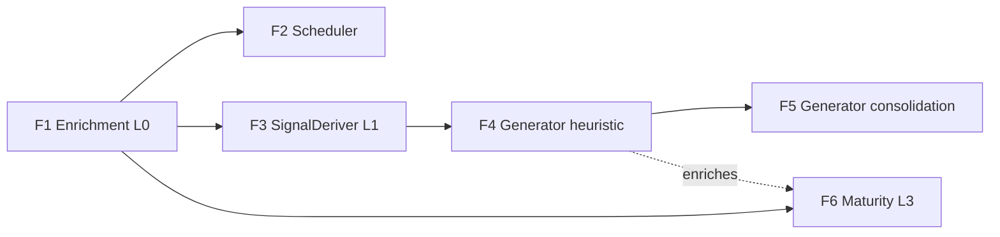

# Session/Log Analyzer — implementation plan

## Objective
Decompose `docs/blueprints/2026-06-22-session-analyzer.md` (#65) into vertical-slice features. Order is bottom-up: each feature is independently implementable, testable, and surfaces observable value through an existing or new reader. F1 alone fixes every zeroed FTR/outcome metric in the product.

## Features

### Feature 1: Session enrichment (L0) + `AnalyzeProject` task
- **Issue:** #66
- **Layers:** daemon (`SessionEnricher` + `TaskKind::AnalyzeProject` in `crates/senseid/src/tasks`) → existing readers (`get_project_ftr`, `list_all_sessions`, `get_project_sessions`) → observatory/sessions UI (no UI change needed — already reads these fields).
- **Depends on:** nothing (hook_events + #31 sessions exist).
- **Acceptance criteria:**
  - A new `TaskKind::AnalyzeProject` runs enrichment for a given project's sessions, deriving from that session's `activity.hook_events` (keyed by `session_id`): `turns` = count(UserPromptSubmit); `tool_usage` (per-`tool_name` PreToolUse/PostToolUse counts + success rate) stored in `props`; `corrections` via the `triage_signal` heuristics (revert/undo/"actually"/repeat-edit-after-failure); `outcome` (`completed` if Stop/SessionEnd present, `abandoned` if none, `blocked` on error-cluster); `ftr` = (corrections == 0); `duration_ms` = last_ts − first_ts; `module` = dominant edited path.
  - It `UPDATE`s `activity.sessions` for those columns; re-running is idempotent (recompute overwrites, no dupes).
  - After running against the existing 18 sessions, `get_project_ftr` returns a non-null FTR for projects with completed sessions, and `list_all_sessions` rows carry a non-null `outcome`.
  - A session with zero hook_events is left untouched (no crash, no false outcome).
  - Enrichment errors are logged (not swallowed) per the no-silent-errors rule.
- **Test scenarios:**
  - Given a session with 3 UserPromptSubmit + a Stop event and no correction signals, When enriched, Then `turns=3`, `outcome='completed'`, `ftr=true`.
  - Given a session with a revert/"actually" correction prompt, When enriched, Then `corrections>=1` and `ftr=false`.
  - Given a session with no Stop/SessionEnd, When enriched, Then `outcome='abandoned'`.
  - Given an already-enriched session, When enriched again, Then the row values are unchanged (idempotent).

### Feature 2: AnalyzerScheduler (periodic + on-demand trigger)
- **Issue:** #67
- **Layers:** daemon (long-lived tokio task, `spawn` like `progress_emitter`) → task queue (enqueues F1) → trigger API/MCP.
- **Depends on:** F1 (`AnalyzeProject` task).
- **Acceptance criteria:**
  - An hourly tick enqueues `AnalyzeProject` only for projects whose `max(sessions.started_at) > last_analyzed_at` (per-project watermark); projects with no new sessions are skipped.
  - `last_analyzed_at` advances only on successful completion; a failed run re-runs next tick.
  - An on-demand trigger (API or MCP) enqueues immediately for one project.
  - The tick interval is config-driven (not a magic literal) and the scheduler survives a single failed analysis.
- **Test scenarios:**
  - Given a project with a session newer than its watermark, When the scheduler ticks, Then exactly one `AnalyzeProject` is enqueued and the watermark advances on success.
  - Given a project with no sessions since its watermark, When the scheduler ticks, Then nothing is enqueued.

### Feature 3: SignalDeriver (L1) — patterns, anti-patterns, FTR trends
- **Issue:** #68
- **Layers:** daemon (`SignalDeriver`) reads enriched sessions + hook_events + code graph → writes `inference.detected_patterns` + `sensei.project_patterns` → patterns reader.
- **Depends on:** F1 (enriched sessions).
- **Acceptance criteria:**
  - Derives recurring tool/edit sequences and repeated file/module touches above a configurable support threshold; writes them as `detected_patterns` with a support/confidence count.
  - Correction/failure clusters (same file or tool repeatedly correcting) are written as anti-patterns (flagged).
  - Per-project and per-module FTR trend over the rolling window is computed and stored.
  - Re-running updates support counts in place (idempotent upsert), never duplicates a pattern.
- **Test scenarios:**
  - Given the same edit sequence across 3 sessions, When derived, Then one `detected_pattern` with support=3 exists.
  - Given a file corrected in 3 of 4 touches, When derived, Then an anti-pattern is flagged for it.

### Feature 4: Generator — heuristic tier (L2)
- **Issue:** #69
- **Layers:** daemon (`Generator`) → `sensei.memories` + `inference.recommendations` → `get_project_recommendations`/memories readers → learnings UI (theme F, built separately).
- **Depends on:** F1 + F3.
- **Acceptance criteria:**
  - New findings create `sensei.memories` (`origin='learned'`) at strength 1.0; recurring evidence reinforces (`reinforced_count`+, strength+); contradicted evidence increments `violated_count`; decayed memories below threshold → `archived`.
  - Generates `inference.recommendations` (`status='pending'`, `reasoning_trace_id=null`) for the six kinds, each mapped to the existing `action_type` (promote-pattern→`promote_pattern`, create-agent→`create_persona`, write-skill→`enable_skill`, archive-memory→`audit_stale`, enrich-memory→reinforce, cross-project→`cross_project`), with non-empty `title`, `why`, `evidence`, and `urgency`.
  - Re-running does not duplicate an existing pending recommendation for the same finding (dedupe by target + kind).
  - Accepting a rec via `accept_proposal` flips `status` to `accepted` (existing path, verified end-to-end).
- **Test scenarios:**
  - Given a `detected_pattern` above the promote threshold, When generated, Then a pending `promote_pattern` recommendation exists with populated `why`/`evidence`.
  - Given the same finding on a second run, When generated, Then no duplicate recommendation is created.
  - Given a memory with new confirming evidence, When generated, Then its `reinforced_count` and `strength` increase.

### Feature 5: Generator — consolidation tier (L2)
- **Issue:** #70
- **Layers:** daemon → gateway (`consolidation` inference role) → `inference.reasoning_traces` → `inference.recommendations`.
- **Depends on:** F4 + a chat model assigned to the consolidation role (gateway).
- **Acceptance criteria:**
  - Candidate findings are batched through the consolidation inference role; the model output produces a `reasoning_trace` row and a recommendation linked via `reasoning_trace_id`, with a written `why`/`impact`/`prompt`.
  - If no model is assigned/available, the tier is a no-op (heuristic recs from F4 still produced) and the skip is logged — never an error.
- **Test scenarios:**
  - Given candidate findings and an available model, When consolidation runs, Then a `reasoning_trace` and a linked recommendation with a non-empty `prompt` exist.
  - Given no assigned model, When consolidation runs, Then no recommendation is created and a warning is logged (F4 recs unaffected).

### Feature 6: MaturityModel (L3) + maturity endpoint
- **Issue:** #71
- **Layers:** daemon (pure maturity fn) → new read API → observatory landing (theme A, built separately).
- **Depends on:** F1 (session counts); richer once F4 exists.
- **Acceptance criteria:**
  - Per-project maturity = `early` until (enriched sessions ≥ target ~3 AND ≥1 generated insight), else `mature`; the endpoint also returns `sessions_watched` and `target` for the first-session meter.
  - The target is config-driven, not a literal scattered across code.
- **Test scenarios:**
  - Given a project with 1 enriched session and no recommendations, When queried, Then maturity=`early`, sessions_watched=1.
  - Given a project with ≥3 sessions and ≥1 recommendation, When queried, Then maturity=`mature`.

## Dependency graph

First shippable: **F1** (fixes product-wide metrics alone). Then F2. F3→F4 unblocks redesign theme F; F6 unblocks theme A.

## Out of scope (tracked elsewhere)
- The observatory/learnings **UI** (redesign themes A/F — separate frontend work).
- Federation/insight sharing (`inference.insights`).
- Verdict-measurement internals (`MeasureVerdicts` exists).
