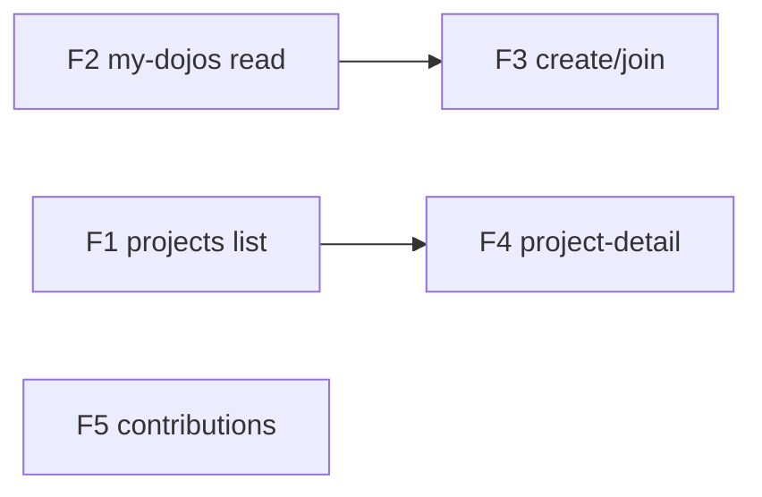

# Dōjō personal zone

## Objective
Turn the four `/you` (user/membership-primary) screens from stub/fixture into real, `/v1`-backed,
three-layer (Component → State → Load) surfaces. Prereqs are shipped: **WS-0 Rule A/B/C**, **WS-1 identity**,
and **`dojo.projects`** (table + RLS + daemon `upsertProjectFromRun` federation + `listOrgProjects` org read).
The `/you/[section]` + `/you/projects/[id]` routes/shells already exist — the loaders need real data. Every
feature is a vertical slice: daemon (Rust) → dōjō Worker (`/v1`) → dōjō SvelteKit (state + load + components) →
tests. Honest-empty on a genuine miss; never a fabricated value (canon + `feedback_functional_tests_not_call_success`).

## Features

### F1: Personal projects list (`/you/projects`)
- **Issue:** #113
- **Layers:** daemon (confirm the relay plan-payload carries `slug|name|classification|phase` → `dojo.projects`; federation exists) → dōjō Worker (new **user-wide** `GET /v1/…/projects` — the user's `dojo.projects` across ALL memberships, `owns_membership`/Rule A; extend the tenant-scoped `listOrgProjects`) → dōjō UI (`projectsState` + `loadProjects` + `ProjectsList`/`ProjectCard`, replacing `ScrProjects`; drill-in key = dereferenced `slug`).
- **Depends on:** `dojo.projects` (done), WS-0 Rule A (done).
- **Acceptance criteria:**
  - `/you/projects` lists the user's projects across **all** their memberships (user-primary), read from `dojo.projects` — not filtered to one tenant.
  - `ProjectCard` renders name + repo + classification chip + phase pill + lastRun + needs; each optional chip appears **only when its field is present** (no fabricated `0`/placeholder).
  - A row navigates to `/you/projects/{slug}`.
  - Genuine-empty → the honest-empty state; a Worker read error → an error state (never `[]`-as-success).
  - `projectsState` filter + `ProjectCard` render tested with no DOM; Load mock→shape; zero-errors; fidelity vs the `ScrProjects` mock.
- **Test scenarios:**
  - Given a user with projects in 2 dōjōs, When they open `/you/projects`, Then projects from both list.
  - Given a project with no `classification`, When rendered, Then no classification chip (not a fabricated one).
  - Given the user has no projects, When they open `/you/projects`, Then the honest-empty state renders.

### F2: My-dōjōs read fix (`/you/dojos`)
- **Issue:** #112
- **Layers:** dōjō server read (add `memberships.kind` to `TENANT_COLS`/`listUserOrgs`; compute per-tenant members/projects/pending counts) → dōjō UI (`myDojosState.groups` by real `kind` + `DojoList`/`DojoGroup`/`DojoRow`, replacing `ScrMyDojos`/`groupDojos`; personal group; row→`/org/{slug}`).
- **Depends on:** `membership_kind` enum (exists), `dojo.projects` (projects count, done). Load is already real (`listUserOrgs`).
- **Acceptance criteria:**
  - Rows group by the **real** `kind` (personal/employer/client/community) — the "everything → Communities" bug is gone.
  - Count chips (members/projects/pending) render **only when computed**; never a fabricated `0`.
  - Clicking a dōjō row navigates to `/org/{slug}`.
  - The user's personal dōjō appears as its own `Personal` group.
  - Grouping + empty-drop tested with no DOM; zero-errors; fidelity vs `ScrMyDojos`.
- **Test scenarios:**
  - Given a user in an employer + a community dōjō, When they open `/you/dojos`, Then two groups render (not all under Communities).
  - Given counts aren't computed for a dōjō, When rendered, Then no count chip (not `0`).
  - Given a dōjō row is clicked, Then the app navigates to `/org/{slug}`.

### F3: Create / join a dōjō (decomposes into 3 — larger)
- **Issue:** epic #116 (F3a #117 · F3b #118 · F3c #119) (epic → F3a/F3b/F3c)
- **Layers:** dōjō Worker + kavach (create-tenant; invite-issue + accept; GitHub-org auto-provision) → dōjō UI (the "Create or join" CTA + flows on `/you/dojos`).
- **Depends on:** F2 (the surface + CTA).
- **Sub-features (each independently shippable + testable):**
  - **F3a self-serve create** — user creates an org/client dōjō, becomes `admin`; AC: new tenant row + an `admin` membership for the creator; name/kind validated; appears in `/you/dojos`.
  - **F3b magic-link invite** — admin invites via kavach magic link → a membership on accept; AC: an invite issues, accepting it (as the invited email) creates the membership at the invited role; an expired/invalid link is rejected (no membership).
  - **F3c GitHub-org auto-join** — SSO-style auto-provision from a GitHub-org membership; AC: a user in the mapped GitHub org auto-gets a membership; leaving the org (next resolve) does not (fail-closed).
- **Test scenarios (F3a):** Given a signed-in user, When they create "Acme", Then a tenant + their `admin` membership exist and it shows in `/you/dojos`.

### F4: Project-detail constitution preview (`/you/projects/{slug}`)
- **Issue:** #114
- **Layers:** daemon (expose the per-project constitution resolution — `render_rules_tiers`/`resolve_local_pack_raws` — as composed rungs + effective rules + ★ locks + discarded conflicts, winner/loser computed server-side) → dōjō Worker (`GET /v1/…/projects/{slug}/constitution`) → dōjō UI (`projectPreviewState` + `loadProjectPreview` + `ConstitutionPreview`, replacing `ScrProjectPreview`; client banner reworded to the universal always-on dereference invariant).
- **Depends on:** F1 (real `slug` + `classification`), the daemon resolve route.
- **Acceptance criteria:**
  - The endpoint returns the composed ladder by classification (personal→[personal,project,stack]; client→[company,client,personal,project,stack]; else→[company,personal,project,stack]) + effective rules + ★ locks + discarded conflicts; the dōjō **displays** it (does not re-resolve client-side).
  - Conflict winner/loser is computed server-side (daemon); the dōjō carries no resolution algorithm.
  - Unknown slug / no membership → `redirect(307, /you/projects)` (never a fabricated project).
  - By-layer ↔ consolidated toggle + rung jump work; client banner uses the **universal** dereference copy.
  - State view/jump/`effective`/`showConflicts` tested with no DOM; zero-errors; fidelity vs `ScrProjectPreview`.
- **Test scenarios:**
  - Given a `client` project, When opened, Then the client rung + discarded-conflicts section render from the server-resolved payload.
  - Given an unknown slug, When opened, Then redirect to `/you/projects`.

### F5: Contributions (`/you/contributions`)
- **Issue:** #115
- **Layers:** daemon (contribute pipeline federates into `dojo.upstream_queue` via `/v1`) → dōjō Worker (`GET /v1/…/contributions` user-wide `{mine, downstream, stat}`; `POST …/contributions/adopt`) → dōjō UI (`contributionsState` + `loadContributions` + `ContributionsView`/`ContributionCard`/`DownstreamCard`, replacing `ScrContributions`; anonymous marker from `attribution_mode`; drop the "devs helped" tile).
- **Depends on:** WS-0 Rule A (done), the contribute pipeline (daemon-side exists).
- **Acceptance criteria:**
  - "Mine" reads `dojo.upstream_queue` (proposed→triaged), "Approved for you" reads `dojo.artifacts` (distributed), both **user-wide** across all the user's dōjōs.
  - Stat row recomputes `approved`/`pending` from `mine`; the "devs helped (lifetime)" tile is **dropped** (no real metric → no fabricated number).
  - The anonymity marker renders from `upstream_queue.attribution_mode` (`named|anonymous`), data-driven — not a client-only heuristic; copy uses the universal dereference invariant.
  - Pin → `POST …/contributions/adopt` optimistically flips `adopted`.
  - Lists stay **honest-empty** until the contribute pipeline federates (no fabricated rows).
  - State stat-recompute + optimistic pin tested with no DOM; zero-errors; fidelity vs `ScrContributions`.
- **Test scenarios:**
  - Given the pipeline hasn't federated, When they open `/you/contributions`, Then both sections render honest-empty (no fabricated rows).
  - Given a downstream item, When Pin is clicked, Then it optimistically flips to adopted and the adopt write fires.

## Dependency graph

**Recommended order:** **F2** (cheapest — Load already real, fixes the visible Communities bug) → **F1** (the spine; `dojo.projects` already federates) → **F4** (drill-in; needs F1's slug/classification) → **F5** (contributions; independent) → **F3** (create/join; larger, separable auth work).
