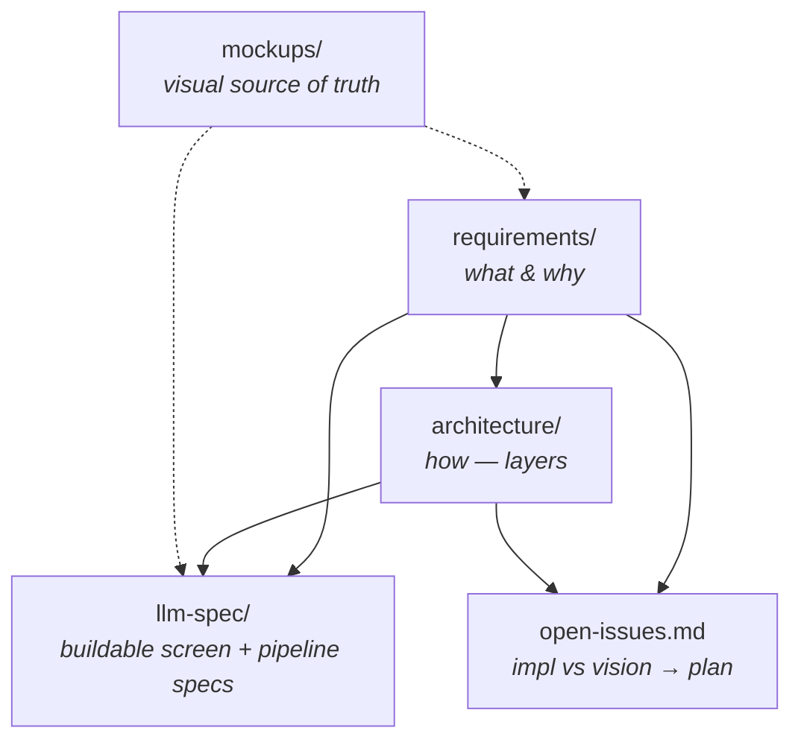

# Requirements

> **The WHAT and the WHY.** Start here. This folder defines what sensei is for
> and what we want to achieve — without dwelling on how. The *how* lives in
> [`../architecture/`](../architecture/README.md); the buildable per-screen and
> per-pipeline contracts live in [`../llm-spec/`](../llm-spec/README.md).

## Reading order

1. [`vision.md`](vision.md) — the north-star (**FTR**), the core retrospective
   loop, the four-segment journey, and the six non-negotiable themes. Visuals
   are drawn from the mockup journey maps.
2. [`objectives.md`](objectives.md) — the WHAT broken down per segment
   (Bootstrap · First-run &amp; Preferences · Observatory · Project window) plus
   the cross-cutting **Dōjō** layer, each with a measurable "met when."
3. [`open-issues.md`](open-issues.md) — the living gap analysis: where the
   implementation stands against the vision, the ranked gaps, and the specced
   plan to close them (workstreams).

## How the doc trees relate

- **requirements/** is the anchor — architecture and specs both trace back to it.
- **architecture/** explains the layers and refers requirements objectives.
- **llm-spec/** is the detailed, gated, buildable contract (five-section per doc).
- **mockups/** is the visual source of truth; requirements + specs cite it.
- **open-issues.md** is where reality is measured against the vision and turned
  into a prioritised plan.
