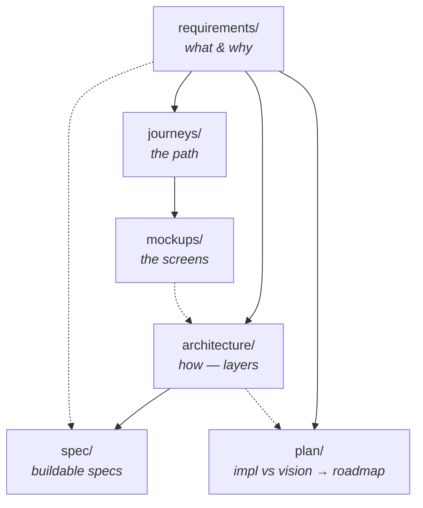

# Requirements

> **The WHAT and the WHY.** Start here. This folder defines what sensei is for
> and what we want to achieve — without dwelling on how. The visual path is
> [`../journeys/`](../journeys/README.md); the *how* lives in
> [`../architecture/`](../architecture/README.md); the buildable contracts live
> in [`../spec/`](../spec/README.md); what's next lives in
> [`../plan/`](../plan/README.md).

## Reading order

1. [`vision.md`](vision.md) — the north-star (**FTR**), the core retrospective
   loop, the four-segment journey, and the six non-negotiable themes. Visuals are
   drawn from the mockup journey maps.
2. [`objectives.md`](objectives.md) — the WHAT broken down per segment
   (Bootstrap · First-run &amp; Preferences · Observatory · Project window) plus
   the cross-cutting **Dōjō** layer, each with a measurable "met when."

Then follow the flow into [`../journeys/`](../journeys/README.md) (the path),
[`../architecture/`](../architecture/README.md) (the how), and
[`../plan/`](../plan/README.md) (the living gap-analysis → roadmap).

## How the doc folders relate

- **requirements/** is the anchor — everything traces back to it.
- **journeys/** shows the path; **mockups/** shows the screens.
- **architecture/** explains the layers and refers requirements objectives.
- **spec/** is the detailed, gated, buildable contract (five-section per doc).
- **plan/** is where reality is measured against the vision and turned into a
  prioritised, phased roadmap.
