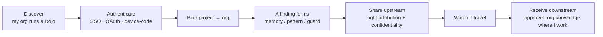
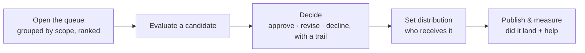
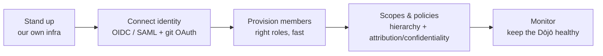
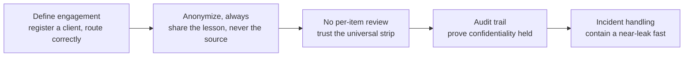
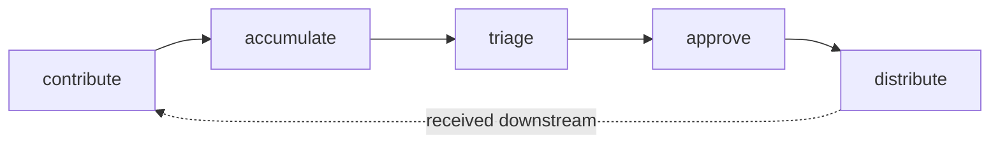

# Objectives

> The **WHAT**, broken down. Each objective states the outcome and how we know
> it's met — never the implementation. Architecture
> ([`../architecture/`](../architecture/README.md)) maps each to a layer; the
> per-screen/per-pipeline contracts live in [`../spec/`](../spec/README.md).
> Traces back to [`vision.md`](vision.md).

Objectives are grouped by the four personal segments plus the cross-cutting
Dōjō layer. Every one is judged against the north-star: **does it move FTR, or
expose why it moved?**

---

## 01 · Bootstrap 支

**Reach a working, trustworthy environment without thinking about toolchains.**

| # | Objective | Met when |
|---|---|---|
| B1 | Verify what's already present before changing anything | Homebrew · Postgres · Ollama · daemon are probed and reported, no blind installs |
| B2 | Bring every prerequisite up **green** | A single status surface shows all deps healthy or the exact remediation |
| B3 | Never leave the user stuck | Every red state names the fix (and, where safe, offers to run it) |

## 02 · First run &amp; Preferences 名

**Point sensei at real folders, watch projects appear, then tune what defaults got wrong.**

| # | Objective | Met when |
|---|---|---|
| F1 | **Value before setup** (theme 1) | First interaction shows the user's own discovered projects — not a wizard |
| F2 | Discover real projects from real folders | Pointing at `~/Developer` yields correctly-classified repos (one repo = one project = one owner) |
| F3 | Tuning is available, never blocking | Every default (scan roots, assistants, providers, inference, libraries) is adjustable in a searchable Preferences surface |

## 03 · Observatory — daily use 家

**Walk in, learn the one thing that needs me today, act on it, stay in control of what leaves my machine.**

| # | Objective | Met when |
|---|---|---|
| O1 | Surface *today's one thing* | The landing shows a single highest-value action with its receipt, not a wall of metrics |
| O2 | One decision, one default (theme 2) | Insights/traceability/libraries/upgrades all use **Apply · Review · Dismiss** |
| O3 | Every claim carries a receipt (theme 4) | FTR chips, confidence, before/after — the user can verify, not trust |
| O4 | The user controls what leaves the machine (theme 5) | Nothing is shared without an explicit Dōjō membership + preview |
| O5 | The module loops each offer an action | Security · Architecture · Testing · Style · Memory · Traceability · Impact · Libraries · Insights each observe → find → offer one action |

## 04 · The project window 雲

**Work inside one project end-to-end and trust what sensei learned here before any of it travels.**

| # | Objective | Met when |
|---|---|---|
| P1 | A trustworthy per-project overview | Overview shows FTR, top recommendation, memory/drift counts — all real, no fabricated numbers |
| P2 | Learned knowledge is inspectable | Memories, patterns, traceability, libraries, impact are all viewable with provenance |
| P3 | Nothing travels unseen | Sharing a finding upstream always previews what leaves and what's stripped |

---

## Dōjō — the cross-cutting team layer

**Extend the same retrospective loop across a team without leaking client work.**
The Dōjō is not a linear "segment 5" — it threads through the Observatory and the
project window (in-app developer surface) and adds an external SaaS **console**
for maintainers/admins/leads. Its core principles (from the journey map):
**identity is the discovery · pull never push · never blind, always preview ·
one universal strip · specificity wins conflicts.**

**Membership contexts** — one developer, many orgs: *Employer · Client orgs ·
Communities · Personal.* The org boundary is the **membership**, with
client-precedence as the tiebreaker.

### Developer (in-app)

### Maintainer (console)

### Org admin (console)

### Lead — client / engagement confidentiality (console)

> The role formerly called *client-lead* is now **lead**. It guards
> confidentiality on **client engagements** (the engagement concept is
> unchanged; only the role name shortened).

### Dōjō lifecycle — what flows through it

| # | Objective | Met when |
|---|---|---|
| DJ1 | Personal sensei works with **no** Dōjō | Every local capability functions with zero memberships |
| DJ2 | The org boundary is exact (theme 5) | A lesson from a client engagement never leaves without anonymization + preview |
| DJ3 | Pull, never push | Downstream knowledge arrives by opt-in pull, never forced |
| DJ4 | Attribution + confidentiality are automatic | One universal strip runs on every client lesson; a lesson that can't be stripped doesn't leave |
| DJ5 | Distribution respects priority ladders, not a rigid hierarchy | Specificity wins conflicts; memberships route by precedence |

---

## Cross-cutting (apply to every objective)

- **Insight copy from the model** (theme 6) — user-facing strings route through `insight-copy`.
- **Discoverability of depth** (theme 3) — nothing important hidden behind a one-liner.
- **The pair goes both ways** — objectives capture human-side signal (sparse instructions, wrong assumptions), not only assistant errors.

## Read next

- [`open-issues.md`](open-issues.md) — how far the implementation is from these objectives, ranked, with the plan.
- [`../architecture/README.md`](../architecture/README.md) — the layers that deliver them.
