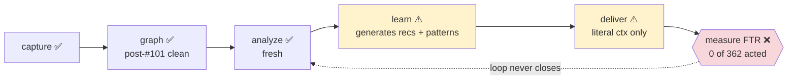

# Open issues — implementation vs vision → the plan

> A **living** gap analysis. It measures the current build against
> [`vision.md`](vision.md) + [`objectives.md`](objectives.md), ranks the gaps by
> FTR value, and organises the work into sequenced workstreams. Updated as
> workstreams land. Evidence date: **2026-07-14** (four live audits: UI, daemon,
> MCP, docs — against the running daemon on :7744 + `sensei` DB).

## The core finding

The surfaces are largely **built**; the **learning loop never closes** and
several signals feeding the surfaces are **noise or empty**. The original
"ship 6–8 screens" framing is spent — 25 screens are live. The value now is in
**closing the FTR loop and raising signal quality**, not more surface area.

## Snapshot

| Layer | State |
|---|---|
| **UI** | 25 shipped · 2 partial · 10 not-built · 4 Dōjō-web. Observatory + project window essentially complete. |
| **Daemon** | capture/analyzer/FTR/patterns/signals/insight-copy/libraries/icons all **producing fresh**. Loop-closing + promotion + drift-quality are the holes. |
| **MCP** | core loop ~80% real; 2 silent-empty bugs; semantic search unbuilt. |
| **Docs** | llm-spec is the real SoT but README points elsewhere; Dōjō scattered; being restructured (this folder). |

## Ranked gaps

Each gap: the objective it violates, the FTR impact, and the approach.

### G1 — The FTR loop never closes *(objectives O3, P1; north-star)*
362 recommendations sit `pending`, **0 acted, 0 measured** (`measured_at` NULL). Generation, ranking, and consolidation all fire (28 reasoning traces), but nothing is ever accepted → `MeasureVerdicts` has no input. **The product's whole promise — prove an FTR delta — is unrealised.**
**Approach:** wire recommendation acceptance (UI triage → `acted_at`) end-to-end so measurement runs; consider a lighter auto-measure signal for adopted memories. Highest value.

### G2 — Memory promotion is dead *(objectives O5, P2, theme 4)*
9 memories, **all `active`**, none `reinforced`/`battle_tested`/`challenged`. The promotion ladder depends on corrections (legitimately sparse) + an LLM promotion step that almost never fires. "Adopted this week" and the Memories surfaces read empty.
**Approach:** define + wire the promotion/merge statuses (readyToShare / toMerge / battle_tested) with an evidence threshold; this is the single biggest "tables exist, writer barely runs" gap.

### G3 — Doc-drift signal is noise *(objective P2, theme 4)*
Traceability runs fresh but flags **4,420 of 4,425** items `broken` — the signature comparison over-fires. Any drift/impact surface shows noise.
**Approach:** fix the matching/threshold so `broken` means broken; re-baseline.

### G4 — Semantic search + context-pack unbuilt *(the differentiator; objective O-core)*
`search` is plain substring (`ILIKE`) despite **157k embedded nodes**; the `context_pack` / `hybrid.rs` / grep-fallback layer the spec sells **doesn't exist on disk**. The assistant gets literal code-graph context first-try, not concept-level retrieval.
**Approach:** build real hybrid semantic search over existing embeddings + a `context_pack` MCP tool with a grep fallback ("never worse than grep").

### G5 — Two MCP tools silently empty *(objectives O5, context delivery)*
`get_communities` hides **158 real communities** behind a single-folder scoping bug (`folder_ids_for_project` takes the lowest-UUID leaf instead of aggregating); `get_patterns` returns empty because the framework-tagger never populated `file_tags` (45,871 rows, all tag-arrays empty).
**Approach:** (a) aggregate community query across all scope folders — cheap, high-value; (b) run/repair the framework-pattern tagger.

### G6 — Corpus starved *(all FTR-downstream)*
Session corpus shrank **216 → 25** (a reset); local daemon is **v0.3.1** while source is **v0.3.4** (newer endpoints + the #101 self-heal aren't live locally).
**Approach:** `make install-service` to current; re-synthesize historical sessions (the #75 backfill path) so FTR/model-effectiveness aren't history-starved.

### G7 — Orphaned + unbuilt intelligence *(various)*
`inference.insights`/`insight_batches` have no writer (superseded by `insight_copy`); governance Tier-2 consolidation unwired (`consolidated_rulesets`=0); impact writer is manual-only; testability + benchmarks are spec-only.
**Approach:** drop/relabel the orphaned tables; wire Tier-2 consolidation to the scheduler; decide impact = manual-note vs MeasureVerdicts-delta; defer testability/benchmarks.

### G8 — Net-new surfaces *(lowest)*
Solution segment (3 screens), Bootstrap splash (2), consolidation screen, insights-reasoning drawer, first-run polish.
**Approach:** build after the loop closes; each is only as good as the data behind it.

## External-blocked (do not count as missing local work)

`collective-intelligence` and `dojo-lifecycle` are substantially **built**
(anonymize, contribute staging, outbox, memberships, routing, federation pull)
but (a) paused by default (`contribute_scheduler` is a no-op until opt-in) and
(b) need a remote Dōjō server (`dojo.sensei-hq.org`) that isn't running. All
dojo/collective tables are 0 for this reason, not absence of code. **Defer live
activation** to the SaaS-infra decision.

## The plan — workstreams

Sequenced; the current lead is **docs restructure (E)** per the standing
decision, with the cheap foundation fixes (G5a, G6-install) folded in.

| WS | Theme | Gaps | Effort | Deps |
|---|---|---|---|---|
| **E** | Docs + Dōjō restructure *(in progress)* | docs | M | — |
| **A** | Close the FTR loop | G1, G2 | M | daemon current |
| **B** | Raise signal quality | G3, G5, G7-orphans | S–M | — |
| **C** | Semantic search + context-pack | G4 | L | embeddings (present) |
| **D** | Foundation + corpus | G6, sibling scan bugs #29/#62/#63, silent-error audit | S–M | — |
| **F** | Net-new surfaces | G8 | L | A/B (data first) |

**Recommended order after E:** D (get the floor current) → A + B (close loop +
de-noise, make shipped screens truthful) → C (the differentiator) → F.

## How this doc stays honest

Update a gap's status inline when a workstream lands (e.g. `G5a ✅ fixed
2026-07-xx <commit>`); move fully-closed gaps to a "Closed" section with the
commit. Never delete a gap silently. This is the roadmap's ground truth —
[`../backlog.md`](../backlog.md) tracks the GitHub-issue index; this tracks the
vision-alignment.
