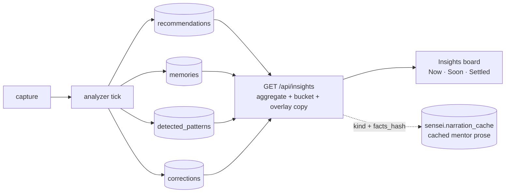

# 察 · Pipeline · Insights (the learnings generator)

> **What an "insight" is, how it's derived, and where it lives.** The generator
> behind the [[screen/observatory-insights]] board (bucketing rules live here) and
> the [[screen/observatory-today]] "one thing". The user-facing wording is the
> separate [[pipeline/narration-cache]] layer.
>
> **Owner files:** aggregator `crates/senseid/src/api/handlers/observatory.rs::get_insights`
> · pure bucketing `crates/senseid/src/insights.rs` · rec generation
> `tasks/handlers/generate.rs` + `rank.rs` (analyzer tick) · impact follow-up
> `tasks/handlers/measure_verdicts.rs` ([[pipeline/impact]]).

## Purpose

An insight is the **human-facing output of the retrospective loop** — the moment
the graph + signals turn into something a person can act on. The promise
([[vision]]) is *"what needs me, what's working, and what's quiet, in
that order"* — not a knowledge base to browse. Every insight is judged by the
north star: does surfacing it move **FTR**, or expose why FTR moved? Kanji 今 — *now*.

## What an insight *is* (the core model)

**An insight is not a first-class stored entity.** It is a **triage presentation
of an already-stored *learning entity*.** The analyzer derives four learning
types from captured activity, each stored in its own table; the Insights surface
is a **server-side aggregator** that gathers the *current* learnings, assigns each
to a triage column, and overlays mentor-voice copy. There is deliberately **no
`insights` table** — materialising one would duplicate the sources it's derived
from. (See *History* below for the abandoned `inference.insights` that tried.)

| Source | Table | Role on the board |
|---|---|---|
| **Recommendation** *(primary)* | `inference.recommendations` | the actionable "here's the one thing to do" |
| **Memory** | `sensei.memories` | the *statement* form of a learning [[pipeline/memory]] |
| **Pattern** | `inference.detected_patterns` | recurring shape, pre-rule |
| **Correction** | `inference.corrections` | clustered mistakes to act on |

## Derivation — bucketing rules (the generator)

`GET /api/insights?project=<name|uuid>?` pulls the four sources and buckets each
into **Now / Soon / Settled** by **pure rules** (`crate::insights`, unit-tested
without a DB — the UI trusts the server label and never re-buckets):

- **Recommendations** (`status='pending'`) by `urgency`: `high`→Now, `medium`→Soon, `low`→Settled.
- **Memories** by `status` + `violated_count`: violated (not archived) → **Now**; `proposed`→Soon; in-force (`active`/`reinforced`/`battle_tested`)→Settled (strength desc); `archived`/`rejected`/`challenged` excluded.
- **Patterns** by `lifecycle`: `suggested`→Soon, `rule`→Settled; `gap` excluded.
- **Corrections**: top-3 by count → **Now**.

Now = the day's decisions · Soon = read-once, revisit · Settled = the "how we work
here" shelf. The tri-column layout *is* the sort — no tabs, no sort control; each
card carries **one** highlighted default verb (Apply · Review · Dismiss).

## The wording layer — [[pipeline/narration-cache]]

Each card's **title + detail** is mentor-voice prose owned by the model (*"the
model owns the sentence, the code owns the action"*). Generated per
`(kind, facts_hash)` — `facts_hash = sha256(kind + canonical_json(facts))`, where
`facts` are only the *discriminating* prose columns (title/why/impact), never
code-owned display state (urgency/status/score) — and persisted in
**`sensei.narration_cache`**. The wire path (`copy_or_warm`) reads the cache and, on a
miss, returns a deterministic **fallback template** immediately while a background
task warms the model copy for next load; inference never runs on a request's
critical path.

> **Two senses of "insight" in the code** — (1) the **board** (this aggregator);
> (2) **`InsightKind`** + `narration_cache` — the *copy* vocabulary (tool cards,
> memory prompts, hero koan, drift…). Neither is a stored insight *entity*: the
> substance is the source learning, the copy is its wording.

## Data model — what is and isn't persisted

| Thing | Persisted? | Where |
|---|---|---|
| Learning entities (rec/memory/pattern/correction) | **yes** — source of truth | their own tables |
| The mentor **copy** (title/detail) | **yes** (a cache) | `sensei.narration_cache` keyed `(kind, facts_hash)` |
| The Insights **board** (Now/Soon/Settled) | **no** — derived live | `/api/insights` (4 reads + pure bucketing) |
| A standalone "insight" row | **no** — deliberately none | — |

## Recommendations — the primary source

Recommendations turn *"the pipeline saw a pattern of corrections"* into *"here's
the one thing to do."* Generated per project on the analyzer tick (`generate.rs`,
[[pipeline/analyzer]]) from, in order: **correction clusters** (dominant path —
signatures ≥ threshold across ≥ 2 sessions), **pattern-effectiveness deltas**,
**persona / skill gaps**, **library-tier detections**, **drift blockers**. Scored
by projected FTR movement × evidence-session count × recency, deduped by
`signature` (a dismissed/applied signature is suppressed until materially
different evidence fires).

**Actions** (each card carries its own `project_id`):
- **Apply** → `POST /api/projects/{project_id}/recommendations/{rec_id}/accept` — snapshots baseline + **schedules `MeasureVerdicts`** (`now + measurement_window`, default 7d) so before/after FTR is measured ([[pipeline/impact]]).
- **Dismiss** → `POST /api/projects/{project_id}/recommendations/{rec_id}/reject` — records the "no"; the signature is suppressed.
- **Review** → navigate to the detail (no write); parks it in Soon.

On a verdict: `positive` → reinforce the underlying memory / promote the pattern
(the [[pipeline/governance]] G1 loop); `negative` → regression alert +
revision-candidate analysis; `insufficient_data` → re-schedule (capped).
High-stakes recs may carry an [[pipeline/inferencing]] `consensus` reasoning trace
(`sensei.reasoning_traces`) surfaced in the reasoning drawer.
**Effectiveness correlation** (`sensei.effectiveness_correlations`) — FTR-when-applied
vs FTR-when-absent per memory/pattern/tool — feeds rec ranking + landing-card hints.

## Design decisions & open questions

1. **The board is derived live — keep it.** 4 SQL reads + pure bucketing: cheap
   and deterministic. A materialised `insights` table would duplicate the sources
   and add write-path coupling for no gain.
2. **Copy generation was *lazy* — ✅ FIXED 2026-07-15 (eager warm).** First view of
   a new learning used to show the fallback template, then the mentor copy appeared
   on the *next* load (the "text transitions" papercut). Now a global
   **`TaskKind::WarmInsightCopy`** task, enqueued each analyzer tick alongside the
   other global passes, **pre-generates** the copy for pending recommendations
   (`insights::rec_copy_inputs` → `narration_cache::generate_and_cache`) so the board
   reads cached copy on the *first* view. Idempotent (a rec whose copy is cached is
   skipped, doesn't spend the cap), bounded (`WARM_CAP=20` model calls/tick, so it
   converges over ticks), breaker-guarded (a down/busy model returns fast). The
   cache stays; its *fill timing* moved from read-time to analyzer-time.
   *Coverage:* recommendations (the primary, most-visible source) today; memories /
   patterns / corrections still warm lazily via `copy_or_warm`.
3. **Naming:** `sensei.narration_cache` holds generated *prose*, not a duplicate.
   Rename → **`insight_text`**. Reserve `insights` / `derived_insights` for a
   *future* materialised, anonymised, shareable snapshot (see 5).
4. **History (why the orphans exist).** `inference.insights` + `insight_batches`
   were an *earlier* materialised-insight design — the adding commit (`11396a0b`)
   says verbatim *"insights + insight_batches: collective-intelligence sharing
   references"* (pipeline *insight → recommendation → action → measurement*). They
   **never got a writer** and were **dropped from the DDL** (`5275f1ea`, "drop 4
   dead inference tables"). The empty husks survive only in the live DB
   (`CREATE IF NOT EXISTS`, never `DROP`) — queued for a surgical drop.
5. **Sharing / anonymisation (Dōjō — future, external-blocked).** When an insight
   is shared upstream, the **mentor copy is the safe form**: it summarises
   *structured facts*, not raw transcript, so it carries no client/repo/source
   identifiers. A shared insight is therefore a **new `dojo`-scope, anonymised
   snapshot** ([[pipeline/collective-intelligence]] — source-strip, dereference),
   **distinct** from the local live board. That is where a materialised
   `derived_insights` table would legitimately live.

## Divergences to reconcile (spec vs code — found 2026-07-15)

The previous version of this doc described an unbuilt recommendation model. The
**code is authoritative**; fix the doc/impl gaps:

- Recs are bucketed by **`status='pending'` + `urgency` (high/medium/low)**, *not*
  a `proposed→reviewed→applied→dismissed→measured` state machine.
- Actions are **`accept`/`reject` under `/api/projects/{id}/recommendations/{rec_id}`**,
  *not* `/api/insights/recommendations/{id}/apply|review|dismiss`.
- The assembler is **`observatory::get_insights`**; there is **no
  `api/handlers/insights.rs`**. Pure bucketing is `crate::insights`.
- The board aggregates **four** sources; "insights = recommendations" is the old
  conflation — recommendations are the *primary* source, not the whole.

## Signals produced

| Signal | Consumer |
|---|---|
| Now / Soon / Settled rows | [[screen/observatory-insights]] |
| Top-1 hero | [[screen/observatory-today]] · [[screen/project-overview]] |
| Applied → `MeasureVerdicts` | [[pipeline/impact]] |
| Dismissed signature | suppression set read by `generate.rs` next tick |
| Cached mentor copy | `narration_cache` per `(kind, facts_hash)` |

## Done gate

- `/api/insights` renders three columns on live data; every card lands in the correct column (a `high` rec never appears in Soon; a Settled memory never has `violated_count > 0`).
- One `facts_hash` serves both the board and the per-project rec endpoint (one warm, two screens).
- Accept on a rec schedules `MeasureVerdicts`; the verdict lands in [[screen/observatory-impact]].
- Once decision (2) lands: a freshly-derived learning shows mentor wording on **first** view (no fallback→warm flip).
- Empty-column copy is the mockup voice ("nothing urgent." / "nothing brewing." / "nothing yet."), never "no data" / "loading".

## Wrong gate

- **A learning appears in two columns** — server bucketing rules aren't mutually exclusive.
- **Counts read 0-0-0 while cards render** — count query and content query diverged.
- **Every Now card reads the same wording** — narration-cache regression ([[pipeline/narration-cache]] wrong-gate).
- **Applied rec never triggers `MeasureVerdicts`** — the impact chain regressed (recurring; see [[pipeline/analyzer]]).
- **A dismissed signature re-fires next tick** — suppression set not consulted.
- **A shared insight leaks client/repo/source** — the anonymised snapshot (decision 5) wasn't applied; raw facts crossed the boundary.

## Related

- [[screen/observatory-insights]] — the board surface (Now/Soon/Settled)
- [[screen/observatory-today]] — the "one thing" over the Now column
- [[pipeline/narration-cache]] — the mentor-voice wording layer (`narration_cache` → `insight_text`)
- [[pipeline/memory]] · [[pipeline/analyzer]] · [[pipeline/impact]] · [[pipeline/signals]] — the sources + measurement
- [[pipeline/collective-intelligence]] — the future shared/anonymised insight snapshot (Dōjō)
