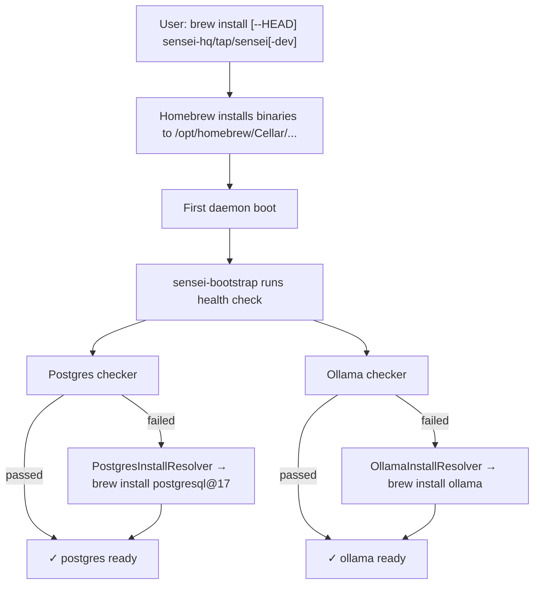

# Brew Resolver Split Implementation Plan

> **For agentic workers:** REQUIRED SUB-SKILL: Use superpowers:subagent-driven-development (recommended) or superpowers:executing-plans to implement this plan task-by-task. Steps use checkbox (`- [ ]`) syntax for tracking.

**Goal:** Replace `BrewBundleResolver` (single omnibus that lumps postgres + ollama + sensei into one `brew bundle` call) with three per-component install resolvers sharing a `brew_install` helper. Delete `Brewfile`/`Brewfile-dev`. Update Makefile cold-install path, design docs, and tap subtree.

**Architecture:** Each component gets its own `Resolver` implementation (`PostgresInstallResolver`, `OllamaInstallResolver`, `SenseiInstallResolver`) that delegates to a shared `brew_install(formula, args)` helper. The helper shells out to `brew install` and parses stderr into typed `BrewError` variants (`BrewNotFound`, `LinkConflict`, `TapMissing`, `Other`). Resolvers map errors to per-variant `Remedy` builders. Auto-attempt is the norm; escalate to `NeedsHumanAction` only when brew itself failed.

**Tech Stack:** Rust 2021 (workspace), `sensei-bootstrap` crate, `cargo test`, `cargo clippy`, `bun test:unit` (regression), GNU Make (build glue), git subtree (tap sync).

**Spec:** `sensei/docs/superpowers/specs/2026-05-14-brew-resolver-split-design.md`

---

## Discipline

- **TDD.** Every code task writes the failing test first, watches it fail with a meaningful message, writes the minimal implementation, watches it pass, then commits.
- **Zero-errors-policy.** Before every commit, run `cargo clippy --all-targets --features dev -- -D warnings && cargo test -p sensei-bootstrap`. No commits with warnings or failing tests.
- **Frequent commits.** One coherent change per commit, conventional-commit prefix (`feat`, `refactor`, `test`, `docs`, `chore`).
- **Branch.** Work on `develop`. Merge to `main` only after the manual verification matrix in Section E passes.
- **No rebasing or amending.** Each task ends in a new commit. If a test fails after commit, push a follow-up commit.

---

## Pre-flight

- [ ] **Confirm branch and clean working tree.**
  ```bash
  cd /Users/Jerry/Developer/sensei-hq/sensei
  git status
  git branch --show-current
  ```
  Expected: branch `develop`, clean tree except possibly `homebrew/Brewfile-dev` (interim fix from earlier session — that file gets deleted in Section C so the local edit doesn't matter).

- [ ] **Confirm baseline tests green.**
  ```bash
  cargo test -p sensei-bootstrap 2>&1 | tail -3
  cd app && bun run test:unit 2>&1 | tail -5 && cd ..
  ```
  Expected: 100 bootstrap tests pass, 364 app tests pass.

---

## Section A — `brew_helpers` shared module

Builds the error type and the `brew install` wrapper that all three resolvers will use. Pure-function parser first (TDD-friendly); shell-out wrapper second.

### Task A1 — `BrewError` enum + `parse_brew_error` (TDD)

**Files:**
- Create: `crates/bootstrap/src/health/resolvers/brew_helpers.rs`

- [ ] **Step 1: Create the file with the failing test module.**

Write the file with only the type stub + tests (tests will fail to compile):

```rust
//! brew_helpers — shared shell-out + stderr parsing for the brew-based
//! install resolvers (postgres_install, ollama_install, sensei_install).
//!
//! `BrewError` captures the four failure modes we surface to the user via
//! distinct `Remedy` builders in each resolver. `parse_brew_error` is a
//! pure function over the stderr text — extracted for exhaustive unit
//! testing without invoking brew.

use std::path::PathBuf;

#[derive(Debug, Clone, PartialEq, Eq)]
pub enum BrewError {
    /// `brew` not on PATH.
    BrewNotFound,
    /// Symlink conflict at `path` (something already exists where brew
    /// wants to link). Destructive remedy — user decides.
    LinkConflict { path: PathBuf },
    /// Formula not found — typically the tap isn't added.
    TapMissing,
    /// Any other brew failure. Carries the last ~500 chars of stderr for
    /// display in the remedy.
    Other(String),
}

// parse_brew_error stub — definition deferred to Step 3.
pub(crate) fn parse_brew_error(_stderr: &str) -> BrewError {
    unimplemented!("parse_brew_error not yet implemented")
}

#[cfg(test)]
mod tests {
    use super::*;
    use std::path::PathBuf;

    const OLLAMA_LINK_CONFLICT: &str = r#"Error: Could not symlink bin/ollama
Target /opt/homebrew/bin/ollama
already exists. You may want to remove it:
  rm '/opt/homebrew/bin/ollama'

To force the link and overwrite all conflicting files:
  brew link --overwrite ollama
"#;

    const POSTGRES_LINK_CONFLICT: &str = r#"Error: Could not symlink bin/psql
Target /opt/homebrew/bin/psql
already exists. You may want to remove it:
  rm '/opt/homebrew/bin/psql'
"#;

    const TAP_MISSING: &str = r#"Error: No available formula with the name "sensei-hq/tap/foo".
"#;

    const GENERIC: &str = r#"Error: Cannot install in Homebrew on ARM processor in Intel default prefix (/usr/local)!
Please create a new installation in /opt/homebrew using one of the
"Alternative Installs" from:
  https://docs.brew.sh/Installation
"#;

    #[test]
    fn parses_ollama_link_conflict() {
        match parse_brew_error(OLLAMA_LINK_CONFLICT) {
            BrewError::LinkConflict { path } => {
                assert_eq!(path, PathBuf::from("/opt/homebrew/bin/ollama"));
            }
            other => panic!("expected LinkConflict, got {other:?}"),
        }
    }

    #[test]
    fn parses_postgres_link_conflict() {
        match parse_brew_error(POSTGRES_LINK_CONFLICT) {
            BrewError::LinkConflict { path } => {
                assert_eq!(path, PathBuf::from("/opt/homebrew/bin/psql"));
            }
            other => panic!("expected LinkConflict, got {other:?}"),
        }
    }

    #[test]
    fn parses_tap_missing() {
        assert_eq!(parse_brew_error(TAP_MISSING), BrewError::TapMissing);
    }

    #[test]
    fn parses_generic_failure_truncates_to_500_chars() {
        let long = "x".repeat(2000);
        match parse_brew_error(&long) {
            BrewError::Other(s) => assert_eq!(s.len(), 500),
            other => panic!("expected Other, got {other:?}"),
        }
    }

    #[test]
    fn parses_generic_failure_preserves_short_messages() {
        match parse_brew_error(GENERIC) {
            BrewError::Other(s) => {
                assert!(s.contains("ARM processor"), "kept body: {s}");
                assert!(s.len() <= 500);
            }
            other => panic!("expected Other, got {other:?}"),
        }
    }
}
```

- [ ] **Step 2: Register the module so the file compiles.**

Append to `crates/bootstrap/src/health/resolvers/mod.rs`:
```rust
pub(crate) mod brew_helpers;
```
(Crate-internal — resolvers use it but external callers don't.)

- [ ] **Step 3: Run the tests; verify they fail with `unimplemented!`.**
  ```bash
  cargo test -p sensei-bootstrap brew_helpers 2>&1 | tail -20
  ```
  Expected: all five tests fail with `not yet implemented` panic.

- [ ] **Step 4: Implement `parse_brew_error`.**

Replace the stub:
```rust
pub(crate) fn parse_brew_error(stderr: &str) -> BrewError {
    if stderr.contains("already exists. You may want to remove it") {
        if let Some(path) = extract_target_path(stderr) {
            return BrewError::LinkConflict { path };
        }
    }
    if stderr.contains("No available formula with the name") {
        return BrewError::TapMissing;
    }
    let tail_start = stderr.len().saturating_sub(500);
    BrewError::Other(stderr[tail_start..].to_string())
}

fn extract_target_path(stderr: &str) -> Option<PathBuf> {
    // Look for a line `Target <path>` immediately before the "already exists" marker.
    for line in stderr.lines() {
        if let Some(rest) = line.strip_prefix("Target ") {
            return Some(PathBuf::from(rest.trim()));
        }
    }
    None
}
```

- [ ] **Step 5: Run tests; verify all pass.**
  ```bash
  cargo test -p sensei-bootstrap brew_helpers 2>&1 | tail -10
  ```
  Expected: 5 passed.

- [ ] **Step 6: Commit.**
  ```bash
  git add crates/bootstrap/src/health/resolvers/brew_helpers.rs \
          crates/bootstrap/src/health/resolvers/mod.rs
  git commit -m "$(cat <<'EOF'
feat(bootstrap): add brew_helpers::parse_brew_error

Pure-function stderr parser with four BrewError variants. Foundation
for the per-component install resolvers replacing BrewBundleResolver.

Co-Authored-By: Claude Opus 4.7 (1M context) <noreply@anthropic.com>
EOF
)"
  ```

### Task A2 — `brew_install` shell-out wrapper

**Files:**
- Modify: `crates/bootstrap/src/health/resolvers/brew_helpers.rs` (add function)

- [ ] **Step 1: Append the wrapper to `brew_helpers.rs` (above `#[cfg(test)]`).**

```rust
use std::process::Command;
use crate::util::which_binary;

/// Run `brew install <args>... <formula>` and translate failure modes
/// into typed `BrewError` variants.
///
/// On success, returns `Ok(())`. On any non-zero exit, parses stderr.
/// If `brew` isn't on PATH, returns `BrewError::BrewNotFound` without
/// invoking anything.
pub fn brew_install(formula: &str, args: &[&str]) -> Result<(), BrewError> {
    let brew = match which_binary("brew") {
        Some(p) => p,
        None    => return Err(BrewError::BrewNotFound),
    };
    let output = Command::new(brew)
        .arg("install")
        .args(args)
        .arg(formula)
        .output()
        .map_err(|e| BrewError::Other(format!("spawn failed: {e}")))?;
    if output.status.success() {
        return Ok(());
    }
    let stderr = String::from_utf8_lossy(&output.stderr);
    Err(parse_brew_error(&stderr))
}
```

- [ ] **Step 2: Add a smoke test that does NOT actually invoke brew.**

Inside the `tests` module:
```rust
    #[test]
    fn brew_install_returns_brew_not_found_when_brew_absent() {
        // Temporarily clobber PATH so `which brew` fails.
        // SAFETY: This test reads no other PATH-dependent state.
        let original = std::env::var("PATH").unwrap_or_default();
        unsafe { std::env::set_var("PATH", ""); }
        let r = brew_install("anything", &[]);
        unsafe { std::env::set_var("PATH", original); }
        assert_eq!(r, Err(BrewError::BrewNotFound));
    }
```

- [ ] **Step 3: Run tests, verify all 6 pass.**
  ```bash
  cargo test -p sensei-bootstrap brew_helpers 2>&1 | tail -10
  ```
  Expected: 6 passed.

- [ ] **Step 4: Clippy check.**
  ```bash
  cargo clippy --all-targets --features dev -p sensei-bootstrap -- -D warnings
  ```
  Expected: no warnings.

- [ ] **Step 5: Commit.**
  ```bash
  git add crates/bootstrap/src/health/resolvers/brew_helpers.rs
  git commit -m "$(cat <<'EOF'
feat(bootstrap): add brew_install wrapper in brew_helpers

Shells out to `brew install [args] <formula>`, parses stderr via
parse_brew_error on failure. Returns BrewNotFound without invoking
brew when it isn't on PATH.

Co-Authored-By: Claude Opus 4.7 (1M context) <noreply@anthropic.com>
EOF
)"
  ```

---

## Section B — Three per-component install resolvers

Each resolver is its own file, follows the same pattern, owns its remedy builders. TDD: write trait-identity tests first (small, fast), then implement.

### Task B1 — `PostgresInstallResolver`

**Files:**
- Create: `crates/bootstrap/src/health/resolvers/postgres_install.rs`
- Modify: `crates/bootstrap/src/health/resolvers/mod.rs` (export)

- [ ] **Step 1: Create the file with full content (test + impl together — small file, TDD on the parser is already done in A1).**

```rust
//! PostgresInstallResolver — resolves ComponentId::Postgres via
//! `brew install postgresql@17`. Auto-attempts brew; escalates to
//! NeedsHumanAction only when brew itself fails. The dmg / Postgres.app
//! case never reaches this resolver — the binary checker passes first
//! and the orchestrator skips us entirely.

use std::path::Path;

use crate::health::resolver::{Resolver, ResolveOutcome};
use crate::health::resolvers::brew_helpers::{brew_install, BrewError};
use crate::health::types::{ComponentId, Remedy};

pub struct PostgresInstallResolver;

const FORMULA: &str = "postgresql@17";
const TARGETS: &[ComponentId] = &[ComponentId::Postgres];

impl Resolver for PostgresInstallResolver {
    fn id(&self) -> &'static str { "postgres_install" }
    fn resolves(&self) -> &'static [ComponentId] { TARGETS }

    fn resolve(&self, _targets: &[ComponentId]) -> ResolveOutcome {
        match brew_install(FORMULA, &[]) {
            Ok(())                                  => ResolveOutcome::Resolved,
            Err(BrewError::BrewNotFound)            => ResolveOutcome::NeedsHumanAction(homebrew_install_remedy()),
            Err(BrewError::LinkConflict { path })   => ResolveOutcome::NeedsHumanAction(overwrite_link_remedy(FORMULA, &path)),
            Err(BrewError::TapMissing)              => ResolveOutcome::NeedsHumanAction(tap_missing_remedy(FORMULA)),
            Err(BrewError::Other(stderr))           => ResolveOutcome::NeedsHumanAction(generic_brew_remedy(FORMULA, &stderr)),
        }
    }
}

pub(crate) fn homebrew_install_remedy() -> Remedy {
    Remedy {
        message: "Homebrew isn't installed. Run the script below to install it, then re-check.".to_string(),
        script:  r#"/bin/bash -c "$(curl -fsSL https://raw.githubusercontent.com/Homebrew/install/HEAD/install.sh)""#.to_string(),
        url:     Some("https://brew.sh".to_string()),
    }
}

pub(crate) fn overwrite_link_remedy(formula: &str, path: &Path) -> Remedy {
    Remedy {
        message: format!(
            "Couldn't link `{formula}` because `{}` already exists. If you installed it elsewhere (e.g. .dmg or Postgres.app) you can keep that and skip this step. To switch to the brew install, run the script below.",
            path.display(),
        ),
        script:  format!("brew link --overwrite {formula}"),
        url:     None,
    }
}

pub(crate) fn tap_missing_remedy(formula: &str) -> Remedy {
    Remedy {
        message: format!("Couldn't find `{formula}`. Run the script below to add the tap, then re-check."),
        script:  format!("brew tap sensei-hq/tap https://github.com/sensei-hq/homebrew-tap && brew install {formula}"),
        url:     None,
    }
}

pub(crate) fn generic_brew_remedy(formula: &str, stderr_tail: &str) -> Remedy {
    Remedy {
        message: format!(
            "Couldn't install `{formula}` automatically. Last brew output was:\n\n```\n{stderr_tail}\n```\n\nRun the script below to retry."
        ),
        script:  format!("brew install {formula}"),
        url:     None,
    }
}

#[cfg(test)]
mod tests {
    use super::*;
    use std::path::PathBuf;

    #[test]
    fn id_is_postgres_install() {
        assert_eq!(PostgresInstallResolver.id(), "postgres_install");
    }

    #[test]
    fn resolves_only_postgres() {
        assert_eq!(PostgresInstallResolver.resolves(), &[ComponentId::Postgres]);
    }

    #[test]
    fn does_not_cover_ollama_or_sensei_or_database_or_daemon() {
        let t = PostgresInstallResolver.resolves();
        assert!(!t.contains(&ComponentId::Ollama));
        assert!(!t.contains(&ComponentId::Sensei));
        assert!(!t.contains(&ComponentId::Database));
        assert!(!t.contains(&ComponentId::Daemon));
    }

    #[test]
    fn homebrew_install_remedy_contains_install_script_and_url() {
        let r = homebrew_install_remedy();
        assert!(r.script.contains("brew.sh") || r.script.contains("Homebrew/install"));
        assert_eq!(r.url.as_deref(), Some("https://brew.sh"));
    }

    #[test]
    fn overwrite_link_remedy_mentions_formula_and_path() {
        let r = overwrite_link_remedy("postgresql@17", &PathBuf::from("/opt/homebrew/bin/psql"));
        assert!(r.message.contains("postgresql@17"));
        assert!(r.message.contains("/opt/homebrew/bin/psql"));
        assert_eq!(r.script, "brew link --overwrite postgresql@17");
    }

    #[test]
    fn tap_missing_remedy_runs_tap_then_install() {
        let r = tap_missing_remedy("postgresql@17");
        assert!(r.script.contains("brew tap"));
        assert!(r.script.contains("brew install postgresql@17"));
    }

    #[test]
    fn generic_brew_remedy_includes_stderr_tail() {
        let r = generic_brew_remedy("postgresql@17", "some failure detail");
        assert!(r.message.contains("some failure detail"));
        assert_eq!(r.script, "brew install postgresql@17");
    }
}
```

- [ ] **Step 2: Register the module in `mod.rs`.**

Open `crates/bootstrap/src/health/resolvers/mod.rs` and edit to:
```rust
pub mod brew_bundle;
pub mod db_setup;
pub mod daemon_start;
pub mod postgres_install;
pub(crate) mod brew_helpers;

pub use brew_bundle::BrewBundleResolver;
pub use db_setup::DatabaseResolver;
pub use daemon_start::DaemonStartResolver;
pub use postgres_install::PostgresInstallResolver;
```

- [ ] **Step 3: Run tests.**
  ```bash
  cargo test -p sensei-bootstrap postgres_install 2>&1 | tail -15
  ```
  Expected: 7 passed.

- [ ] **Step 4: Clippy check.**
  ```bash
  cargo clippy --all-targets --features dev -p sensei-bootstrap -- -D warnings
  ```
  Expected: no warnings.

- [ ] **Step 5: Commit.**
  ```bash
  git add crates/bootstrap/src/health/resolvers/postgres_install.rs \
          crates/bootstrap/src/health/resolvers/mod.rs
  git commit -m "$(cat <<'EOF'
feat(bootstrap): add PostgresInstallResolver

Per-component install resolver for ComponentId::Postgres. Auto-runs
brew install postgresql@17; escalates to NeedsHumanAction only on
brew failure (homebrew missing, link conflict, tap missing, other).
Defines the four reusable remedy builders that ollama_install and
sensei_install will lift in B2 and B3.

Co-Authored-By: Claude Opus 4.7 (1M context) <noreply@anthropic.com>
EOF
)"
  ```

### Task B2 — `OllamaInstallResolver`

**Files:**
- Create: `crates/bootstrap/src/health/resolvers/ollama_install.rs`
- Modify: `crates/bootstrap/src/health/resolvers/mod.rs`

- [ ] **Step 1: Create the file.**

```rust
//! OllamaInstallResolver — resolves ComponentId::Ollama via
//! `brew install ollama`. Identical structure to PostgresInstallResolver;
//! reuses its remedy builders.

use crate::health::resolver::{Resolver, ResolveOutcome};
use crate::health::resolvers::brew_helpers::{brew_install, BrewError};
use crate::health::resolvers::postgres_install::{
    generic_brew_remedy, homebrew_install_remedy, overwrite_link_remedy, tap_missing_remedy,
};
use crate::health::types::ComponentId;

pub struct OllamaInstallResolver;

const FORMULA: &str = "ollama";
const TARGETS: &[ComponentId] = &[ComponentId::Ollama];

impl Resolver for OllamaInstallResolver {
    fn id(&self) -> &'static str { "ollama_install" }
    fn resolves(&self) -> &'static [ComponentId] { TARGETS }

    fn resolve(&self, _targets: &[ComponentId]) -> ResolveOutcome {
        match brew_install(FORMULA, &[]) {
            Ok(())                                  => ResolveOutcome::Resolved,
            Err(BrewError::BrewNotFound)            => ResolveOutcome::NeedsHumanAction(homebrew_install_remedy()),
            Err(BrewError::LinkConflict { path })   => ResolveOutcome::NeedsHumanAction(overwrite_link_remedy(FORMULA, &path)),
            Err(BrewError::TapMissing)              => ResolveOutcome::NeedsHumanAction(tap_missing_remedy(FORMULA)),
            Err(BrewError::Other(stderr))           => ResolveOutcome::NeedsHumanAction(generic_brew_remedy(FORMULA, &stderr)),
        }
    }
}

#[cfg(test)]
mod tests {
    use super::*;

    #[test]
    fn id_is_ollama_install() {
        assert_eq!(OllamaInstallResolver.id(), "ollama_install");
    }

    #[test]
    fn resolves_only_ollama() {
        assert_eq!(OllamaInstallResolver.resolves(), &[ComponentId::Ollama]);
    }

    #[test]
    fn does_not_cover_others() {
        let t = OllamaInstallResolver.resolves();
        assert!(!t.contains(&ComponentId::Postgres));
        assert!(!t.contains(&ComponentId::Sensei));
        assert!(!t.contains(&ComponentId::Database));
        assert!(!t.contains(&ComponentId::Daemon));
    }
}
```

- [ ] **Step 2: Register in `mod.rs`.**

```rust
pub mod brew_bundle;
pub mod db_setup;
pub mod daemon_start;
pub mod postgres_install;
pub mod ollama_install;
pub(crate) mod brew_helpers;

pub use brew_bundle::BrewBundleResolver;
pub use db_setup::DatabaseResolver;
pub use daemon_start::DaemonStartResolver;
pub use postgres_install::PostgresInstallResolver;
pub use ollama_install::OllamaInstallResolver;
```

- [ ] **Step 3: Run tests.**
  ```bash
  cargo test -p sensei-bootstrap ollama_install 2>&1 | tail -10
  ```
  Expected: 3 passed.

- [ ] **Step 4: Clippy.**
  ```bash
  cargo clippy --all-targets --features dev -p sensei-bootstrap -- -D warnings
  ```

- [ ] **Step 5: Commit.**
  ```bash
  git add crates/bootstrap/src/health/resolvers/ollama_install.rs \
          crates/bootstrap/src/health/resolvers/mod.rs
  git commit -m "$(cat <<'EOF'
feat(bootstrap): add OllamaInstallResolver

Per-component install resolver for ComponentId::Ollama. Reuses the
remedy builders from postgres_install.

Co-Authored-By: Claude Opus 4.7 (1M context) <noreply@anthropic.com>
EOF
)"
  ```

### Task B3 — `SenseiInstallResolver`

**Files:**
- Create: `crates/bootstrap/src/health/resolvers/sensei_install.rs`
- Modify: `crates/bootstrap/src/health/resolvers/mod.rs`

- [ ] **Step 1: Create the file.**

```rust
//! SenseiInstallResolver — resolves ComponentId::Sensei via
//! `brew install [--HEAD] sensei-hq/tap/sensei[-dev]`. The dev/prod
//! formula split branches on `SenseiConfig::is_dev()` (compile-time
//! feature flag).

use crate::config::SenseiConfig;
use crate::health::resolver::{Resolver, ResolveOutcome};
use crate::health::resolvers::brew_helpers::{brew_install, BrewError};
use crate::health::resolvers::postgres_install::{
    generic_brew_remedy, homebrew_install_remedy, overwrite_link_remedy, tap_missing_remedy,
};
use crate::health::types::ComponentId;

pub struct SenseiInstallResolver;

const TARGETS: &[ComponentId] = &[ComponentId::Sensei];

const PROD_FORMULA: &str = "sensei-hq/tap/sensei";
const DEV_FORMULA:  &str = "sensei-hq/tap/sensei-dev";

fn formula_and_args() -> (&'static str, &'static [&'static str]) {
    if SenseiConfig::from_env().is_dev() {
        (DEV_FORMULA, &["--HEAD"])
    } else {
        (PROD_FORMULA, &[])
    }
}

impl Resolver for SenseiInstallResolver {
    fn id(&self) -> &'static str { "sensei_install" }
    fn resolves(&self) -> &'static [ComponentId] { TARGETS }

    fn resolve(&self, _targets: &[ComponentId]) -> ResolveOutcome {
        let (formula, args) = formula_and_args();
        match brew_install(formula, args) {
            Ok(())                                  => ResolveOutcome::Resolved,
            Err(BrewError::BrewNotFound)            => ResolveOutcome::NeedsHumanAction(homebrew_install_remedy()),
            Err(BrewError::LinkConflict { path })   => ResolveOutcome::NeedsHumanAction(overwrite_link_remedy(formula, &path)),
            Err(BrewError::TapMissing)              => ResolveOutcome::NeedsHumanAction(tap_missing_remedy(formula)),
            Err(BrewError::Other(stderr))           => ResolveOutcome::NeedsHumanAction(generic_brew_remedy(formula, &stderr)),
        }
    }
}

#[cfg(test)]
mod tests {
    use super::*;

    #[test]
    fn id_is_sensei_install() {
        assert_eq!(SenseiInstallResolver.id(), "sensei_install");
    }

    #[test]
    fn resolves_only_sensei() {
        assert_eq!(SenseiInstallResolver.resolves(), &[ComponentId::Sensei]);
    }

    #[test]
    fn does_not_cover_others() {
        let t = SenseiInstallResolver.resolves();
        assert!(!t.contains(&ComponentId::Postgres));
        assert!(!t.contains(&ComponentId::Ollama));
        assert!(!t.contains(&ComponentId::Database));
        assert!(!t.contains(&ComponentId::Daemon));
    }

    #[cfg(feature = "dev")]
    #[test]
    fn dev_build_uses_head_arg_and_dev_formula() {
        let (formula, args) = formula_and_args();
        assert_eq!(formula, "sensei-hq/tap/sensei-dev");
        assert_eq!(args, &["--HEAD"]);
    }

    #[cfg(not(feature = "dev"))]
    #[test]
    fn prod_build_uses_stable_tap_no_args() {
        let (formula, args) = formula_and_args();
        assert_eq!(formula, "sensei-hq/tap/sensei");
        assert_eq!(args, &[] as &[&str]);
    }
}
```

- [ ] **Step 2: Register in `mod.rs`.**

```rust
pub mod brew_bundle;
pub mod db_setup;
pub mod daemon_start;
pub mod postgres_install;
pub mod ollama_install;
pub mod sensei_install;
pub(crate) mod brew_helpers;

pub use brew_bundle::BrewBundleResolver;
pub use db_setup::DatabaseResolver;
pub use daemon_start::DaemonStartResolver;
pub use postgres_install::PostgresInstallResolver;
pub use ollama_install::OllamaInstallResolver;
pub use sensei_install::SenseiInstallResolver;
```

- [ ] **Step 3: Run tests under both modes.**
  ```bash
  cargo test -p sensei-bootstrap --features dev sensei_install 2>&1 | tail -10
  cargo test -p sensei-bootstrap sensei_install 2>&1 | tail -10
  ```
  Expected: 4 passed under each (3 mode-independent + 1 mode-specific).

- [ ] **Step 4: Clippy.**
  ```bash
  cargo clippy --all-targets --features dev -p sensei-bootstrap -- -D warnings
  cargo clippy --all-targets -p sensei-bootstrap -- -D warnings
  ```

- [ ] **Step 5: Commit.**
  ```bash
  git add crates/bootstrap/src/health/resolvers/sensei_install.rs \
          crates/bootstrap/src/health/resolvers/mod.rs
  git commit -m "$(cat <<'EOF'
feat(bootstrap): add SenseiInstallResolver

Per-component install resolver for ComponentId::Sensei. Branches on
SenseiConfig::is_dev() to pick between `sensei-hq/tap/sensei` (prod)
and `sensei-hq/tap/sensei-dev` with `--HEAD` (dev). Replaces the
brew-bundle-driven install path that hit a spurious failure bug with
HEAD-only formulas.

Co-Authored-By: Claude Opus 4.7 (1M context) <noreply@anthropic.com>
EOF
)"
  ```

---

## Section C — Cutover: swap registry, delete old resolver

### Task C1 — Replace `BrewBundleResolver` in `MacOSProvider`

**Files:**
- Modify: `crates/bootstrap/src/health/platforms/macos.rs`

- [ ] **Step 1: Update the import line and `resolvers()` body.**

Open `crates/bootstrap/src/health/platforms/macos.rs`. Change the import on line 20:
```rust
use crate::health::resolvers::{
    DatabaseResolver, DaemonStartResolver,
    PostgresInstallResolver, OllamaInstallResolver, SenseiInstallResolver,
};
```

Replace the `resolvers()` method body (lines 63-69):
```rust
    fn resolvers(&self) -> Vec<Box<dyn Resolver>> {
        vec![
            Box::new(PostgresInstallResolver),
            Box::new(OllamaInstallResolver),
            Box::new(SenseiInstallResolver),
            Box::new(DatabaseResolver { db_name: SenseiConfig::from_env().db_name }),
            Box::new(DaemonStartResolver),
        ]
    }
```

- [ ] **Step 2: Update the `default_remedy()` method (lines 71-77).**

Replace with a generic onramp that doesn't depend on a brewfile:
```rust
    fn default_remedy(&self) -> Remedy {
        let cfg = SenseiConfig::from_env();
        let (formula, head) = if cfg.is_dev() {
            ("sensei-hq/tap/sensei-dev", " --HEAD")
        } else {
            ("sensei-hq/tap/sensei", "")
        };
        Remedy {
            message: "Some components need attention. Run the script below to (re)install sensei; missing prerequisites will be installed when the daemon next runs its health check.".to_string(),
            script:  format!("brew install{head} {formula}"),
            url:     None,
        }
    }
```

- [ ] **Step 3: Update the tests in the same file (lines 109-134).**

Replace `provides_three_resolvers`, `brew_bundle_resolver_covers_postgres_ollama_sensei`, and `default_remedy_mentions_brew_bundle`:
```rust
    #[test]
    fn provides_five_resolvers() {
        let r = MacOSProvider.resolvers();
        assert_eq!(r.len(), 5);
        let ids: Vec<&'static str> = r.iter().map(|r| r.id()).collect();
        assert!(ids.contains(&"postgres_install"));
        assert!(ids.contains(&"ollama_install"));
        assert!(ids.contains(&"sensei_install"));
        assert!(ids.contains(&"db_setup"));
        assert!(ids.contains(&"daemon_start"));
    }

    #[test]
    fn each_brew_install_resolver_covers_one_component() {
        let r = MacOSProvider.resolvers();
        let by_id = |id: &str| -> &'static [ComponentId] {
            r.iter().find(|r| r.id() == id).expect("present").resolves()
        };
        assert_eq!(by_id("postgres_install"), &[ComponentId::Postgres]);
        assert_eq!(by_id("ollama_install"), &[ComponentId::Ollama]);
        assert_eq!(by_id("sensei_install"), &[ComponentId::Sensei]);
    }

    #[test]
    fn default_remedy_uses_brew_install_for_sensei_tap() {
        let r = MacOSProvider.default_remedy();
        assert!(r.script.starts_with("brew install"));
        assert!(r.script.contains("sensei-hq/tap/sensei"));
    }
```

- [ ] **Step 4: Run macos tests.**
  ```bash
  cargo test -p sensei-bootstrap platforms::macos 2>&1 | tail -15
  ```
  Expected: all macos tests pass. The deleted tests (`brew_bundle_resolver_covers_...`, `default_remedy_mentions_brew_bundle`, `provides_three_resolvers`) are replaced; the rest still pass.

- [ ] **Step 5: Clippy.**
  ```bash
  cargo clippy --all-targets --features dev -p sensei-bootstrap -- -D warnings
  ```

- [ ] **Step 6: Commit.**
  ```bash
  git add crates/bootstrap/src/health/platforms/macos.rs
  git commit -m "$(cat <<'EOF'
refactor(bootstrap): swap BrewBundleResolver for three per-component resolvers

MacOSProvider now registers PostgresInstallResolver + OllamaInstallResolver
+ SenseiInstallResolver instead of the omnibus BrewBundleResolver. Failure
in any one prerequisite no longer blocks the others. Default remedy moves
from `brew bundle --file=<url>` to `brew install [--HEAD] sensei-hq/tap/...`.

Co-Authored-By: Claude Opus 4.7 (1M context) <noreply@anthropic.com>
EOF
)"
  ```

### Task C2 — Update `SenseiConfig` to drop brewfile accessors

**Files:**
- Modify: `crates/bootstrap/src/config.rs`

The `brewfile_url()` / `brew_bundle_script()` accessors and the `HOMEBREW_BREWFILE_URL` / `HOMEBREW_BREWFILE_DEV_URL` constants no longer have callers after C1. Remove them along with their tests; add a replacement `brew_install_script()` for any future callers.

- [ ] **Step 1: Find current callers.**
  ```bash
  grep -rn "brewfile_url\|brew_bundle_script\|HOMEBREW_BREWFILE_URL\|HOMEBREW_BREWFILE_DEV_URL" \
       crates/bootstrap/src/ 2>&1
  ```
  Expected: only definitions in `config.rs` + the test functions. No other callers should remain after C1.

- [ ] **Step 2: Open `crates/bootstrap/src/config.rs` and remove `brewfile_url()` (around lines 211-215) and `brew_bundle_script()` (lines 217-222).**

Replace with a single new accessor:
```rust
    /// Returns the canonical `brew install [--HEAD] <formula>` script for
    /// the current mode. Replaces the deprecated `brew_bundle_script()` —
    /// the brewfile workflow is retired in favor of per-component install
    /// resolvers (see `health/resolvers/{postgres,ollama,sensei}_install.rs`).
    pub fn brew_install_script(&self) -> String {
        if self.is_dev() {
            "brew install --HEAD sensei-hq/tap/sensei-dev".to_string()
        } else {
            "brew install sensei-hq/tap/sensei".to_string()
        }
    }
```

- [ ] **Step 3: Remove the two `HOMEBREW_BREWFILE_*` constants.**

Open the top of `config.rs`, find the constants (search for `HOMEBREW_BREWFILE`), and delete the two `pub(crate) const HOMEBREW_BREWFILE_URL` / `HOMEBREW_BREWFILE_DEV_URL` declarations along with any leading doc comment that's specific to them.

- [ ] **Step 4: Remove the now-stale tests.**

In the `#[cfg(test)] mod tests` block of `config.rs`, delete:
- `homebrew_brewfile_url_is_github_raw`
- `brewfile_dev_url_is_github_raw`
- `brewfile_url_matches_mode`
- `brew_bundle_script_uses_mode_url`

Add a replacement:
```rust
    #[test]
    fn brew_install_script_matches_mode() {
        let cfg = SenseiConfig::from_env();
        let script = cfg.brew_install_script();
        if cfg.is_dev() {
            assert_eq!(script, "brew install --HEAD sensei-hq/tap/sensei-dev");
        } else {
            assert_eq!(script, "brew install sensei-hq/tap/sensei");
        }
    }
```

- [ ] **Step 5: Run all bootstrap tests.**
  ```bash
  cargo test -p sensei-bootstrap 2>&1 | tail -5
  ```
  Expected: all pass.

- [ ] **Step 6: Clippy.**
  ```bash
  cargo clippy --all-targets --features dev -p sensei-bootstrap -- -D warnings
  ```

- [ ] **Step 7: Commit.**
  ```bash
  git add crates/bootstrap/src/config.rs
  git commit -m "$(cat <<'EOF'
refactor(bootstrap): replace brewfile_url/brew_bundle_script with brew_install_script

Drops the HOMEBREW_BREWFILE_URL / HOMEBREW_BREWFILE_DEV_URL constants and
their accessors — the brewfile workflow is retired. Adds brew_install_script()
which returns the new `brew install [--HEAD] sensei-hq/tap/sensei[-dev]`
onramp for any future callers.

Co-Authored-By: Claude Opus 4.7 (1M context) <noreply@anthropic.com>
EOF
)"
  ```

### Task C3 — Delete `brew_bundle.rs`

**Files:**
- Delete: `crates/bootstrap/src/health/resolvers/brew_bundle.rs`
- Modify: `crates/bootstrap/src/health/resolvers/mod.rs`

- [ ] **Step 1: Confirm there are no remaining callers.**
  ```bash
  grep -rn "BrewBundleResolver\|brew_bundle::" crates/bootstrap/src/ 2>&1
  ```
  Expected: only `mod.rs` declares the module and the re-export.

- [ ] **Step 2: Delete the file.**
  ```bash
  rm crates/bootstrap/src/health/resolvers/brew_bundle.rs
  ```

- [ ] **Step 3: Remove the module declaration and re-export from `mod.rs`.**

Edit `crates/bootstrap/src/health/resolvers/mod.rs` to:
```rust
pub mod db_setup;
pub mod daemon_start;
pub mod postgres_install;
pub mod ollama_install;
pub mod sensei_install;
pub(crate) mod brew_helpers;

pub use db_setup::DatabaseResolver;
pub use daemon_start::DaemonStartResolver;
pub use postgres_install::PostgresInstallResolver;
pub use ollama_install::OllamaInstallResolver;
pub use sensei_install::SenseiInstallResolver;
```

- [ ] **Step 4: Build and test.**
  ```bash
  cargo test -p sensei-bootstrap 2>&1 | tail -5
  cargo clippy --all-targets --features dev -p sensei-bootstrap -- -D warnings
  ```
  Expected: all pass, no warnings.

- [ ] **Step 5: Commit.**
  ```bash
  git add -A crates/bootstrap/src/health/resolvers/
  git commit -m "$(cat <<'EOF'
refactor(bootstrap): delete BrewBundleResolver

Superseded by PostgresInstallResolver + OllamaInstallResolver +
SenseiInstallResolver. The omnibus resolver coupled three independent
installs into one `brew bundle` call, causing cross-component cascades
when any single dep had a conflict (e.g. dmg-installed ollama blocking
sensei install) and producing spurious failures for HEAD-only formulas.

Co-Authored-By: Claude Opus 4.7 (1M context) <noreply@anthropic.com>
EOF
)"
  ```

---

## Section D — Build system, brewfiles, and docs

### Task D1 — Update `Makefile` `install-dev` cold path

**Files:**
- Modify: `Makefile` (sensei monorepo Makefile, lines 53-78)

- [ ] **Step 1: Open `Makefile`, locate `install-dev:` target (line 53).**

Replace lines 53-65 (the `brew bundle` cold-install block plus the daemon-stop block — keep the daemon-stop block as-is, only the brew block changes):

```make
install-dev: crates-dev
	@# Cold install: ensure the sensei-dev formula is present via direct
	@# `brew install --HEAD`. Postgres + ollama are no longer cold-installed
	@# here — the daemon's health resolvers handle them on first boot.
	@if ! brew list --formula sensei-dev >/dev/null 2>&1; then \
	  echo "Cold install: brew install --HEAD sensei-hq/tap/sensei-dev (one-time, slow)..."; \
	  brew tap sensei-hq/tap https://github.com/sensei-hq/homebrew-tap >/dev/null 2>&1 || true; \
	  brew install --HEAD sensei-hq/tap/sensei-dev; \
	fi
	@# Stop any running dev daemon before overlay.
	@if pgrep -x senseid-dev > /dev/null; then \
	  echo "Stopping senseid-dev (pid $$(pgrep -x senseid-dev))..."; \
	  pkill -x senseid-dev; \
	  sleep 1; \
	fi
```

(Lines 66-78, the overlay+codesign block, remain unchanged.)

- [ ] **Step 2: Check `install-release` for an equivalent block.**
  ```bash
  grep -n "install-release\|brew bundle\|Brewfile" Makefile | head -20
  ```
  If `install-release` references `brew bundle` or `Brewfile`, apply the same swap with `sensei` formula and no `--HEAD`:
  ```make
  @if ! brew list --formula sensei >/dev/null 2>&1; then \
    brew tap sensei-hq/tap https://github.com/sensei-hq/homebrew-tap >/dev/null 2>&1 || true; \
    brew install sensei-hq/tap/sensei; \
  fi
  ```

- [ ] **Step 3: Build dev binaries to confirm the target still parses.**
  ```bash
  make crates-dev 2>&1 | tail -5
  ```
  Expected: cargo build completes (no Makefile parse errors). This does NOT cold-install; just verifies the target.

- [ ] **Step 4: Commit.**
  ```bash
  git add Makefile
  git commit -m "$(cat <<'EOF'
chore(make): install-dev uses brew install --HEAD directly

Drops the `brew bundle --file=./homebrew/Brewfile-dev` cold-install
hop in favor of a direct `brew install --HEAD sensei-hq/tap/sensei-dev`.
Sidesteps the brew bundle HEAD-formula spurious-failure bug. Postgres
and ollama are no longer cold-installed here — the daemon's health
resolvers handle them lazily.

Co-Authored-By: Claude Opus 4.7 (1M context) <noreply@anthropic.com>
EOF
)"
  ```

### Task D2 — Update `tap-push` to stop syncing Brewfiles

**Files:**
- Modify: `Makefile` (lines 262-274, the `tap-push:` target)

- [ ] **Step 1: Edit `tap-push:` to drop the two `cp homebrew/Brewfile*` lines.**

Current target body (around lines 262-274):
```make
tap-push:
	@tmpdir=$$(mktemp -d) && \
	git clone git@github.com:sensei-hq/homebrew-tap.git "$$tmpdir" 2>&1 && \
	cp homebrew/Formula/sensei.rb "$$tmpdir/Formula/" && \
	cp homebrew/Formula/sensei-dev.rb "$$tmpdir/Formula/" && \
	cp homebrew/Casks/senseihq.rb "$$tmpdir/Casks/" && \
	cp homebrew/Brewfile "$$tmpdir/" && \
	cp homebrew/Brewfile-dev "$$tmpdir/" && \
	cd "$$tmpdir" && \
	...
```

Replace with:
```make
tap-push:
	@tmpdir=$$(mktemp -d) && \
	git clone git@github.com:sensei-hq/homebrew-tap.git "$$tmpdir" 2>&1 && \
	cp homebrew/Formula/sensei.rb "$$tmpdir/Formula/" && \
	cp homebrew/Formula/sensei-dev.rb "$$tmpdir/Formula/" && \
	cp homebrew/Casks/senseihq.rb "$$tmpdir/Casks/" && \
	rm -f "$$tmpdir/Brewfile" "$$tmpdir/Brewfile-dev" && \
	cd "$$tmpdir" && \
	git add -A && \
	git diff --cached --quiet && echo "homebrew-tap already up to date" || \
	  (git commit -m "chore: sync from sensei monorepo (retire Brewfiles)" && git push origin main) && \
	rm -rf "$$tmpdir"
```

The `rm -f` ensures the tap-side Brewfiles are deleted when the next `tap-push` runs. The `git add -A` picks up the deletion.

- [ ] **Step 2: Commit (do not run `tap-push` yet — Brewfiles still exist locally; deletion happens in D3).**

  ```bash
  git add Makefile
  git commit -m "$(cat <<'EOF'
chore(make): tap-push deletes Brewfile/Brewfile-dev from tap repo

The brewfile workflow is retired in favor of per-component install
resolvers. Next `make tap-push` will remove the stale Brewfiles from
sensei-hq/homebrew-tap.

Co-Authored-By: Claude Opus 4.7 (1M context) <noreply@anthropic.com>
EOF
)"
  ```

### Task D3 — Delete local `Brewfile` and `Brewfile-dev`

**Files:**
- Delete: `homebrew/Brewfile`
- Delete: `homebrew/Brewfile-dev`

- [ ] **Step 1: Confirm no in-tree references remain.**
  ```bash
  grep -rln "homebrew/Brewfile\|--file=.*Brewfile\|brew bundle" \
       Makefile crates/ app/ docs/ 2>/dev/null
  ```
  Expected: zero hits. (Design doc changes in D4 will remove any that still exist there.)

- [ ] **Step 2: Delete the files.**
  ```bash
  rm homebrew/Brewfile homebrew/Brewfile-dev
  ```

- [ ] **Step 3: Confirm build still passes.**
  ```bash
  cargo test -p sensei-bootstrap 2>&1 | tail -5
  ```

- [ ] **Step 4: Commit.**
  ```bash
  git add -A homebrew/
  git commit -m "$(cat <<'EOF'
chore(homebrew): delete Brewfile and Brewfile-dev

The brewfile workflow is replaced by per-component install resolvers
in sensei-bootstrap. Cold-install onramps are now single commands:

  prod: brew install sensei-hq/tap/sensei
  dev:  brew install --HEAD sensei-hq/tap/sensei-dev

Co-Authored-By: Claude Opus 4.7 (1M context) <noreply@anthropic.com>
EOF
)"
  ```

### Task D4 — Update `docs/design/09-homebrew.md` with mermaid diagrams

**Files:**
- Modify: `docs/design/09-homebrew.md`

- [ ] **Step 1: Read the current file.**
  ```bash
  cat docs/design/09-homebrew.md
  ```
  (89 lines — review in full before editing.)

- [ ] **Step 2: Replace the Brewfile section and inventory.**

The exact edits depend on file content. Apply these substitutions:

A. In the file inventory at line 17 (`Brewfile  One-command install: CLI + app + prerequisites`), delete that line entirely (the Brewfile no longer exists).

B. Find the `### Brewfile` section starting around line 39 and replace it with:
````markdown
### Cold-install onramp

Single command, no file to fetch. Branches by build mode:

```bash
# Stable / production
brew install sensei-hq/tap/sensei

# Dev / contributor (built from develop branch HEAD)
brew install --HEAD sensei-hq/tap/sensei-dev
```

Prerequisites (postgresql@17, ollama) are *not* installed here. They are
installed lazily on first daemon boot by the per-component install
resolvers in `sensei-bootstrap`'s health module.

### Install flow



The split-resolver design replaces the previous omnibus `brew bundle`
workflow — see `docs/superpowers/specs/2026-05-14-brew-resolver-split-design.md`.
````

C. Search the rest of the file for `brew bundle`, `Brewfile`, or `--file=` and remove or rewrite each reference to use the new onramp. If the references are inside an example shell block illustrating the old workflow, replace the entire block with the new one-liner.

- [ ] **Step 3: Verify no stale references.**
  ```bash
  grep -n "brew bundle\|Brewfile\|--file=" docs/design/09-homebrew.md
  ```
  Expected: zero hits.

- [ ] **Step 4: Commit.**
  ```bash
  git add docs/design/09-homebrew.md
  git commit -m "$(cat <<'EOF'
docs(design): rewrite 09-homebrew for per-component resolver model

Replaces the Brewfile-based cold-install onramp with direct
`brew install [--HEAD]` commands. Adds a mermaid diagram showing the
install + lazy-prereq flow via PostgresInstallResolver and
OllamaInstallResolver.

Co-Authored-By: Claude Opus 4.7 (1M context) <noreply@anthropic.com>
EOF
)"
  ```

### Task D5 — Update `docs/design/01-app.md` references

**Files:**
- Modify: `docs/design/01-app.md` (lines 129, 136)

- [ ] **Step 1: Read the relevant lines.**
  ```bash
  sed -n '120,145p' docs/design/01-app.md
  ```

- [ ] **Step 2: Edit line 129.**

Find the sentence ending in `…offers "Install All" via brew bundle.` and replace with:
> All five gates (postgres, ollama, sensei, database, daemon) are checked in parallel by the health provider. The result is returned synchronously to the frontend. If prerequisites are missing, the per-component resolvers (`PostgresInstallResolver`, `OllamaInstallResolver`, `SenseiInstallResolver`) attempt `brew install` for each one independently — failures stay isolated.

(Adjust to match surrounding paragraph style.)

- [ ] **Step 3: Edit line 136 (the table row).**

Find the row `| install_prerequisites | factory::install_prerequisites() | brew bundle with Brewfile via stdin |` and replace the third column with: `per-component resolvers via PlatformProvider::resolvers()`.

- [ ] **Step 4: Verify no stale references in the file.**
  ```bash
  grep -n "brew bundle\|Brewfile" docs/design/01-app.md
  ```
  Expected: zero hits.

- [ ] **Step 5: Commit.**
  ```bash
  git add docs/design/01-app.md
  git commit -m "$(cat <<'EOF'
docs(design): update 01-app for per-component install resolvers

The app no longer drives an "Install All" via brew bundle. Per-component
install resolvers in sensei-bootstrap own the install flow, one per
prerequisite. Updates the prose summary and the architecture table row.

Co-Authored-By: Claude Opus 4.7 (1M context) <noreply@anthropic.com>
EOF
)"
  ```

### Task D6 — Sweep remaining doc references

**Files:**
- Modify: `docs/task.md` (if it references the old workflow)
- Modify: any other files surfaced by the sweep

- [ ] **Step 1: Find any remaining references.**
  ```bash
  grep -rln "brew bundle\|--file=.*Brewfile\|BrewBundleResolver\|homebrew/Brewfile" \
       docs/ Makefile README* 2>/dev/null
  ```

- [ ] **Step 2: For each hit, read context and decide:**
  - If it's a current-system-of-record doc (e.g., `docs/task.md` working notes), update to the new onramp.
  - If it's an archived spec/plan under `docs/archive/`, leave untouched — archives are historical record.

- [ ] **Step 3: For active files, replace `brew bundle --file=<url>` with `brew install [--HEAD] sensei-hq/tap/sensei[-dev]` per the mode.**

- [ ] **Step 4: Commit (only if changes were made).**
  ```bash
  git add docs/task.md  # plus any others surfaced
  git commit -m "$(cat <<'EOF'
docs: sweep brew bundle references in active docs

Updates working-notes references from the retired brew bundle workflow
to the new direct brew install onramps. Archive docs left untouched.

Co-Authored-By: Claude Opus 4.7 (1M context) <noreply@anthropic.com>
EOF
)"
  ```

### Task D7 — Update `homebrew-tap/README.md` (tap repo)

The tap repository's README is not synced by `make tap-push` (it's only the formula + cask files). Update directly via a clone-edit-push cycle.

**Files:**
- Modify: `README.md` in the `sensei-hq/homebrew-tap` repo (lines 35, 38, 44 per the spec sweep — actual line numbers may drift, search before editing).

- [ ] **Step 1: Clone the tap repo to a temporary location.**
  ```bash
  TAP_DIR=$(mktemp -d)
  git clone git@github.com:sensei-hq/homebrew-tap.git "$TAP_DIR"
  cd "$TAP_DIR"
  ```

- [ ] **Step 2: Replace the Brewfile-driven onramp section in `README.md`.**

Find the three references reported by:
```bash
grep -n "brew bundle\|Brewfile\|--file=" README.md
```

Replace the section that says "Install from the Brewfile hosted on GitHub…" and the two adjacent code blocks (`curl … | brew bundle --file=-` and `brew bundle --file=Brewfile`) with:

````markdown
### Install

Single command per build flavor — no file to fetch.

```bash
# Stable / production
brew install sensei-hq/tap/sensei

# Dev / contributor (built from develop branch HEAD)
brew install --HEAD sensei-hq/tap/sensei-dev
```

The first run of the daemon installs missing prerequisites (`postgresql@17`,
`ollama`) automatically via per-component install resolvers — no separate
`brew bundle` step needed.
````

- [ ] **Step 3: Verify no stale references.**
  ```bash
  grep -n "brew bundle\|Brewfile\|--file=" README.md
  ```
  Expected: zero hits.

- [ ] **Step 4: Commit and push.**
  ```bash
  git add README.md
  git commit -m "docs(readme): retire Brewfile onramp — use brew install [--HEAD]"
  git push origin main
  ```

- [ ] **Step 5: Clean up.**
  ```bash
  cd /Users/Jerry/Developer/sensei-hq/sensei
  rm -rf "$TAP_DIR"
  ```

---

## Section E — Sync + Manual Verification

### Task E1 — Sync tap subtree

**Files:** none (runs the existing `tap-push` target which now drops Brewfiles).

- [ ] **Step 1: Confirm working tree is clean.**
  ```bash
  git status --short
  ```
  Expected: empty.

- [ ] **Step 2: Run tap-push.**
  ```bash
  make tap-push
  ```
  Expected output: clone succeeds, `git add -A` picks up Brewfile/Brewfile-dev deletions, commit pushes to `sensei-hq/homebrew-tap` `main` with message "chore: sync from sensei monorepo (retire Brewfiles)".

- [ ] **Step 3: Verify on the tap repo (sanity).**
  ```bash
  tmpdir=$(mktemp -d) && \
    git clone --depth=1 git@github.com:sensei-hq/homebrew-tap.git "$tmpdir" && \
    ls "$tmpdir" && \
    test ! -f "$tmpdir/Brewfile" && test ! -f "$tmpdir/Brewfile-dev" && \
    echo "OK: tap has no Brewfiles" && \
    rm -rf "$tmpdir"
  ```
  Expected: prints `OK: tap has no Brewfiles`.

### Task E2 — Manual verification matrix

This is hands-on; record outcomes in a comment on the PR or in `docs/task.md`. Re-run from a clean shell.

- [ ] **Scenario 1 — Cold install, no conflicts.**
  ```bash
  # Preflight: remove sensei-dev so install-dev hits the cold path.
  brew uninstall sensei-dev 2>/dev/null || true
  cd /Users/Jerry/Developer/sensei-hq/sensei
  make install-dev 2>&1 | tail -30
  ```
  Expected: `Cold install: brew install --HEAD ...` line appears; install succeeds; overlay step runs; exit 0.

- [ ] **Scenario 2 — Warm install.**
  ```bash
  make install-dev 2>&1 | tail -10
  ```
  Expected: cold-install block skipped (sensei-dev formula present); only overlay step runs.

- [ ] **Scenario 3 — Ollama link conflict simulated.**
  ```bash
  # If brew ollama installed, uninstall first so the resolver actually shells out.
  brew uninstall ollama 2>/dev/null || true
  # Drop a fake binary at the link path to trigger LinkConflict.
  touch /tmp/fake-ollama && chmod +x /tmp/fake-ollama
  ln -sf /tmp/fake-ollama /opt/homebrew/bin/ollama-test-conflict
  # Then in a Rust test harness or via sensei CLI, invoke the resolver and confirm
  # it returns NeedsHumanAction with a `brew link --overwrite ollama` script.
  ```
  Note: full E2E for this scenario requires the live health UI; for the plan's purposes, the unit tests in A1 already cover `parse_brew_error` on the captured ollama stderr — that's the unit-level evidence the parser works. The live UI surface is verified as part of Phase 1c re-verification.

- [ ] **Scenario 4 — Postgres absent.**
  ```bash
  # Stop sensei daemon if running.
  pkill -x senseid-dev 2>/dev/null || true
  # Uninstall postgres@17 (keeps any data in /opt/homebrew/var/postgres@17 intact).
  brew uninstall --ignore-dependencies postgresql@17 2>/dev/null || true
  # Start daemon and watch the health flow.
  ./target/debug/senseid-dev start &
  sleep 5
  # Inspect /health endpoint:
  curl -s http://localhost:7745/health | jq .
  pkill -x senseid-dev
  ```
  Expected: payload shows postgres status transitioning `checking → resolving → ok` after the resolver auto-installs. If the resolver hits a link conflict instead, the UI shows the `brew link --overwrite postgresql@17` remedy.

- [ ] **Scenario 5 — Phase 1c E2E walk.**

  Re-run the verification gate from `docs/superpowers/plans/2026-05-13-health-state-phase-1c.md`'s "Verification gate" section against the new resolver layout. The wire shape is unchanged; this is a regression check.

  Expected: phase 1c verification stays green.

- [ ] **Step 6: Record results.**

  Append a verification log under `docs/task.md` (or wherever ongoing notes live):
  ```markdown
  ## 2026-05-14 — Brew resolver split verification
  - Scenario 1 (cold install, no conflicts): ✓
  - Scenario 2 (warm install): ✓
  - Scenario 3 (link conflict — unit test): ✓
  - Scenario 4 (postgres absent): ✓
  - Scenario 5 (phase 1c E2E): ✓
  ```

### Task E3 — Merge to main

- [ ] **Step 1: Final all-green run.**
  ```bash
  cargo clippy --all-targets --features dev -- -D warnings
  cargo clippy --all-targets -- -D warnings
  cargo test -p sensei-bootstrap 2>&1 | tail -5
  cd app && bun run test:unit 2>&1 | tail -5 && cd ..
  ```
  Expected: zero warnings, all bootstrap tests pass, all 364+ app tests pass.

- [ ] **Step 2: Push develop.**
  ```bash
  git push origin develop
  ```

- [ ] **Step 3: Merge to main and push.**
  ```bash
  git checkout main
  git merge --ff-only develop
  git push origin main
  git checkout develop
  ```

- [ ] **Step 4: Mark backlog item complete in `docs/backlog.md`** if there's a corresponding entry. Otherwise, append a brief completion line:
  ```markdown
  - [x] **Brew resolver split** (2026-05-14) — replaced BrewBundleResolver with per-component install resolvers; deleted Brewfile/Brewfile-dev; updated design docs.
  ```

  ```bash
  git add docs/backlog.md
  git commit -m "$(cat <<'EOF'
chore(backlog): mark brew resolver split complete

Co-Authored-By: Claude Opus 4.7 (1M context) <noreply@anthropic.com>
EOF
)"
  git push origin develop
  ```

---

## Estimated commit shape

| Section | Tasks | Commits |
|---|---|---|
| A | 2 | 2 |
| B | 3 | 3 |
| C | 3 | 3 |
| D | 7 | 7 (D7 commits on the tap repo, not the sensei repo) |
| E | 3 | 2 (tap-push is a remote sync, no local commit; merge produces no new commit) |
| **Total** | **18** | **17** |

Roughly 1-2 hours of focused work assuming clean baseline.

---

## Verification gate

The plan is complete when:

1. `cargo test -p sensei-bootstrap` reports ≥110 passing tests (was 100, added ~10-15 net across new resolvers + parser).
2. `cargo clippy --all-targets --features dev -- -D warnings` and `cargo clippy --all-targets -- -D warnings` both clean.
3. `bun run test:unit` in `app/` continues to pass 364+ tests.
4. `homebrew/Brewfile` and `homebrew/Brewfile-dev` do not exist locally or in the tap repo.
5. No grep hits for `brew bundle` or `Brewfile` in active source under `crates/`, `Makefile`, `app/`, or active (non-archive) `docs/`.
6. Phase 1c verification gate from `2026-05-13-health-state-phase-1c.md` still passes (regression).
7. Manual verification matrix Scenarios 1, 2, 4, 5 all green.

---

## Out of scope (handled by separate work)

- Cross-platform resolvers (Windows / Linux non-brew). The existing Windows path is already a no-resolver platform; nothing changes here.
- Version-drift warnings on existing installs.
- A `sensei bootstrap` CLI subcommand to run the resolvers manually.
- Migrating non-resolver callers of the deleted `brew_bundle_script()`. (Search confirms none exist after C1.)
