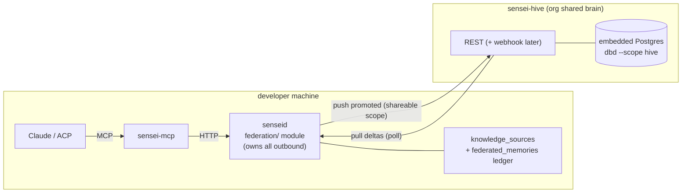
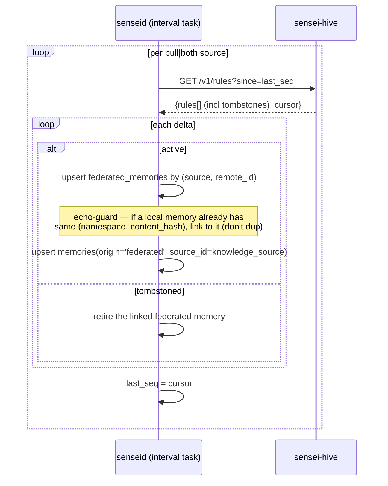

# Hive-mind Federation — Design (Governance P4)

> Design-altitude spec for **P4 — Hive-mind federation** of the governance plane epic
> ([#28](https://github.com/sensei-hq/sensei/issues/28)). Covers the three P4 issues as one
> coherent architecture, then decomposes into three implementation plans:
> [#25](https://github.com/sensei-hq/sensei/issues/25) (hive-mind service),
> [#26](https://github.com/sensei-hq/sensei/issues/26) (daemon federation module),
> [#27](https://github.com/sensei-hq/sensei/issues/27) (Configure UI).
>
> Concept: [`docs/concepts/governance.md`](../../concepts/governance.md). This spec elaborates that
> concept into a buildable shape; where it extends or refines the concept, §15 says so.

---

## 1. Context

The governance-plane core (P1–P3) is shipped and live-verified: scope×enforcement rule model,
`scopes`/`namespaces` (level-based set membership), `memories` extended with
`namespace_id`/`enforcement`/`origin`/`source_id`, two-tier resolution (Tier-1 `get_rules`,
Tier-2 `consolidation`-role merge), `~/.sensei/rules.md` materialization, README-frontmatter
identity, and promotion (`promote_memory` → `proposed` at a higher scope → approve).

What remains is **federation**: making a rule promoted to a *shareable* scope (organization /
client / team) available to every teammate's machine, and pulling applicable shared rules down
into each local session. Today knowledge is personal + global only; federation is the bridge that
lets a lesson learned painfully in one repo propagate to every teammate where it applies — the
**FTR (First-Time-Right)** payoff governance exists to raise.

### What already de-risks this

- `scopes.shareable` already flags `organization`/`client`/`team` as federating.
- `memories.origin` is free `text` (default `'learned'`, already carries `'promoted'`) and its
  column comment **already documents `federated` as the federation origin value** — so the
  inbound origin needs no enum migration. `source_id uuid` exists for provenance back-links.
- A working **Keychain credential pattern** exists (`crates/senseid/src/gateway_keys/mod.rs` shells
  out to `security`; registered/refreshed per router in `api/handlers/gateway_routers.rs`).
  [#26](https://github.com/sensei-hq/sensei/issues/26) explicitly says to mirror it.
- `crates/gateway-embedded/` is precedent for an in-process sub-service.
- `dbd` supports **scopes** (default = full; named scopes carry include/exclude lists), so the
  hive's database can be a *selected subset of the one DDL tree* — no duplicated schema.

---

## 2. Scope of this spec

This is **one federation architecture** designed end-to-end, because the daemon module and the
hive-mind service are the two ends of a single protocol and cannot be sensibly designed apart. It
decomposes into three TDD implementation plans (§16). The UI (#27) is specified only to the
**daemon API contract** it binds to; its visual design is a separate frontend sub-spec.

**Non-goals for the MVP** (tracked in §17): webhook push, per-namespace ACLs, hosted multi-tenant
SaaS, the `mcp`/`rest` knowledge-source kinds (only `hive_mind` is wired), and any embedding /
vector federation (rules are text; embeddings stay local).

---

## 3. Locked decisions

| # | Decision | Choice |
|---|----------|--------|
| 1 | Spec scope | One architecture spec for all of P4; decomposes into per-issue plans. |
| 2 | Topology (MVP) | **Self-hosted single binary, one instance per org.** `sensei-hive` + embedded Postgres; teammates point their daemons at its URL + API key. Hosted multi-tenant is a later option that does not change the daemon-side protocol. |
| 3 | Sync mechanism | **Poll-first, webhook-ready.** Daemon polls the hive for deltas. `knowledge_sources.direction` + a `subscriptions` table/endpoint stub are laid so a webhook "nudge" layers on later with no redesign. |
| 4 | Cross-machine identity | A namespace's identity is **`(scope_key, slug)`** (already `unique` locally, derived deterministically from README frontmatter). No manual id binding. Rename ⇒ register the old slug as an alias (not auto-migrate). |
| 5 | Inbound trust | **Trusted.** Pulled rules land `active` (`origin='federated'`) and enter resolution immediately. Registering a source and subscribing to a namespace *is* the consent; `mandatory` remote rules bind non-overridably. Non-mandatory remote rules remain overridable by a more-specific local scope and can be locally muted. |
| 6 | Hive RBAC | Three instance-global roles: `member` (pull), `publisher` (pull + publish), `admin` (+ manage members/keys/namespaces, view audit). Per-namespace ACLs deferred (non-breaking `member_namespaces` add). |
| 7 | Code placement | **Monorepo crate** `crates/hive-mind/` → binary `sensei-hive`; wire types in a shared `crates/hive-protocol/`. Ships via existing release/Homebrew machinery. |
| 8 | Schema strategy | **Single `database/` DDL tree, `dbd` scope-tagged.** `dbd apply --scope hive` materializes only the hive subset. No duplicated schema; pgvector/DDL parity automatic. |

---

## 4. Architecture & boundary

Three Rust units:

- **`senseid`** (existing daemon) gains a **`federation/` module**: `knowledge_sources` table, a
  `federated_memories` sync ledger, a sync engine (push-on-approve + a poll task), credentials via
  the existing `gateway_keys` Keychain path.
- **`sensei-hive`** (new, `crates/hive-mind/`): slim Axum service over an embedded Postgres
  (`postgresql_embedded`), schema materialized by `dbd apply --scope hive`, REST API, API-key auth
  + RBAC, an audit log.
- **`hive-protocol`** (new, `crates/hive-protocol/`): the serde wire types (request/response
  payloads, `PublishedRule`, error envelope) depended on by **both** sides. The DRY hard rule in
  `CLAUDE.md` requires the wire contract to have a single owner rather than a duplicated schema per
  crate.

**The boundary invariant (from the concept doc):**



The ACP **never** talks to the hive. The flow is always `ACP → sensei tool → senseid → sensei-hive`.
The daemon owns every outbound call; this keeps the federation surface auditable and the ACP
credential-free.

---

## 5. Identity model

A namespace's cross-machine identity is **`(scope_key, slug)`**. Locally `namespaces.id` is a
per-machine `gen_random_uuid()` and cannot be the shared identity; `slug` is derived deterministically
from README frontmatter (`organization: Sensei HQ` → `sensei-hq`), which teammates already share via
git, so two machines independently arrive at the same `(organization, "sensei-hq")` pair.

- **On push**, the daemon sends `scope_key + slug + name`; the hive **upserts** the namespace by
  `(scope_key, slug)` (display `name` refreshed).
- **On pull**, the daemon maps the incoming `(scope_key, slug)` back to its local namespace,
  **creating it if absent**.
- **Rename** (org changes its display name and thus slug): handled as *alias registration* — the
  hive keeps a `slug_aliases text[]` on the namespace so old published rules still resolve; no
  destructive auto-migration. (Alias maintenance is an admin action; out of MVP scope to automate.)

---

## 6. The sync protocol

REST over HTTPS. `Authorization: Bearer <api_key>`; the hive stores only `sha256(key)` and compares
constant-time (`subtle`). Pull uses a **monotonic `bigint` sequence cursor** (`seq`), not timestamps
— gap-free and immune to clock skew.

### Endpoints (`sensei-hive`, prefix `/v1`)

| Method | Path | Role | Purpose |
|--------|------|------|---------|
| `GET`  | `/health` | none | Liveness; returns version + schema scope. |
| `GET`  | `/namespaces` | member | List shared namespaces visible to the caller. |
| `POST` | `/rules` | publisher | Publish a rule. Upsert by `(namespace, content_hash)`; assigns `seq`, bumps `version`; returns canonical `{id, version, seq}`. |
| `GET`  | `/rules?since=<seq>` | member | Pull deltas (incl. tombstones) ordered by `seq`; returns `{rules[], cursor}`. **The poll endpoint.** |
| `DELETE` | `/rules/{id}` | publisher | Retract → tombstone (sets `status='tombstoned'`, new `seq`). |
| `POST` | `/members` · `DELETE /members/{id}` | admin | Manage members. |
| `POST` | `/members/{id}/keys` · `DELETE /keys/{id}` | admin | Issue / rotate / revoke keys (key shown once). |
| `GET`  | `/audit?since=<seq>` | admin | Audit log. |
| `POST` | `/subscriptions` | member | **Stubbed for MVP** — webhook callback registration; table + route exist, handler returns `501`. |

### Push (publish on approval)

```mermaid
sequenceDiagram
    participant U as User (UI/MCP)
    participant D as senseid
    participant H as sensei-hive
    U->>D: accept promotion (memory origin=promoted, shareable scope)
    D->>D: knowledge_source for this namespace with direction push|both?
    alt registered
        D->>H: POST /v1/rules (PublishedRule)
        H->>H: upsert by (namespace, content_hash); assign seq, version
        H-->>D: {id, version, seq}
        D->>D: federated_memories upsert (memory_id ↔ remote id)
    else none
        D->>D: stays local at higher scope
    end
```

### Pull (poll deltas)



Pulled rules are ordinary `memories` rows, so they flow into the **existing** Tier-1 `get_rules`
and Tier-2 `consolidate` with **zero new resolution code**. Existing dedup-by-normalized-content
and the `mandatory` enforcement-lock already arbitrate remote-vs-local: a remote `mandatory` rule
binds; a remote `recommended` rule is overridable by a more-specific local scope.

---

## 7. What gets published — `PublishedRule`

A **flattened snapshot**, never the memory graph. The hive is a *publish registry*, not a replicated
memory DB; strength / outcomes / evidence / links are local lifecycle and stay on each daemon.

```jsonc
// crates/hive-protocol — shared wire type
PublishedRule {
  content_hash:    String,   // sha256(normalized(content)); dedup key within a namespace
  scope_key:       String,   // 'organization' | 'client' | 'team'
  namespace_slug:  String,   // 'sensei-hq'
  namespace_name:  String,   // 'Sensei HQ' (display; upserts the ns)
  rule_type:       String,   // memory_type value as text (classification only)
  title:           String,
  content:         String,
  impact:          Option<String>,
  enforcement:     String,   // advisory|recommended|required|mandatory
  // provenance — denormalized, NO foreign keys
  origin_repo:     Option<String>,  // 'sensei/daemon' (display only)
  published_by:    String,          // member label
  published_at:    String,          // RFC3339
}
```

`content_hash` normalization **must reuse the same normalizer** as `governance::structure_ruleset`
(the existing dedup), so a rule pushed from machine A dedups against the same rule the local
resolver would. Extract that normalizer into `hive-protocol` (or a shared governance util) so both
the daemon and the hive compute identical hashes — no second normalization implementation.

---

## 8. Hive-mind service — `crates/hive-mind/` (#25)

### Schema (scope `hive`, schema `hive` in the embedded PG)

Materialized by `dbd apply --scope hive` from the single `database/` tree. Members of the `hive`
scope:

- **Shared, also in the daemon's full set:** `enforcement` (enum), `scopes`, `namespaces`
  (`namespaces` already has no FK to folders, so it is clean to share; `slug_aliases text[]` column
  added for §5).
- **Hive-only new entities:**

```sql
-- shared_rules — the published-rule registry (named to avoid implying it mirrors `memories`)
create sequence if not exists shared_rules_seq;
create table if not exists shared_rules (
  id            uuid        primary key default gen_random_uuid()
, seq           bigint      not null default nextval('shared_rules_seq')  -- monotonic cursor
, namespace_id  uuid        not null references namespaces(id)
, content_hash  text        not null
, rule_type     text        not null
, title         text        not null
, content       text        not null
, impact        text
, enforcement   enforcement not null
, status        text        not null default 'active'       -- active | tombstoned
, version       integer     not null default 1
, origin_repo   text
, published_by  text        not null
, published_at  timestamptz not null
, updated_at    timestamptz not null default now()
, constraint shared_rules_ns_content unique (namespace_id, content_hash)
);
create index if not exists shared_rules_seq_idx on shared_rules(seq);
-- seq MUST advance on every mutation, not just insert, so pulls observe republishes + tombstones.
-- The publish upsert and the retract both set seq = nextval('shared_rules_seq') (or a BEFORE UPDATE
-- trigger does). bigserial alone is insufficient — it fires only on insert.

-- members
create table if not exists members (
  id           uuid        primary key default gen_random_uuid()
, name         text        not null
, email        text
, role         text        not null default 'member'        -- member | publisher | admin
, disabled_at  timestamptz
, created_at   timestamptz not null default now()
);

-- api_keys (hash only; key shown once at issue)
create table if not exists api_keys (
  id          uuid        primary key default gen_random_uuid()
, member_id   uuid        not null references members(id)
, key_hash    text        not null
, label       text
, last_used_at timestamptz
, revoked_at  timestamptz
, created_at  timestamptz not null default now()
);

-- audit_log
create table if not exists audit_log (
  id         bigserial    primary key
, ts         timestamptz  not null default now()
, member_id  uuid         references members(id)
, action     text         not null      -- publish | retract | key.issue | key.revoke | member.add | ...
, target     text
, detail     jsonb        not null default '{}'
);
```

- **Deferred (tables only, handlers stubbed):** `subscriptions` (callback_url, secret, namespaces,
  created_at) for the webhook nudge; `member_namespaces` for per-namespace ACL.
- **No FK to `projects`/`folders`/`sessions`/`nodes`** anywhere — self-containment. Provenance is
  the denormalized `origin_repo`/`published_by` text. pgvector is available in the embedded PG for
  parity but **unused** at MVP.

### Service

- Axum router mirroring §6. Auth middleware resolves `Bearer` → `api_keys.key_hash` (constant-time),
  loads the member + role, enforces the per-route role floor, stamps `audit_log`, bumps `last_used_at`.
- **Embedded Postgres lifecycle:** `sensei-hive` owns the `postgresql_embedded` process — starts it
  on boot (data dir configurable, default `~/.sensei-hive/`), runs `dbd apply --scope hive` +
  `dbd import --scope hive` (seeds `scopes.jsonl` so the ladder/levels exist), stops it on shutdown.
- **Bootstrap admin:** a CLI subcommand `sensei-hive keygen --role admin --label <l>` operates
  directly on the embedded DB to mint the first key (printed once) — the chicken-and-egg breaker
  before any REST key management exists.
- **TLS:** binds via `rustls` with a configurable cert/key, **or** runs behind a reverse proxy.
  Plain `http` permitted only on loopback (dev). The daemon refuses to register a non-loopback
  `http` source (§12).
- Reuses `crates/logger` and `crates/sensei-config` patterns; no daemon/code-graph/scanner/session
  machinery.

---

## 9. Daemon federation module — `crates/senseid/src/federation/` (#26)

### Schema (daemon's default/full scope, schema `sensei`)

```sql
-- knowledge_sources — registered federation endpoints (mirrors gateway-router registration)
create table if not exists knowledge_sources (
  id             uuid        primary key default gen_random_uuid()
, kind           text        not null      -- hive_mind | mcp | rest | webhook  (only hive_mind wired @ MVP)
, name           text        not null
, url            text        not null
, namespace_id   uuid        references namespaces(id) on delete set null   -- null = all shareable namespaces
, credential_ref text        not null      -- Keychain key id (the API key lives in the OS keychain)
, direction      text        not null default 'both'    -- push | pull | both
, last_seq       bigint      not null default 0          -- pull cursor for this source
, enabled        boolean     not null default true
, created_at     timestamptz not null default now()
);

-- federated_memories — local↔remote rule mapping + per-rule cursor (sync bookkeeping, not a parallel rules table)
create table if not exists federated_memories (
  knowledge_source_id uuid not null references knowledge_sources(id) on delete cascade
, remote_rule_id      uuid not null
, content_hash        text not null
, memory_id           uuid references memories(id) on delete set null
, remote_seq          bigint not null
, synced_at           timestamptz not null default now()
, primary key (knowledge_source_id, remote_rule_id)
);
```

`memories.source_id` is set to the **`knowledge_sources.id`** for federated rows (provenance:
"which endpoint did this come from"); the per-rule remote identity lives in the `federated_memories`
ledger. This resolves the small concept-doc/DDL ambiguity about what `source_id` points at, and
keeps federation-specific bookkeeping off the large `memories` table while giving pull a clean
idempotency key `(knowledge_source_id, remote_rule_id)`.

### Credentials

Reuse `gateway_keys` — generalize it from "router key" to "secret keyed by id", keyed by
`knowledge_source.id`. **No new keychain code.** `credential_ref` stores the keychain entry id; the
key value never touches Postgres.

### Sync engine

- **Push** hooks the promotion-approval path: when `accept_proposal` activates a memory with
  `origin='promoted'` at a `shareable` scope, and a `push|both` source is registered for that
  namespace, build a `PublishedRule` and `POST /v1/rules`; record the returned id in
  `federated_memories`. Idempotent via the hive's `(namespace, content_hash)` upsert.
- **Pull** is a background interval task (same pattern as the watcher/scan tasks): per `pull|both`
  source, `GET /v1/rules?since=last_seq`, apply deltas per §6 (echo-guard + tombstone-retire),
  advance `last_seq`. Also exposed as an on-demand "sync now".

### Daemon API (the contract the UI binds to)

| Method | Path | Purpose |
|--------|------|---------|
| `POST` | `/api/knowledge/sources` | Register: `{kind, name, url, namespace_id?, direction, api_key}` — key → Keychain, row → table, first sync kicked. |
| `GET`  | `/api/knowledge/sources` | List sources + status (last sync, last_seq, counts, last error). |
| `DELETE` | `/api/knowledge/sources/{id}` | Deregister (cascade ledger; key removed from Keychain). |
| `POST` | `/api/knowledge/sources/{id}/sync` | Pull now. |
| `GET`  | `/api/knowledge/sources/{id}/status` | Detailed sync status. |

---

## 10. UI — Configure section (#27, contract only)

A thin client over §9's daemon API: register a hive-mind (URL + API key + pick shared namespaces +
direction), list registered sources, and show sync status (last pull, `last_seq`, pushed/pulled
counts, errors). Surfaces which local rules are `federated` vs `promoted`/`authored`. **Visual design
is a separate frontend sub-spec**; this spec fixes only the API contract above.

---

## 11. Resolution integration (no new code)

Federated memories are `memories` rows (`origin='federated'`, `namespace_id` = the local namespace
mapped from `(scope_key, slug)`, `enforcement` carried from the publisher). They are picked up
automatically by:

- **Tier-1** `resolve_rules_raw` / `get_rules` — ordered by `enforcement DESC` then scope `level DESC`,
  deduped by normalized content (highest-authority wins), `mandatory`-locked.
- **Tier-2** `consolidate` — the `consolidation`-role LLM merge, run on change/refresh, surfaces
  conflicts for approval.

A remote `mandatory` org rule therefore outranks a local `recommended` project rule exactly as a
locally-authored `mandatory` rule would — the federation path adds *rows*, not resolution rules.

---

## 12. Security

- **API keys:** high-entropy random (≥256 bits), hashed at rest (`sha256`), shown once at issue,
  constant-time comparison (`subtle`). Revocation = `revoked_at` (checked in auth middleware).
- **Transport:** `rustls` or reverse proxy; non-loopback `http` source URLs **rejected by the daemon**
  at registration. No SSRF surface beyond user-registered URLs (the daemon only calls endpoints the
  user explicitly registered).
- **RBAC** enforced per route (§6) with `audit_log` on every mutating action.
- **Webhook (later):** HMAC-signed callbacks (`subscriptions.secret`); deferred with the feature.
- Prefer vetted crates over hand-rolled crypto (`subtle` for comparison, `rand` for key material).

---

## 13. `dbd` scope strategy

Single `database/` DDL tree. Default scope = full (the daemon). A named `hive` scope is defined by
**inclusion**:

| Entity | In `hive` scope? | In default (daemon)? |
|--------|:---:|:---:|
| `enforcement` (enum) | ✓ | ✓ |
| `scopes` | ✓ | ✓ |
| `namespaces` (+`slug_aliases`) | ✓ | ✓ |
| `shared_rules` | ✓ | ✗ |
| `members`, `api_keys`, `audit_log` | ✓ | ✗ |
| `subscriptions`, `member_namespaces` (deferred) | ✓ | ✗ |
| `knowledge_sources`, `federated_memories` | ✗ | ✓ |
| memories, nodes, folders, … (everything else) | ✗ | ✓ |

`sensei-hive` runs `dbd apply --scope hive` + `dbd import --scope hive` against its embedded PG.
The daemon continues to apply the full default set. The shared three live once in the tree and
appear in both. Exact include/exclude syntax in `design.yaml` is pinned in the #25 plan.

---

## 14. Testing strategy (TDD)

- **`hive-protocol`:** unit tests for `content_hash` normalization parity (same input → same hash as
  `governance::structure_ruleset`), serde round-trips.
- **`sensei-hive` (#25):** HTTP integration tests against a real `postgresql_embedded` instance
  bootstrapped via `dbd apply --scope hive` — auth/role enforcement (each route's role floor),
  publish upsert-by-content-hash + version bump, pull `since` cursor (gap-free, includes tombstones),
  retract tombstone, audit entries, keygen CLI.
- **daemon federation (#26):** unit tests for the push payload builder, the echo-guard, tombstone
  retire, and `last_seq` advance (pure functions over injected rows). Integration: register a source
  → promote+approve → assert `POST /v1/rules` → second daemon (or same daemon, second source) pulls
  → memory appears `origin='federated'` → `get_rules` ranks a remote `mandatory` above a local
  `recommended`.
- **end-to-end:** two daemon DBs + one hive; promote on A, verify it resolves on B and binds when
  `mandatory`.
- Zero-errors-policy at both checkpoints; `make test-fast` (no DB) stays green for the pure pieces.

---

## 15. Extensions / refinements vs the concept doc

All within the concept doc's intent; called out for transparency:

1. **`hive-protocol` shared types crate** — new; mandated by DRY so the wire contract has one owner.
2. **`federated_memories` ledger** — new daemon-side table; the concept doc named only
   `knowledge_sources` + `source_id`. The ledger isolates sync bookkeeping and gives pull a clean
   idempotency key.
3. **`source_id` = `knowledge_sources.id`** (endpoint), remote rule identity in the ledger —
   reconciles the concept-doc ("→ knowledge_sources") vs `memories.ddl` comment ("source memory or
   remote record") ambiguity.
4. **Monotonic `seq` cursor** instead of timestamps — refinement for gap-free, skew-proof pulls.
5. **Single DDL tree via `dbd --scope hive`** instead of a duplicated "self-contained subset" —
   strictly better DRY; the self-containment rule is satisfied by *no cross-FKs*, not by separate files.
6. **`origin='federated'`** (matching the existing `memories.origin` column comment) rather than the
   concept doc's prose word "remote".
7. **`shared_rules`** as the registry table name (vs `rules`) to avoid implying it mirrors `memories`.

---

## 16. Decomposition → implementation plans (build order)

1. **#25 — `sensei-hive` service.** Crate scaffold + `hive-protocol` + `dbd --scope hive` bootstrap
   over `postgresql_embedded` + REST/auth/RBAC/audit + keygen CLI. Standalone, HTTP-integration-tested.
   *Deliverable: a runnable org brain with no daemon dependency.*
2. **#26 — daemon federation module.** `knowledge_sources` + `federated_memories` + `gateway_keys`
   reuse + push hook + pull task + daemon API. Tested against a real `sensei-hive`. *Deliverable:
   promote→approve→push→pull→resolve, end-to-end.*
3. **#27 — Configure UI.** Thin client over the daemon API (own frontend sub-spec).

Each is a separate TDD plan via `writing-plans`.

---

## 17. Future / out of MVP

- **Webhook nudge** (poll → push-to-pull latency): `subscriptions` table/route stubbed now; HMAC
  callbacks + a daemon receiver later.
- **Per-namespace ACLs** (`member_namespaces`): "client-X rules visible only to the client-X sub-team."
- **Hosted multi-tenant** `sensei-hive` (tenants + isolation) — protocol-compatible, no daemon change.
- **Other `knowledge_sources.kind`s**: `mcp` (a federated MCP server as a knowledge provider),
  `rest`, generic `webhook`.
- **Slug-rename automation** beyond manual alias registration.
- **`insights`/`insight_batches`** as the emit point + the dormant `pending_share` status, and #24
  (entangled with this; revisit once federation lands).

---

*Related: [governance concept](../../concepts/governance.md) · [knowledge-plane spec](2026-05-27-knowledge-plane-design.md) · epic [#28](https://github.com/sensei-hq/sensei/issues/28).*
