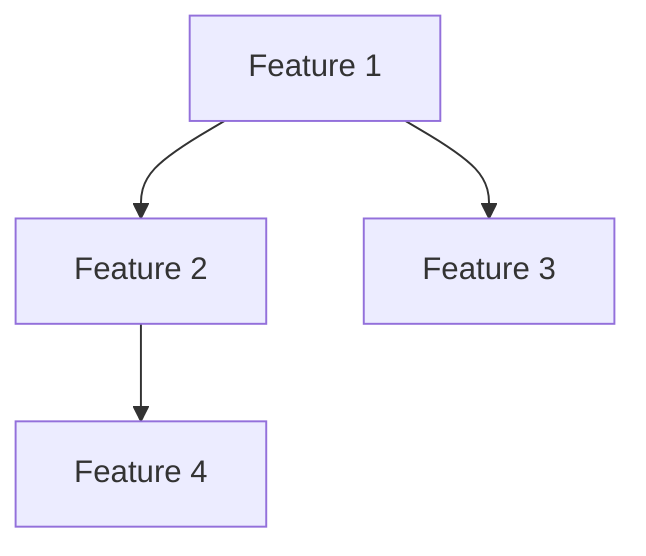

# [Plan Name]

## Overview

<!-- What blueprint or design is this plan decomposing? What's the scope? -->

## Principles

<!-- Implementation principles for this plan. Reference D18: vertical slices, bottom-up, fully tested. -->

- Vertical feature slices — each feature spans all layers (daemon → MCP → command)
- Innermost layer first, build up, fully tested at each layer
- TDD: tests written and approved before implementation
- Each feature becomes a GitHub issue with acceptance criteria

## Features

### Feature 1: [Name]

**Issue:** #[number] (if created)
**Priority:** high | medium | low
**Depends on:** [other features in this plan]

**Layers:**
<!-- List each layer this feature touches, in implementation order (bottom-up) -->
1. [Layer] — [what needs to be built, with tests]
2. [Layer] — [what needs to be built, with tests]

**Acceptance criteria:**
- [ ] [Specific, testable criterion]
- [ ] [Specific, testable criterion]

**Test scenarios:**
```gherkin
Scenario: [Description]
  Given [precondition]
  When [action]
  Then [outcome]
```

---

### Feature 2: [Name]

**Issue:** #[number]
**Priority:**
**Depends on:**

**Layers:**
1. [Layer] — [what]
2. [Layer] — [what]

**Acceptance criteria:**
- [ ] [criterion]

**Test scenarios:**
```gherkin
Scenario: [Description]
  Given [precondition]
  When [action]
  Then [outcome]
```

---

## Dependency graph

<!-- Which features block which. Mermaid or ASCII. -->



## Progress

| # | Feature | Status |
|---|---------|--------|
| 1 | [name] | Planned |
| 2 | [name] | Planned |
