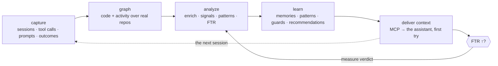
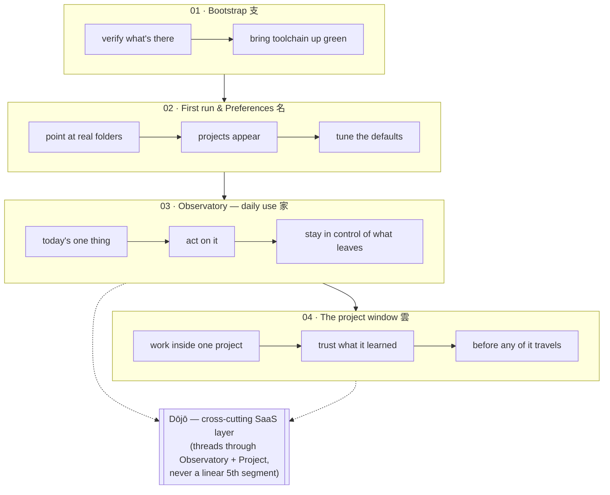

# Vision

> **What sensei is for.** The *why* and the *what* — not the *how*.
> Architecture ([`architecture/`](architecture/README.md)) says how we build
> toward this; the detailed build specs live in [`spec/`](spec/README.md).
>
> Measurable objectives per segment → [objectives.md](objectives.md).

## One paragraph

Sensei is a **helpful observer and mentor of how a developer works with AI
coding assistants** — mentoring that surfaces as insights land. It captures the
sessions (hook events, tool calls, prompts, outcomes), builds a code + activity
graph over the developer's real repos, and turns the resulting signal into
things a human can act on: **memories** that stick, **patterns** worth reusing,
**guards** worth adopting, and a clear picture of **when the pairing worked and
when it didn't**. It is not a productivity dashboard — it is a **retrospective
loop for a pair (you + your assistant) that otherwise never gets one**. The
Observatory shows *today's one thing*; the project window shows *what this
project learned*; the Dōjō (SaaS) extends the same loop across a team without
leaking client work.

## North-star metric — FTR

**First-turn resolution: the fraction of sessions where the assistant's first
attempt landed without a correction.** Every screen, pipeline, and layer is
judged by one question: *does it make FTR go up, or expose the reason it went
down?* A feature that does neither is not a priority.

## The pair goes both ways

Sensei is not "watching the assistant make mistakes." It watches a **pair** —
human + assistant — and notices patterns from both sides. Sometimes the
correction was the assistant's fault; sometimes the human gave underspecified
instructions, incomplete context, or wrong assumptions. Both are learning
signal. The ultimate aim is human and LLM working in sync — **mutual
improvement, not one-sided teaching.**

## The core loop

Everything sensei does is one loop. Each layer exists to keep this turning:

The loop is only as trustworthy as its weakest link: a wrong graph poisons
analysis; unreliable capture starves it; low-quality signal makes the surfaces
noise; and if the learning never gets **delivered back** to the assistant or
its FTR impact never **measured**, the loop generates but never closes.

## The journey — four segments + a cross-cutting Dōjō

Source of truth for the visuals: [`mockups/Sensei/Sensei Journey Map.html`](mockups/Sensei/Sensei%20Journey%20Map.html)
and [`mockups/Sensei/Sensei Dōjō Journey Map.html`](mockups/Sensei/Sensei%20D%C5%8Dj%C5%8D%20Journey%20Map.html).

**Value before setup** is literal: the first thing the user does is see *their
own projects*, not a wizard. The old nine-stage wizard is gone — tuning lives in
Preferences, reachable but never blocking.

### The loops inside the daily app

The Observatory and project window are not flat screens — each domain is a small
retrospective loop of its own (mockup: *"Module lifecycles — the loops inside
the daily app"*): **Security &amp; guards · Architecture · Testing · Style &amp;
conventions · Memory · Traceability · Impact · Libraries · Insights.** Each
observes, forms a finding, and offers one action.

## The relay — long runs, supervised from anywhere, through the Dōjō

Multi-agent workflows are becoming the norm: several assistants (Claude Code ·
Codex · OpenCode · Aider) running long, mostly-autonomous jobs across your
machines. **Relay** makes that legible and controllable when you're away from the
keyboard — now **folded into the Dōjō**, reachable on phone and console. Visual
source: [`mockups/Sensei/Sensei Dōjō Journey Map.html`](mockups/Sensei/Sensei%20D%C5%8Dj%C5%8D%20Journey%20Map.html).

- **Agents run on your own hardware.** The daemon supervises the agent CLIs and
  publishes only a *filtered status* — never the code, never the raw transcript.
- **Reach a live session through the Dōjō — no pairing.** The daemon already holds
  an outbound line to the Dōjō; that same line, over **realtime**, carries live
  session control. Any signed-in phone or console **subscribes** and picks the
  session up — no pairing, no install, no open ports. A responsive **PWA** is the
  surface; a thin native wrapper adds push + offline.
- **Watch, don't babysit.** A cross-Dōjō Projects home ranked by *what's blocked
  on me*; you're pulled in only at a **gate** (approve the exact command), a
  **decision** (3–4 options + a free reply), or to **chat** the run back on course.
- **Free for individuals, paid where shared.** The individual loop is free; the
  shared-team coordination around it (on-call inbox, presence, attributed
  decisions) is the paid tier.

Relay extends the north-star: a run you can't supervise can't be corrected — it
keeps the pair (and the fleet) legible and steerable at a distance. Detail:
[journeys/dojo → Relay](journeys/dojo.md#relay--away-from-keyboard-through-the-dōjō).

## The business model — free where public or personal

The line is drawn by **who the knowledge is for**, not by features. A **public /
open-source** Dōjō and your **personal** solo Dōjō are **free forever** — full
governance, full Relay. Payment begins only when a Dōjō is **private and shared**
by a team or org: you pay to *coordinate a group's private knowledge* and for the
control a business needs (self-hosting, SSO, audit) — never to use sensei, never
for tokens (inference is BYO-key and local). Tiers + open pricing questions:
[journeys/dojo → Business model](journeys/dojo.md#business-model--free-where-public-or-personal).

## Why it's worth building — one loop, not two products

Source: [`mockups/Sensei/Sensei End-to-End Journey.html`](mockups/Sensei/Sensei%20End-to-End%20Journey.html)
— the machine → Dōjō → beyond loop, a developer's day (Rin), an org's practice
(Keiko), and the honest case for building it.

**The case, plainly.** Two problems most tools ignore: **knowledge evaporates**
between sessions and people, and **autonomous work needs a human at the gate.**
Sensei captures the first locally and lets the Dōjō share it; Relay makes the
second answerable from anywhere.

**Who benefits** — *Solo dev*: a memory that persists + free personal governance.
*Team*: conventions taught once, inherited on join. *Agency*: client
confidentiality with an audit trail. *Org*: measurable first-try-right lift across
repos.

**Why it's defensible.** Local-first + BYOK means **no token markup to undercut**
and privacy as the default, not a feature. The moat is the **accumulated, governed
knowledge graph** — plus **confidentiality-grade anonymization**, which is exactly
what regulated and agency buyers pay for.

**What has to be true (the load-bearing risks).** Local observation surfaces
lessons good enough to trust; teams will actually curate (triage can't become a
chore); realtime through the Dōjō is reliable enough to gate on; the free tier
converts to paid team seats. The first two are validated **before** investing in
the enterprise surface.

**The verdict — build the loop, not the halves.** The desktop app alone is a nice
notebook; the Dōjō alone is a governance console with nothing to govern. Together
they form a **flywheel**: local observation feeds the shared mind, the shared mind
makes every developer better, and that pulls more observation in. Sequence the
wedge — **ship the free local loop** (observe → learn → personal Dōjō) to seed
adoption, then **charge teams for coordination** (shared scopes, governance,
Relay-at-scale, confidentiality).

## The six non-negotiable themes

Every requirement and design decision honours these. If something pushes against
one, we call it out.

| # | Theme | What it means |
|---|---|---|
| 1 | **Value before setup** | First interaction shows the user their own projects — not a wizard. |
| 2 | **One decision, one default** | The same verb set everywhere — **Apply · Review · Dismiss** — recommended one highlighted, others one keystroke away. |
| 3 | **Discoverability of depth** | Nothing important hidden behind a one-liner; Preferences is searchable; the sidebar clusters with a Focus mode. |
| 4 | **Trust through proof** | No claim without a receipt — confidence scores, regression notes, before/after FTR. The user verifies; they don't take our word. |
| 5 | **Org boundary is the Dōjō membership** | Anything that should stay inside a company or a client engagement travels through a Dōjō membership, not the global Collective. Personal sensei works perfectly with no Dōjō; when one exists, the boundary is exact. |
| 6 | **Insight copy comes from the model** | Every human-readable insight string routes through [`insight-copy`](spec/pipeline/insight-copy.md) (embedded gemma first, static template as fallback). Actions and route labels stay deterministic. |

## What sensei is *not*

- Not a productivity/vanity dashboard (lines, commits, streaks).
- Not a code reviewer or linter — it learns *how the pair works*, not just the code.
- Not a cloud service by default — personal sensei is fully local; the Dōjō is opt-in and the org boundary is exact.

## Read next

- [`objectives.md`](objectives.md) — the WHAT, broken down per segment + the Dōjō layer, with measurable outcomes.
- [`open-issues.md`](plan/README.md) — where the implementation stands against this vision, the ranked gaps, and the specced plan to close them.
- [`architecture/README.md`](architecture/README.md) — how the layers realise this.
