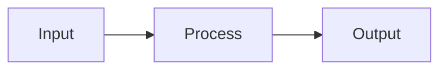

# [Blueprint Name]

## Overview

<!-- 2-3 sentences: what this component/system does, its role, and the key design decision that shapes everything. -->

## Architecture

<!-- System diagram showing components and how they connect. Use ASCII art or mermaid. -->

```
[diagram here]
```

## Components

<!-- For each component: what it is, what it owns, what it depends on. -->

### [Component 1]

<!-- Description, responsibilities, interfaces -->

### [Component 2]

<!-- Description, responsibilities, interfaces -->

## Data flow

<!-- How data moves through the system. What triggers what. Sequence or flow diagram. -->



## Integration points

<!-- How this connects to other systems, components, or external services. -->

| Integration | Method | Notes |
|-------------|--------|-------|
| [system] | [how] | [constraints] |

## Dependencies

<!-- What must exist or be true for this blueprint to work. -->

| Dependency | Status | Impact if missing |
|-----------|--------|-------------------|
| [dependency] | [exists/planned] | [what breaks] |

## Implementation order

<!-- Ordered list of what to build first, second, third. Bottom-up from dependencies. -->

| # | Item | Type | Depends on |
|---|------|------|-----------|
| 1 | [item] | [type] | [deps] |

## Personas

<!-- If .sensei/personas.yaml defines personas, consider each one here. -->

| Persona | Key goal | Acceptance from their perspective |
|---------|----------|----------------------------------|
| [persona] | [what they want] | [how they know it works] |

## What this blueprint does NOT cover

<!-- Explicit scope boundaries. What's out of scope and where it's tracked instead. -->
